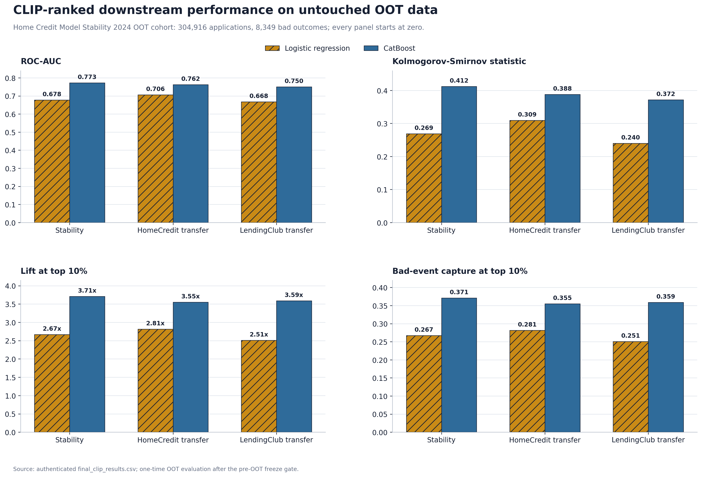
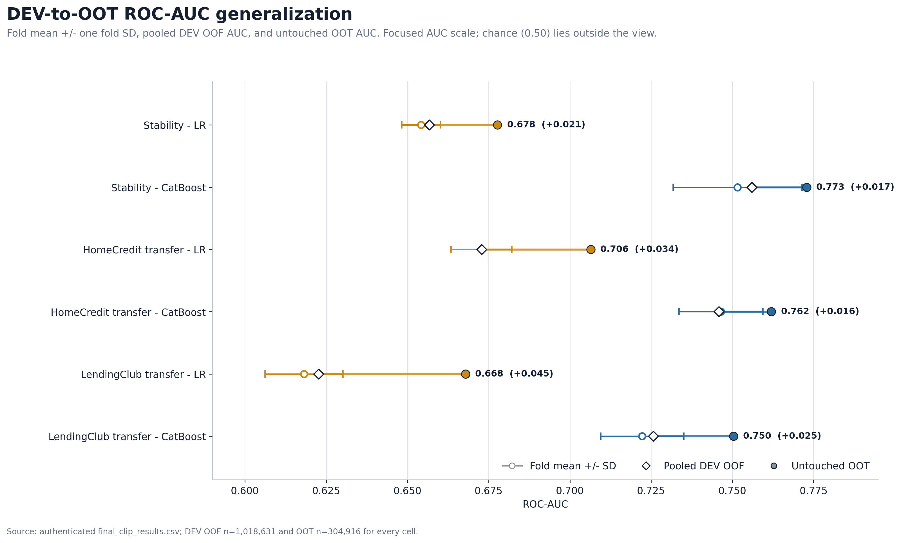
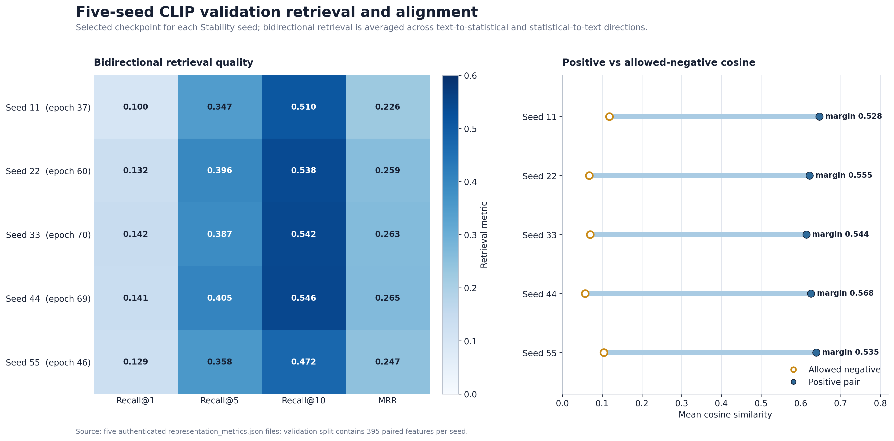
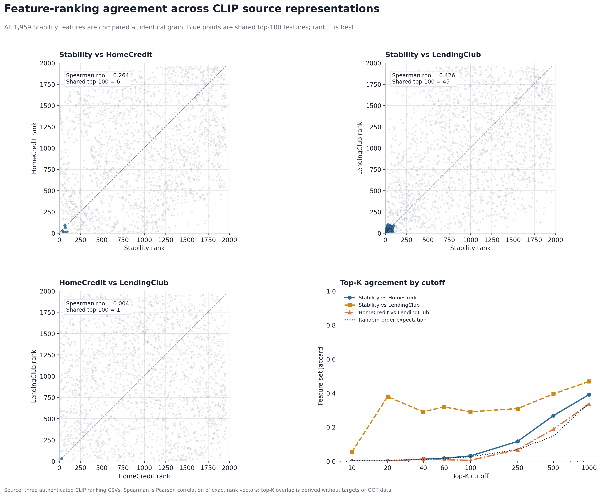
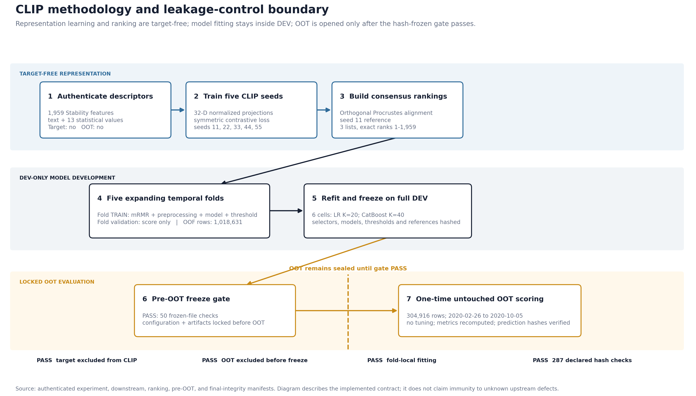

# CLIP Feature-Ranking Transfer to Home Credit Model Stability 2024

## Technical summary

The frozen CLIP Stability experiment completed all 10 stages and all six preregistered downstream cells. The highest observed untouched out-of-time (OOT) ROC-AUC was **0.772871742** for **Stability-trained CLIP ranking -> Stability CatBoost**; its OOT Gini was **0.545743484**, KS was **0.412006485**, lift at 10% was **3.706982153**, and bad-event capture at 10% was **0.370703078**. The two transferred CatBoost rankings also retained useful observed discrimination on the same Stability OOT cohort: **0.761999064** from HomeCredit and **0.750327250** from LendingClub.

These AUC values belong to the downstream Stability classifiers after CLIP ranking and legacy mRMR selection; they are not CLIP training metrics. This report supports the narrower conclusion that the completed pipeline produced internally consistent, non-random observed discrimination under its locked protocol. It does **not** claim statistical superiority over another method because paired inference and the optional bootstrap were not enabled.

Within the implemented and authenticated boundary, the leakage audit passes:

- Prompt-1 recorded 29/29 validation checks as PASS and explicitly recorded that target values, OOT feature values, OOT labels, prior selector ranks, prior model outputs, and LLM rankings were not consumed.
- CLIP representation and ranking were target-free and OOT-free; all three rankings contain exactly 1,959 unique Stability predictors with exact ranks 1 through 1,959 and finite scores.
- Fold mRMR, preprocessing, classifier fitting, and decision-threshold fitting used fold TRAIN only.
- All six final selectors, preprocessors, classifiers, thresholds, and score references were fit on full DEV and hash-frozen before the OOT gate passed.
- Every OOT file contains exactly 304,916 unique case IDs, no dropped rows, dates only from 2020-02-26 through 2020-10-05, finite predictions in [0, 1], and the same target counts: 296,567 good and 8,349 bad.
- Every saved OOT metric, including score PSI, was independently recomputed from the frozen prediction and full-DEV score-reference files and matched the saved value. All 287 manifest-declared SHA-256 comparisons passed.

The strongest defensible wording is therefore: **"The CLIP pipeline completed successfully, produced the reported observed OOT performance, and passed the implemented target, temporal, fitting-scope, row-identity, metric-recomputation, and hash-integrity checks."** A stronger statement such as "proven superior" or "guaranteed leak-free under every possible upstream failure" is not supported.

## CLIP result and methodology figures

### Untouched-OOT performance



**Figure 1.** CatBoost produced higher observed OOT discrimination and top-decile concentration than LR under all three CLIP rankings. Stability-to-Stability CatBoost was highest on OOT ROC-AUC (0.772872), KS (0.412006), lift at 10% (3.706982), and capture at 10% (0.370703). These are descriptive comparisons on the common 304,916-row OOT cohort, not significance claims.

### DEV-to-OOT generalization



**Figure 2.** All six untouched-OOT ROC-AUC values exceeded their corresponding pooled DEV OOF values in this completed run; observed increases ranged from +0.016 to +0.045. The focused axis is disclosed in the figure and should be used to inspect generalization deltas, not absolute distance from chance.

### Five-seed representation quality



**Figure 3.** At the selected checkpoints, bidirectional validation Recall@10 ranged from 0.472 to 0.546 and mean reciprocal rank from 0.226 to 0.265. Every seed retained positive-versus-allowed-negative cosine separation, with margins from 0.528 to 0.568; the completed collapse diagnostics also recorded PASS for every projected split.

### Cross-source ranking structure



**Figure 4.** Exact full-ranking Spearman correlations were 0.264 for Stability versus HomeCredit, 0.426 for Stability versus LendingClub, and 0.004 for HomeCredit versus LendingClub. Shared top-100 counts were 6, 45, and 1, respectively. This is the faithful structure view supported by the persisted outputs; a UMAP or t-SNE cluster plot is not presented because standalone consensus embedding arrays were not saved.

### Leakage-control methodology



**Figure 5.** The visual boundary separates target-free CLIP representation and ranking, fold-local DEV model development, full-DEV freezing, the pre-OOT gate, and one-time untouched-OOT scoring. It summarizes the implemented contract and audit trail; it does not claim protection from an unknown upstream defect outside that contract.

The reproducible plotting script, artifact sources, and figure-specific interpretation notes are in [`plots/README.md`](plots/README.md).

## Scope and scientific question

This experiment evaluates feature-representation and feature-ranking transferability into the Home Credit - Credit Risk Model Stability 2024 dataset. It does not transfer a row-level default classifier and is not zero-shot default prediction.

The only evaluated directions are:

1. Stability-trained CLIP -> Stability feature ranking -> Stability LR/CatBoost.
2. HomeCredit-trained CLIP -> Stability feature ranking -> Stability LR/CatBoost.
3. LendingClub-trained CLIP -> Stability feature ranking -> Stability LR/CatBoost.

All six cells use Stability labels only after the CLIP ranking has been frozen, for training-boundary mRMR and the downstream Stability classifier. No other dataset direction or non-CLIP result is included in this report.

The executed pipeline is:

```text
Frozen feature text (384-D) + target-free statistical descriptors (13-D)
    -> five independently trained/frozen CLIP projection pairs
    -> source-specific five-seed consensus/scoring
    -> rank all 1,959 Stability predictors
    -> fixed top-60 pool for LR / fixed top-100 pool for CatBoost
    -> TRAIN-only RF-relevance/correlation-redundancy mRMR
    -> K=20 LR variables / K=40 CatBoost variables
    -> TRAIN-only preprocessing and classifier fitting
    -> temporal DEV validation
    -> full-DEV selector, preprocessor, model, and threshold freeze
    -> hashed pre-OOT gate
    -> one final Stability OOT scoring pass
```

## Data, cohorts, and denominators

| Cohort | Rule | Rows | Date coverage used in evaluation | Bad count | Bad rate |
| --- | --- | ---: | --- | ---: | ---: |
| Full DEV fitting population | `date_decision < 2020-02-26` | 1,221,743 | 2019-01-01 to 2020-02-25 | Not separately exported in the CLIP metric bundle | Not separately exported |
| Pooled DEV OOF validation coverage | Union of five locked fold-validation partitions | 1,018,631 | 2019-03-30 to 2020-02-25 | 34,217 | 0.033591 |
| Final OOT | `date_decision >= 2020-02-26` | 304,916 | 2020-02-26 to 2020-10-05 | 8,349 | 0.027381 |

The OOF denominator is smaller than full DEV because expanding temporal cross-validation needs an initial training prefix and a one-unique-date gap; those rows are used for fitting or separation rather than OOF validation. Every case ID inside the locked five-fold validation coverage occurs exactly once in each cell's OOF file.

| Fold | Train rows | Validation rows | Validation dates | Validation bads | Validation bad rate |
| ---: | ---: | ---: | --- | ---: | ---: |
| 1 | 200,661 | 204,567 | 2019-03-30 to 2019-06-19 | 5,931 | 0.028993 |
| 2 | 402,103 | 203,798 | 2019-06-20 to 2019-08-24 | 5,548 | 0.027223 |
| 3 | 604,598 | 205,980 | 2019-08-25 to 2019-10-27 | 7,159 | 0.034756 |
| 4 | 810,904 | 201,466 | 2019-10-28 to 2019-12-20 | 7,280 | 0.036135 |
| 5 | 1,012,061 | 202,820 | 2019-12-21 to 2020-02-25 | 8,299 | 0.040918 |

The splitter is `GroupedTimeSeriesSplit` with five expanding folds and a one-unique-date gap. Identical dates remain together; no random row cross-validation or temporal shuffling is used.

## Metric definitions

- **ROC-AUC** is the primary, threshold-free discrimination metric.
- **Gini** is `2 * ROC-AUC - 1`.
- **KS** is the maximum `TPR - FPR` over the evaluated score distribution. `KS threshold` is the score at that maximum and is descriptive; it is distinct from the frozen decision threshold.
- **Decision threshold** maximizes KS on the fitting partition only: fold TRAIN for fold metrics and full DEV for final OOT metrics. It is never optimized on validation or OOT.
- **Precision, recall, F1, accuracy, TN, FP, FN, TP, approval rate, and bad rate among approved** are computed at that frozen decision threshold. "Approved" means predicted class 0.
- **Log loss** and **Brier score** measure probability quality; lower is better.
- **Capture at 10%** is the fraction of all bad cases contained in the highest-scored ceiling of 10% of rows. **Lift at 10%** divides the bad rate in that slice by the overall bad rate.
- **Score PSI** compares OOT scores with the frozen full-DEV score reference using 10 quantile-based bins derived only from full DEV. Under the repository helper's descriptive convention: less than 0.10 is stable, 0.10 to less than 0.25 is moderate drift, and 0.25 or more is unstable.
- **MRR and Recall@K** are bidirectional CLIP feature-retrieval diagnostics. They did not select checkpoints or downstream cells.
- **Selected-feature Jaccard** compares each fold's selected set with the immediately preceding fold's set.
- **RSS MiB and CPU %** are point-in-time process snapshots, not peak-resource measurements. A recorded CPU value of 0.0 is therefore not evidence of zero CPU usage.

## Frozen CLIP representation methodology

### Input contracts

Every direction ranks the same 1,959 engineered Stability modeling variables. `case_id`, `date_decision`, `MONTH`, `WEEK_NUM`, and `target` are non-predictors and do not appear in any ranking.

The frozen text view is:

- Template: `feature_text_v1`.
- Encoder: `sentence-transformers/all-MiniLM-L6-v2`, revision `main`.
- Dimension: 384.
- L2 normalization: enabled.
- Encoder weights: frozen.

The frozen target-free statistical view is `compact_target_free_v2`, dimension 13, in this exact order:

1. `missing_rate`
2. `unique_ratio`
3. `concentration_share`
4. `signed_log_mean`
5. `log_standard_deviation`
6. `clipped_skewness`
7. `normalized_entropy`
8. `is_numeric`
9. `is_categorical`
10. `is_binary`
11. `numeric_stats_valid`
12. `skewness_valid`
13. `entropy_valid`

Prompt-1 generated these descriptors from Stability DEV feature distributions without target or OOT. The representation-identity split contains 1,564 TRAIN feature identities and 395 VALIDATION feature identities under `identity_equivalence_v2`.

### Source-specific descriptor preprocessing

- **Stability source:** the first seven continuous descriptors use median/IQR scaling fitted on the 1,564 representation-TRAIN feature identities, clipped to [-8, 8]; the final six indicator descriptors are unchanged. Internal preprocessor identity: `de617783c333384feffa1a0e433ed13da17409fc874e20de4dd358583a63f3a6`.
- **HomeCredit source:** Stability raw descriptors are transformed by the authenticated, frozen corrected HomeCredit preprocessor. Its first seven descriptors use median/IQR scaling and clipping to [-8, 8], while indicators are unchanged. Identity: `98265cde0bc0271a339ee7a1fe6bbb816f58953c45c482a567c7162ec50131c9`.
- **LendingClub source:** Stability raw descriptors are transformed by the authenticated, frozen LendingClub preprocessor using median imputation and standard scaling across all 13 fields with no clipping. Identity: `693133fd3cd2f8bae7144f328664b90d0124a5cb691ff2c4d517961ef3dbe350`.

The HomeCredit and LendingClub preprocessors, checkpoints, and anchors were read-only. No source object was refit on Stability.

### Architecture and objective

The corrected `CreditRiskCLIP` architecture has two projection heads:

- Text head: `384 -> 64 -> GELU -> dropout(0.05) -> 32 -> L2 normalize`.
- Statistical head: `13 -> 16 -> GELU -> dropout(0.05) -> 32 -> L2 normalize`.
- Joint embedding dimension: 32.
- Parameter count: 27,488.
- Temperature: 0.07, non-trainable, contract range [0.02, 0.5].

For a batch with normalized text projections `T` and statistical projections `S`:

```text
logits = T @ S.T / temperature

loss = 0.5 * (
    CrossEntropy(logits, identity)
    + CrossEntropy(logits.T, identity)
)
```

The positive pair is the text/statistical view of the same feature identity. `identity_equivalence_v2` supplies the permitted alias, identity-transform, and exact-duplicate exclusions. No target-derived negatives, downstream behavior, AUC, or OOT information enters the contrastive objective.

### Stability training and checkpoint rule

- Independent seeds: 11, 22, 33, 44, 55.
- Optimizer: AdamW; learning rate 0.001; weight decay 0.01.
- Batch size: 64; batches smaller than 2 skipped.
- Maximum epochs: 80.
- Gradient clipping norm: 1.0.
- Early stopping: source validation loss; patience 15; minimum improvement 0.0001.
- Scheduler: none.
- Deterministic algorithms: enabled; device policy: CPU.
- Checkpoint selection: minimum source validation loss independently for each seed.

MRR and Recall@1/5/10 are diagnostics only. No downstream AUC was used to choose a checkpoint, seed, pool, model, or cell.

### Five-seed consensus and ranking

- **Stability -> Stability:** L2-normalize each seed representation, use seed 11 as the reference, orthogonally align seeds 22/33/44/55 by SVD Procrustes, average, L2-normalize, then score against the frozen 23-member Stability source anchor.
- **HomeCredit -> Stability:** apply the five frozen corrected HomeCredit projectors, use the same seed-11-reference Procrustes consensus, and score against the frozen HomeCredit consensus anchor.
- **LendingClub -> Stability:** preserve the corrected LendingClub source-specific rule: calculate the five frozen seed-anchor similarities and take their arithmetic mean. The transfer manifest also authenticates seed ordering, projection identities, and the five-seed aligned representation evidence.

Tie-breaking is deterministic: descending CLIP score, then ascending feature name. Consensus and ranking use neither target nor OOT.

## Frozen downstream methodology

### Candidate restriction and mRMR

Before any target-supervised selector runs:

- LR receives the frozen CLIP top 60 and must select exactly K=20 original variables.
- CatBoost receives the frozen CLIP top 100 and must select exactly K=40 original variables.

The selector is the authenticated `RandomForestRelevanceMRMRSelector`, not mutual-information mRMR:

- Relevance: deterministic mean impurity importance from a 128-tree random forest.
- RF settings include `min_samples_split=0.01`, `max_features=0.15`, seed 42, and four jobs.
- Redundancy: mean absolute Pearson correlation with already-selected features, computed on a deterministic sample of at most 10,000 TRAIN rows.
- Redundancy floor: 0.05.
- Greedy score: RF relevance divided by floored redundancy.

For every temporal fold, the selector sees only that fold's TRAIN feature values and TRAIN target. For final OOT, it is rerun once on full DEV only and frozen before OOT access.

### Model preprocessing

Selection acts on original engineered variables. After final K selection, the standard Stability sparse preprocessor is fit on the fitting partition only:

- Numeric: training-only mean imputation, fallback 0, `StandardScaler`, float32 sparse output.
- Categorical: missing fill, `OneHotEncoder(handle_unknown="ignore", min_frequency=10)`, float32 sparse output.

### Classifiers

LR is fixed at `solver=liblinear`, `max_iter=1000`, `class_weight=balanced`, `random_state=42`, `C=1.0`, `tol=0.0001`, and `fit_intercept=true`.

CatBoost is fixed at 1,500 iterations, depth 10, `grow_policy=Depthwise`, learning rate 0.01, `l2_leaf_reg=95`, `min_data_in_leaf=290`, `rsm=0.9`, `random_strength=0.125`, Bernoulli bootstrap with subsample 0.55, Newton leaf estimation, Logloss objective, AUC evaluation metric, balanced automatic class weights, seed 42, and four threads. No validation `eval_set`, held-out early stopping, or hyperparameter tuning is used.

## Why the OOT result is protected from leakage

| Boundary | Control | Saved evidence | Result |
| --- | --- | --- | --- |
| Prompt-1 | Target and OOT unavailable during feature-text/descriptor/pair/anchor preparation | `outputs/.../clip_preparation_v1/validation/validation_report.json` | 29/29 PASS; target/OOT/prior-output consumption all recorded NO |
| Source transfer | Corrected HC/LC roots, seeds, architecture, preprocessors, checkpoints, and anchors authenticated read-only | `manifests/source_artifact_authentication.json` | HC PASS; LC PASS; both 27,488 parameters; required seeds present |
| CLIP training | Representation split fixed by feature identity; checkpoint chosen only by source validation loss | Five checkpoint manifests and training summary | Seeds 11/22/33/44/55 complete; no downstream AUC selection |
| Ranking | Target and OOT forbidden; exact predictor count/order asserted | Three ranking files and ranking manifest | 1,959 unique IDs and names each; exact ranks; finite scores; no non-predictors |
| DEV folds | mRMR, preprocessor, classifier, and threshold fit on fold TRAIN only | Six fold metric files and six OOF files | 30/30 folds have exact K; 1,018,631 unique OOF IDs per cell; all dates before OOT |
| Final fitting | Selector, preprocessor, model, threshold, and score reference fit on full DEV only | Six full-DEV freeze manifests | All six complete before the OOT gate |
| OOT gate | Hash all scientific choices while `oot_values_opened=false` | `pre_oot_freeze_manifest.json` | PASS at 2026-08-23 14:23:35 UTC; hash `a7685e...f749d` |
| OOT scoring | Transform/predict only; no retraining, selection, threshold change, or dropped row | Six prediction files and six OOT metric files | 304,916 unique IDs per cell; dates within OOT; finite [0,1] predictions; `no_oot_tuning=true` |
| Final audit | Hash inventories, stage outputs, row checks, and metric recomputation | Stage manifests, SHA inventories, final integrity manifest | All 10 stages COMPLETE; 287/287 declared hash checks and all metric recomputations passed |

`oot_values_opened=false` in the pre-OOT manifest is intentional: it records the state at the instant all choices were frozen. OOT access occurs only after that immutable manifest passes. The six OOT metric files carry the same gate hash, proving which frozen state authorized scoring.

One archived `seed_11.incomplete.*` directory records the earlier interrupted attempt that produced the reported shape error. It is not referenced as a completed seed, checkpoint, consensus input, ranking input, downstream input, or OOT input. The successful run archived the incomplete attempt and used only the five completed seed directories authenticated in `stability_seed_checkpoints.json`.

## Primary results: all six completed cells

All values below are observed results. "Higher" describes the observed point estimate only.

| Direction | Model | Pool | K | Mean fold AUC | Fold AUC SD | Pooled OOF AUC | OOT AUC | OOT Gini | OOT KS | Lift@10% | Capture@10% | Precision | Recall | F1 | Accuracy | Log loss | Brier | Score PSI |
| --- | --- | ---: | ---: | ---: | ---: | ---: | ---: | ---: | ---: | ---: | ---: | ---: | ---: | ---: | ---: | ---: | ---: | ---: |
| Stability->Stability | LR | 60 | 20 | 0.654243 | 0.005983 | 0.656681 | 0.677712 | 0.355425 | 0.268752 | 2.669746 | 0.266978 | 0.048697 | 0.590969 | 0.089979 | 0.672690 | 0.697156 | 0.244662 | 0.021635 |
| Stability->Stability | CatBoost | 100 | 40 | 0.751597 | 0.019807 | 0.755978 | **0.772872** | **0.545743** | **0.412006** | **3.706982** | **0.370703** | 0.066942 | 0.659121 | 0.121541 | 0.739115 | 0.511569 | 0.172555 | 0.010464 |
| HomeCredit->Stability | LR | 60 | 20 | 0.672754 | 0.009334 | 0.672869 | 0.706434 | 0.412868 | 0.309240 | 2.813474 | 0.281351 | 0.051303 | 0.642233 | 0.095015 | 0.665016 | 0.630634 | 0.218280 | 0.033539 |
| HomeCredit->Stability | CatBoost | 100 | 40 | 0.746471 | 0.012927 | 0.745859 | 0.761999 | 0.523998 | 0.388140 | 3.550079 | 0.355013 | 0.051743 | 0.788478 | 0.097112 | 0.598548 | 0.671565 | 0.239054 | 0.153625 |
| LendingClub->Stability | LR | 60 | 20 | 0.618169 | 0.011967 | 0.622680 | 0.667862 | 0.335724 | 0.239805 | 2.509250 | 0.250928 | 0.040885 | 0.679722 | 0.077131 | 0.554622 | 0.700434 | 0.246001 | 0.020654 |
| LendingClub->Stability | CatBoost | 100 | 40 | 0.722237 | 0.012758 | 0.725691 | 0.750327 | 0.500655 | 0.371796 | 3.587209 | 0.358726 | 0.060853 | 0.656725 | 0.111384 | 0.713082 | 0.578127 | 0.197401 | 0.007463 |

The CatBoost cell has a higher observed OOT AUC than LR in each direction. Stability->Stability CatBoost is the highest observed OOT result. HomeCredit->Stability CatBoost is close in point estimate, while LendingClub->Stability CatBoost remains above 0.75. These are descriptive comparisons only; no confidence intervals or paired tests were run.

Five of six score PSI values are below 0.10. HomeCredit->Stability CatBoost has PSI 0.153625, which is moderate score-distribution drift under the locked helper convention. That does not invalidate its AUC, but it is a monitoring flag and helps explain why calibration/threshold metrics should be interpreted separately from rank discrimination.

## Complete OOT threshold, confusion-matrix, and resource metrics

The decision threshold is frozen from full-DEV training predictions. The KS threshold is calculated on OOT only to report where the OOT KS maximum occurs; it is not used to classify OOT rows.

| Direction | Model | Decision threshold | KS threshold | TN | FP | FN | TP | Approval rate | Bad rate approved | RSS MiB | CPU % |
| --- | --- | ---: | ---: | ---: | ---: | ---: | ---: | ---: | ---: | ---: | ---: |
| Stability->Stability | LR | 0.505207 | 0.495458 | 200,180 | 96,387 | 3,415 | 4,934 | 0.667708 | 0.016773 | 1,154.421875 | 0.000000 |
| Stability->Stability | CatBoost | 0.513896 | 0.460740 | 219,865 | 76,702 | 2,846 | 5,503 | 0.730401 | 0.012779 | 1,322.082031 | 0.000000 |
| HomeCredit->Stability | LR | 0.502811 | 0.487982 | 197,412 | 99,155 | 2,987 | 5,362 | 0.657227 | 0.014905 | 1,233.769531 | 0.000000 |
| HomeCredit->Stability | CatBoost | 0.497126 | 0.583726 | 175,924 | 120,643 | 1,766 | 6,583 | 0.582751 | 0.009939 | 1,373.882812 | 0.000000 |
| LendingClub->Stability | LR | 0.487341 | 0.508331 | 163,438 | 133,129 | 2,674 | 5,675 | 0.544780 | 0.016098 | 1,266.281250 | 0.000000 |
| LendingClub->Stability | CatBoost | 0.510129 | 0.515098 | 211,947 | 84,620 | 2,866 | 5,483 | 0.704499 | 0.013342 | 1,372.718750 | 0.000000 |

## Stability CLIP five-seed diagnostics

### Selected checkpoints

| Seed | Best epoch | Stop epoch | Best validation loss | Mean validation MRR | Mean R@1 | Mean R@5 | Mean R@10 | Checkpoint SHA-256 |
| ---: | ---: | ---: | ---: | ---: | ---: | ---: | ---: | --- |
| 11 | 37 | 52 | 4.096997738 | 0.225524545 | 0.100000001 | 0.346835434 | 0.510126591 | `b4b8010f071ffc09958ef13094a4c0e6184e321824d204ede3aab35af5c985c5` |
| 22 | 60 | 75 | 4.063111782 | 0.258653134 | 0.131645571 | 0.396202534 | 0.537974685 | `2bacf1e982f8099224f72f57038ef3238be6a37abf5c652b43308be18b77a1a8` |
| 33 | 70 | 80 | 4.053390026 | 0.263452813 | 0.141772151 | 0.387341768 | 0.541772127 | `6710d775f8dd2f1444be50d54895027706f541cb42c66edf918ba4d961189f32` |
| 44 | 69 | 80 | 4.103792191 | 0.265123159 | 0.140506327 | 0.405063286 | 0.545569599 | `fbec69b7ed747758dedbb78c61f7238780db322b112e5052c342d543b3fdcba6` |
| 55 | 46 | 61 | 4.094027519 | 0.246582575 | 0.129113927 | 0.358227849 | 0.472151890 | `93e54d5aba4ea5de6219b8fd27e4b33d0462e32924d0abccbe7d859a65d0e69b` |

Seeds 33 and 44 reached the 80-epoch cap; seeds 11, 22, and 55 stopped after the locked patience rule. Every selected checkpoint is the minimum validation-loss checkpoint for its own seed, not a globally chosen seed.

### Training retrieval metrics at each selected checkpoint

| Seed | Loss | Positive cosine | Allowed-negative cosine | Margin | T->S R@1 | T->S R@5 | T->S R@10 | S->T R@1 | S->T R@5 | S->T R@10 | T->S MRR | S->T MRR | Mean MRR |
| ---: | ---: | ---: | ---: | ---: | ---: | ---: | ---: | ---: | ---: | ---: | ---: | ---: | ---: |
| 11 | 4.422903 | 0.716399 | 0.104713 | 0.611686 | 0.079284 | 0.236573 | 0.388747 | 0.059463 | 0.223146 | 0.362532 | 0.173409 | 0.153101 | 0.163255 |
| 22 | 4.138771 | 0.719497 | 0.065870 | 0.653627 | 0.097187 | 0.323529 | 0.475703 | 0.087596 | 0.290921 | 0.445652 | 0.215519 | 0.196014 | 0.205766 |
| 33 | 4.092895 | 0.709865 | 0.065560 | 0.644305 | 0.122762 | 0.322890 | 0.492967 | 0.092072 | 0.312660 | 0.464194 | 0.228641 | 0.204967 | 0.216804 |
| 44 | 4.071702 | 0.724689 | 0.048824 | 0.675864 | 0.111893 | 0.340153 | 0.510230 | 0.090793 | 0.291560 | 0.453325 | 0.228202 | 0.200511 | 0.214357 |
| 55 | 4.372885 | 0.717107 | 0.093678 | 0.623429 | 0.084399 | 0.261509 | 0.420077 | 0.065217 | 0.232097 | 0.367647 | 0.184166 | 0.160395 | 0.172280 |

### Validation retrieval metrics at each selected checkpoint

| Seed | Loss | Positive cosine | Allowed-negative cosine | Margin | T->S R@1 | T->S R@5 | T->S R@10 | S->T R@1 | S->T R@5 | S->T R@10 | T->S MRR | S->T MRR | Mean MRR |
| ---: | ---: | ---: | ---: | ---: | ---: | ---: | ---: | ---: | ---: | ---: | ---: | ---: | ---: |
| 11 | 4.096998 | 0.646556 | 0.118211 | 0.528345 | 0.116456 | 0.351899 | 0.516456 | 0.083544 | 0.341772 | 0.503797 | 0.238618 | 0.212432 | 0.225525 |
| 22 | 4.063112 | 0.621987 | 0.067212 | 0.554776 | 0.144304 | 0.382278 | 0.531646 | 0.118987 | 0.410127 | 0.544304 | 0.264969 | 0.252337 | 0.258653 |
| 33 | 4.053390 | 0.613679 | 0.069849 | 0.543830 | 0.144304 | 0.384810 | 0.544304 | 0.139241 | 0.389873 | 0.539240 | 0.262173 | 0.264733 | 0.263453 |
| 44 | 4.103792 | 0.625578 | 0.057119 | 0.568458 | 0.156962 | 0.417722 | 0.551899 | 0.124051 | 0.392405 | 0.539240 | 0.279582 | 0.250665 | 0.265123 |
| 55 | 4.094028 | 0.638849 | 0.104283 | 0.534566 | 0.131646 | 0.362025 | 0.486076 | 0.126582 | 0.354430 | 0.458228 | 0.249959 | 0.243206 | 0.246583 |

All selected checkpoints have positive-pair cosine substantially above allowed-negative cosine on both splits. This supports learned cross-view alignment, while the retrieval values remain diagnostics rather than evidence of default-prediction performance.

### Representation collapse diagnostics

| Seed | View | N | Dim | Variance mean | Unique @ 6dp | Mean pair cosine | SD pair cosine | Max norm error | Status |
| ---: | --- | ---: | ---: | ---: | ---: | ---: | ---: | ---: | --- |
| 11 | train text | 1,564 | 32 | 0.027699 | 1,564 | 0.113061 | 0.353049 | 1.300e-07 | pass |
| 11 | train statistical | 1,564 | 32 | 0.025933 | 1,229 | 0.169608 | 0.337771 | 1.115e-07 | pass |
| 11 | validation text | 395 | 32 | 0.027182 | 395 | 0.127984 | 0.353322 | 1.101e-07 | pass |
| 11 | validation statistical | 395 | 32 | 0.025578 | 319 | 0.179416 | 0.340557 | 9.462e-08 | pass |
| 22 | train text | 1,564 | 32 | 0.027881 | 1,564 | 0.107229 | 0.346387 | 9.994e-08 | pass |
| 22 | train statistical | 1,564 | 32 | 0.028374 | 1,231 | 0.091462 | 0.350811 | 1.228e-07 | pass |
| 22 | validation text | 395 | 32 | 0.027590 | 395 | 0.114883 | 0.347330 | 1.167e-07 | pass |
| 22 | validation statistical | 395 | 32 | 0.028118 | 319 | 0.097938 | 0.357757 | 1.063e-07 | pass |
| 33 | train text | 1,564 | 32 | 0.028246 | 1,564 | 0.095559 | 0.346902 | 1.129e-07 | pass |
| 33 | train statistical | 1,564 | 32 | 0.028254 | 1,231 | 0.095308 | 0.344777 | 1.283e-07 | pass |
| 33 | validation text | 395 | 32 | 0.028228 | 395 | 0.094421 | 0.351233 | 1.160e-07 | pass |
| 33 | validation statistical | 395 | 32 | 0.027741 | 319 | 0.110026 | 0.347508 | 1.107e-07 | pass |
| 44 | train text | 1,564 | 32 | 0.029671 | 1,564 | 0.049922 | 0.355360 | 1.241e-07 | pass |
| 44 | train statistical | 1,564 | 32 | 0.028193 | 1,232 | 0.097259 | 0.347408 | 1.217e-07 | pass |
| 44 | validation text | 395 | 32 | 0.029316 | 395 | 0.059503 | 0.352699 | 1.059e-07 | pass |
| 44 | validation statistical | 395 | 32 | 0.027934 | 319 | 0.103833 | 0.353455 | 1.025e-07 | pass |
| 55 | train text | 1,564 | 32 | 0.027788 | 1,564 | 0.110224 | 0.363187 | 1.077e-07 | pass |
| 55 | train statistical | 1,564 | 32 | 0.027008 | 1,230 | 0.135185 | 0.357584 | 1.071e-07 | pass |
| 55 | validation text | 395 | 32 | 0.027289 | 395 | 0.124543 | 0.356337 | 9.303e-08 | pass |
| 55 | validation statistical | 395 | 32 | 0.026563 | 319 | 0.147820 | 0.359846 | 9.924e-08 | pass |

All 20 collapse checks pass. Variance exceeds the frozen minimum, unique-vector counts exceed the required fraction, pairwise cosine is below the collapse ceiling, pairwise-cosine standard deviation exceeds the minimum, and norm error stays near 1e-7.

## Ranking results

Each complete ranking contains all 1,959 Stability predictors. The tables show the first 10; the authenticated CSVs contain the complete ordered rankings and lineage fields.

### Stability->Stability top 10

| Rank | Feature | CLIP score |
| ---: | --- | ---: |
| 1 | `d0__static__applicationscnt_1086L` | 0.974238 |
| 2 | `d0__static__clientscnt_304L` | 0.970121 |
| 3 | `d0__static__applicationcnt_361L` | 0.968018 |
| 4 | `d0__static__clientscnt_533L` | 0.964526 |
| 5 | `d0__static__clientscnt_1130L` | 0.963504 |
| 6 | `d0__static__clientscnt_1071L` | 0.962953 |
| 7 | `d0__static__clientscnt_1022L` | 0.956269 |
| 8 | `d0__static__applications30d_658L` | 0.955943 |
| 9 | `d1__deposit__row_count` | 0.955811 |
| 10 | `d0__static__clientscnt_257L` | 0.955553 |

### HomeCredit->Stability top 10

| Rank | Feature | CLIP score |
| ---: | --- | ---: |
| 1 | `d1__applprev__dtlastpmtallstes_3545839D__mean` | 0.962506 |
| 2 | `d1__applprev__approvaldate_319D__mean` | 0.961177 |
| 3 | `d1__applprev__firstnonzeroinstldate_307D__mean` | 0.957703 |
| 4 | `d1__applprev__dtlastpmt_581D__mean` | 0.953116 |
| 5 | `d1__person__birth_259D__mean` | 0.948343 |
| 6 | `d1__applprev__dateactivated_425D__mean` | 0.946010 |
| 7 | `d1__credit_bureau_a__refreshdate_3813885D__mean` | 0.934460 |
| 8 | `d1__person__persontype_1072L__mean` | 0.932725 |
| 9 | `d1__person__row_count` | 0.924659 |
| 10 | `d1__person__persontype_792L__mean` | 0.924409 |

### LendingClub->Stability top 10

| Rank | Feature | CLIP score |
| ---: | --- | ---: |
| 1 | `d1__credit_bureau_a__prolongationcount_1120L__count_non_missing` | 0.909096 |
| 2 | `d1__credit_bureau_a__prolongationcount_599L__count_non_missing` | 0.854117 |
| 3 | `d1__credit_bureau_b__row_count` | 0.791912 |
| 4 | `d1__credit_bureau_a__annualeffectiverate_199L__count_non_missing` | 0.786833 |
| 5 | `d1__credit_bureau_a__nominalrate_498L__count_non_missing` | 0.784991 |
| 6 | `d0__static__clientscnt6m_3712949L` | 0.781400 |
| 7 | `d1__credit_bureau_a__interestrate_508L__count_non_missing` | 0.781158 |
| 8 | `d0__static__clientscnt3m_3712950L` | 0.776759 |
| 9 | `d0__static__clientscnt_157L` | 0.772742 |
| 10 | `d0__static__clientscnt_304L` | 0.764899 |

## Appendix A: complete temporal fold metrics

The following tables contain every field saved in the six `fold_metrics.csv` files. Values are rounded to six decimals here; the CSVs preserve full machine precision.

### Discrimination, thresholds, calibration, and row counts

| Direction | Model | Fold | Train n | Validation n | AUC | Gini | KS | KS threshold | Decision threshold | Log loss | Brier |
| --- | --- | ---: | ---: | ---: | ---: | ---: | ---: | ---: | ---: | ---: | ---: |
| Stability->Stability | LR | 1 | 200,661 | 204,567 | 0.650516 | 0.301033 | 0.214270 | 0.501510 | 0.519986 | 0.653269 | 0.227665 |
| Stability->Stability | LR | 2 | 402,103 | 203,798 | 0.658774 | 0.317549 | 0.225156 | 0.495792 | 0.500286 | 0.627023 | 0.215426 |
| Stability->Stability | LR | 3 | 604,598 | 205,980 | 0.657882 | 0.315765 | 0.228893 | 0.499297 | 0.483602 | 0.636495 | 0.220042 |
| Stability->Stability | LR | 4 | 810,904 | 201,466 | 0.645476 | 0.290953 | 0.208478 | 0.541749 | 0.484655 | 0.723887 | 0.260012 |
| Stability->Stability | LR | 5 | 1,012,061 | 202,820 | 0.658565 | 0.317129 | 0.239768 | 0.526165 | 0.483009 | 0.706833 | 0.250661 |
| Stability->Stability | CatBoost | 1 | 200,661 | 204,567 | 0.721438 | 0.442876 | 0.327127 | 0.410788 | 0.520237 | 0.457989 | 0.148648 |
| Stability->Stability | CatBoost | 2 | 402,103 | 203,798 | 0.741240 | 0.482480 | 0.365178 | 0.322490 | 0.518747 | 0.405254 | 0.128016 |
| Stability->Stability | CatBoost | 3 | 604,598 | 205,980 | 0.765293 | 0.530587 | 0.403461 | 0.401871 | 0.525924 | 0.474872 | 0.158070 |
| Stability->Stability | CatBoost | 4 | 810,904 | 201,466 | 0.766612 | 0.533223 | 0.399841 | 0.469936 | 0.507386 | 0.524071 | 0.178452 |
| Stability->Stability | CatBoost | 5 | 1,012,061 | 202,820 | 0.763404 | 0.526807 | 0.394837 | 0.486159 | 0.516664 | 0.549922 | 0.189088 |
| HomeCredit->Stability | LR | 1 | 200,661 | 204,567 | 0.668557 | 0.337113 | 0.245098 | 0.512749 | 0.477684 | 0.639397 | 0.224773 |
| HomeCredit->Stability | LR | 2 | 402,103 | 203,798 | 0.688044 | 0.376088 | 0.281732 | 0.489514 | 0.491943 | 0.634753 | 0.221954 |
| HomeCredit->Stability | LR | 3 | 604,598 | 205,980 | 0.668004 | 0.336008 | 0.247444 | 0.474736 | 0.486836 | 0.645254 | 0.226908 |
| HomeCredit->Stability | LR | 4 | 810,904 | 201,466 | 0.664368 | 0.328736 | 0.230558 | 0.488249 | 0.497936 | 0.647531 | 0.227974 |
| HomeCredit->Stability | LR | 5 | 1,012,061 | 202,820 | 0.674797 | 0.349594 | 0.255317 | 0.495577 | 0.501562 | 0.655238 | 0.230534 |
| HomeCredit->Stability | CatBoost | 1 | 200,661 | 204,567 | 0.726227 | 0.452453 | 0.342970 | 0.289549 | 0.535252 | 0.356071 | 0.105902 |
| HomeCredit->Stability | CatBoost | 2 | 402,103 | 203,798 | 0.759559 | 0.519118 | 0.391326 | 0.359285 | 0.534716 | 0.413862 | 0.130793 |
| HomeCredit->Stability | CatBoost | 3 | 604,598 | 205,980 | 0.743909 | 0.487818 | 0.365465 | 0.447004 | 0.508965 | 0.514030 | 0.173261 |
| HomeCredit->Stability | CatBoost | 4 | 810,904 | 201,466 | 0.747237 | 0.494473 | 0.371679 | 0.518338 | 0.498970 | 0.593820 | 0.205928 |
| HomeCredit->Stability | CatBoost | 5 | 1,012,061 | 202,820 | 0.755424 | 0.510848 | 0.380120 | 0.532276 | 0.502498 | 0.625382 | 0.219809 |
| LendingClub->Stability | LR | 1 | 200,661 | 204,567 | 0.610907 | 0.221814 | 0.159428 | 0.478147 | 0.478794 | 0.667862 | 0.234629 |
| LendingClub->Stability | LR | 2 | 402,103 | 203,798 | 0.607502 | 0.215004 | 0.155970 | 0.472579 | 0.485552 | 0.673470 | 0.237161 |
| LendingClub->Stability | LR | 3 | 604,598 | 205,980 | 0.629691 | 0.259381 | 0.176186 | 0.467153 | 0.491441 | 0.652160 | 0.227185 |
| LendingClub->Stability | LR | 4 | 810,904 | 201,466 | 0.610124 | 0.220248 | 0.148359 | 0.561251 | 0.505897 | 0.746718 | 0.271494 |
| LendingClub->Stability | LR | 5 | 1,012,061 | 202,820 | 0.632622 | 0.265245 | 0.186851 | 0.539687 | 0.509086 | 0.717299 | 0.255472 |
| LendingClub->Stability | CatBoost | 1 | 200,661 | 204,567 | 0.702119 | 0.404238 | 0.297558 | 0.442749 | 0.475327 | 0.509051 | 0.167736 |
| LendingClub->Stability | CatBoost | 2 | 402,103 | 203,798 | 0.718233 | 0.436466 | 0.326633 | 0.442653 | 0.508498 | 0.505233 | 0.167412 |
| LendingClub->Stability | CatBoost | 3 | 604,598 | 205,980 | 0.725499 | 0.450999 | 0.336975 | 0.433378 | 0.480375 | 0.515684 | 0.171406 |
| LendingClub->Stability | CatBoost | 4 | 810,904 | 201,466 | 0.731657 | 0.463314 | 0.344852 | 0.473714 | 0.497176 | 0.577296 | 0.197065 |
| LendingClub->Stability | CatBoost | 5 | 1,012,061 | 202,820 | 0.733679 | 0.467358 | 0.347179 | 0.485863 | 0.488535 | 0.600385 | 0.207217 |

### Classification, feature-set stability, elapsed time, and resources

| Direction | Model | Fold | TN | FP | FN | TP | Precision | Recall | F1 | Accuracy | Approval rate | Bad rate approved | Jaccard vs prior | Elapsed s | RSS MiB | CPU % |
| --- | --- | ---: | ---: | ---: | ---: | ---: | ---: | ---: | ---: | ---: | ---: | ---: | ---: | ---: | ---: | ---: |
| Stability->Stability | LR | 1 | 146,261 | 52,375 | 3,135 | 2,796 | 0.050679 | 0.471421 | 0.091519 | 0.728646 | 0.730304 | 0.020984 | N/A | 12.778810 | 918.347656 | 0.000000 |
| Stability->Stability | LR | 2 | 140,925 | 57,325 | 2,706 | 2,842 | 0.047235 | 0.512257 | 0.086495 | 0.705439 | 0.704771 | 0.018840 | 0.818182 | 22.961143 | 1,142.871094 | 0.000000 |
| Stability->Stability | LR | 3 | 128,671 | 70,150 | 3,003 | 4,156 | 0.055931 | 0.580528 | 0.102032 | 0.644854 | 0.639256 | 0.022806 | 0.739130 | 35.398845 | 1,333.691406 | 0.000000 |
| Stability->Stability | LR | 4 | 88,574 | 105,612 | 2,030 | 5,250 | 0.047356 | 0.721154 | 0.088876 | 0.465706 | 0.449724 | 0.022405 | 0.818182 | 47.114849 | 1,498.312500 | 0.000000 |
| Stability->Stability | LR | 5 | 99,182 | 95,339 | 2,535 | 5,764 | 0.057011 | 0.694542 | 0.105373 | 0.517434 | 0.501514 | 0.024922 | 0.904762 | 61.158084 | 1,692.617188 | 0.000000 |
| Stability->Stability | CatBoost | 1 | 161,520 | 37,116 | 3,168 | 2,763 | 0.069285 | 0.465857 | 0.120629 | 0.803077 | 0.805057 | 0.019236 | N/A | 81.796216 | 1,499.058594 | 0.000000 |
| Stability->Stability | CatBoost | 2 | 166,457 | 31,793 | 3,114 | 2,434 | 0.071113 | 0.438717 | 0.122388 | 0.828718 | 0.832054 | 0.018364 | 0.702128 | 166.641010 | 1,801.562500 | 0.000000 |
| Stability->Stability | CatBoost | 3 | 154,513 | 44,308 | 2,933 | 4,226 | 0.087073 | 0.590306 | 0.151761 | 0.770652 | 0.764375 | 0.018629 | 0.818182 | 347.000276 | 2,114.050781 | 0.000000 |
| Stability->Stability | CatBoost | 4 | 139,839 | 54,347 | 2,396 | 4,884 | 0.082457 | 0.670879 | 0.146863 | 0.718349 | 0.706000 | 0.016845 | 0.818182 | 510.463846 | 2,422.601562 | 0.000000 |
| Stability->Stability | CatBoost | 5 | 138,272 | 56,249 | 2,652 | 5,647 | 0.091234 | 0.680443 | 0.160895 | 0.709590 | 0.694823 | 0.018819 | 0.860465 | 615.186350 | 2,684.105469 | 0.000000 |
| HomeCredit->Stability | LR | 1 | 112,072 | 86,564 | 1,912 | 4,019 | 0.044368 | 0.677626 | 0.083283 | 0.567496 | 0.557196 | 0.016774 | N/A | 26.818801 | 1,466.910156 | 0.000000 |
| HomeCredit->Stability | LR | 2 | 121,972 | 76,278 | 1,855 | 3,693 | 0.046179 | 0.665645 | 0.086367 | 0.616615 | 0.607597 | 0.014981 | 0.739130 | 48.387713 | 1,646.187500 | 0.000000 |
| HomeCredit->Stability | LR | 3 | 116,840 | 81,981 | 2,447 | 4,712 | 0.054353 | 0.658192 | 0.100413 | 0.590116 | 0.579119 | 0.020514 | 0.818182 | 71.473501 | 1,826.382812 | 0.000000 |
| HomeCredit->Stability | LR | 4 | 117,214 | 76,972 | 2,732 | 4,548 | 0.055790 | 0.624725 | 0.102432 | 0.604380 | 0.595366 | 0.022777 | 0.739130 | 92.950036 | 2,033.117188 | 0.000000 |
| HomeCredit->Stability | LR | 5 | 119,371 | 75,150 | 2,989 | 5,310 | 0.065996 | 0.639836 | 0.119650 | 0.614737 | 0.603294 | 0.024428 | 0.904762 | 116.588325 | 2,153.238281 | 0.000000 |
| HomeCredit->Stability | CatBoost | 1 | 180,416 | 18,220 | 4,191 | 1,740 | 0.087174 | 0.293374 | 0.134410 | 0.890447 | 0.902428 | 0.022702 | N/A | 189.824316 | 1,708.703125 | 0.000000 |
| HomeCredit->Stability | CatBoost | 2 | 168,778 | 29,472 | 2,973 | 2,575 | 0.080351 | 0.464131 | 0.136986 | 0.840798 | 0.842751 | 0.017310 | 0.860465 | 332.235508 | 1,991.718750 | 0.000000 |
| HomeCredit->Stability | CatBoost | 3 | 147,285 | 51,536 | 2,801 | 4,358 | 0.077969 | 0.608744 | 0.138233 | 0.736203 | 0.728644 | 0.018663 | 0.777778 | 481.106954 | 2,292.875000 | 0.000000 |
| HomeCredit->Stability | CatBoost | 4 | 128,853 | 65,333 | 2,141 | 5,139 | 0.072923 | 0.705907 | 0.132190 | 0.665085 | 0.650204 | 0.016344 | 0.777778 | 645.370154 | 2,607.082031 | 0.000000 |
| HomeCredit->Stability | CatBoost | 5 | 123,420 | 71,101 | 2,131 | 6,168 | 0.079825 | 0.743222 | 0.144166 | 0.638931 | 0.619027 | 0.016973 | 0.777778 | 819.078949 | 2,835.347656 | 0.000000 |
| LendingClub->Stability | LR | 1 | 119,469 | 79,167 | 2,627 | 3,304 | 0.040063 | 0.557073 | 0.074749 | 0.600160 | 0.596851 | 0.021516 | N/A | 14.403634 | 1,519.113281 | 0.000000 |
| LendingClub->Stability | LR | 2 | 121,159 | 77,091 | 2,568 | 2,980 | 0.037217 | 0.537130 | 0.069611 | 0.609128 | 0.607106 | 0.020755 | 0.739130 | 27.452361 | 1,700.765625 | 0.000000 |
| LendingClub->Stability | LR | 3 | 130,016 | 68,805 | 3,476 | 3,683 | 0.050808 | 0.514457 | 0.092483 | 0.649087 | 0.648082 | 0.026039 | 0.739130 | 41.274395 | 1,839.460938 | 0.000000 |
| LendingClub->Stability | LR | 4 | 89,589 | 104,597 | 2,390 | 4,890 | 0.044663 | 0.671703 | 0.083757 | 0.468958 | 0.456548 | 0.025984 | 0.739130 | 54.363535 | 2,026.855469 | 0.000000 |
| LendingClub->Stability | LR | 5 | 116,377 | 78,144 | 3,497 | 4,802 | 0.057893 | 0.578624 | 0.105255 | 0.597471 | 0.591036 | 0.029172 | 0.739130 | 69.167630 | 2,131.027344 | 0.000000 |
| LendingClub->Stability | CatBoost | 1 | 146,771 | 51,865 | 2,684 | 3,247 | 0.058916 | 0.547462 | 0.106384 | 0.733344 | 0.730592 | 0.017959 | N/A | 174.966243 | 1,700.574219 | 0.000000 |
| LendingClub->Stability | CatBoost | 2 | 152,437 | 45,813 | 2,536 | 3,012 | 0.061690 | 0.542898 | 0.110790 | 0.762760 | 0.760425 | 0.016364 | 0.739130 | 288.736730 | 1,970.902344 | 0.000000 |
| LendingClub->Stability | CatBoost | 3 | 145,089 | 53,732 | 2,893 | 4,266 | 0.073554 | 0.595893 | 0.130945 | 0.725095 | 0.718429 | 0.019550 | 0.777778 | 387.803881 | 2,252.800781 | 0.000000 |
| LendingClub->Stability | CatBoost | 4 | 135,775 | 58,411 | 2,593 | 4,687 | 0.074281 | 0.643819 | 0.133195 | 0.697200 | 0.686806 | 0.018740 | 0.860465 | 488.416142 | 2,531.277344 | 0.000000 |
| LendingClub->Stability | CatBoost | 5 | 128,656 | 65,865 | 2,611 | 5,688 | 0.079494 | 0.685384 | 0.142464 | 0.662380 | 0.647209 | 0.019891 | 0.818182 | 571.133874 | 2,815.171875 | 0.000000 |

## Appendix B: final full-DEV selected feature sets

The following are the exact frozen OOT feature sets in legacy-mRMR selection order. Parentheses show the upstream CLIP rank and CLIP score. The corresponding CSVs additionally preserve RF relevance, mean absolute correlation, and the greedy selection score at full machine precision.

<details>
<summary>Stability->Stability LR, K=20</summary>

1. `d0__static__numrejects9m_859L` (rank 30, 0.893954)
2. `d1__tax_registry_a__row_count` (rank 52, 0.835642)
3. `d0__static_cb__days30_165L` (rank 41, 0.851164)
4. `d1__credit_bureau_b__row_count` (rank 22, 0.924486)
5. `d1__tax_registry_c__row_count` (rank 51, 0.836227)
6. `d1__applprev__currdebt_94A__missing_count` (rank 45, 0.845057)
7. `d0__static__homephncnt_628L` (rank 13, 0.947094)
8. `d1__applprev__outstandingdebt_522A__missing_count` (rank 50, 0.838861)
9. `d1__person__birth_259D__missing_count` (rank 33, 0.883379)
10. `d0__static__applicationscnt_867L` (rank 20, 0.934916)
11. `d0__static__sellerplacecnt_915L` (rank 24, 0.917260)
12. `d1__credit_bureau_a__numberofoverdueinstls_834L__count_non_missing` (rank 58, 0.828021)
13. `d1__applprev__actualdpd_943P__min` (rank 59, 0.827708)
14. `d0__static__clientscnt_887L` (rank 32, 0.887640)
15. `d1__credit_bureau_a__overdueamountmax_35A__count_non_missing` (rank 34, 0.876735)
16. `d1__applprev__actualdpd_943P__missing_count` (rank 37, 0.864386)
17. `d1__applprev__row_count` (rank 42, 0.847943)
18. `d0__static__applications30d_658L` (rank 8, 0.955943)
19. `d1__debitcard__row_count` (rank 15, 0.941844)
20. `d0__static__clientscnt12m_3712952L` (rank 14, 0.942180)

</details>

<details>
<summary>Stability->Stability CatBoost, K=40</summary>

1. `d1__credit_bureau_a__numberofoverdueinstlmaxdat_641D__count_non_missing` (rank 69, 0.811961)
2. `d0__static__numrejects9m_859L` (rank 30, 0.893954)
3. `d1__tax_registry_c__row_count` (rank 51, 0.836227)
4. `d1__credit_bureau_a__prolongationcount_1120L__count_non_missing` (rank 67, 0.815499)
5. `d0__static__mobilephncnt_593L` (rank 85, 0.796726)
6. `d1__credit_bureau_a__overdueamountmax2date_1142D__count_non_missing` (rank 82, 0.797604)
7. `d0__static_cb__days90_310L` (rank 94, 0.789259)
8. `d1__credit_bureau_a__row_count` (rank 64, 0.821673)
9. `d1__credit_bureau_b__row_count` (rank 22, 0.924486)
10. `d1__applprev__currdebt_94A__missing_count` (rank 45, 0.845057)
11. `d1__tax_registry_a__row_count` (rank 52, 0.835642)
12. `d0__static_cb__days120_123L` (rank 75, 0.805022)
13. `d1__applprev__actualdpd_943P__max` (rank 91, 0.792807)
14. `d1__applprev__outstandingdebt_522A__missing_count` (rank 50, 0.838861)
15. `d1__credit_bureau_a__overdueamountmax2date_1002D__count_non_missing` (rank 81, 0.797793)
16. `d0__static_cb__days30_165L` (rank 41, 0.851164)
17. `d1__credit_bureau_a__numberofoverdueinstlmaxdat_148D__count_non_missing` (rank 65, 0.819301)
18. `d1__applprev__actualdpd_943P__mean` (rank 86, 0.795697)
19. `d0__static__homephncnt_628L` (rank 13, 0.947094)
20. `d1__credit_bureau_a__residualamount_856A__count_non_missing` (rank 98, 0.786780)
21. `d1__applprev__approvaldate_319D__missing_count` (rank 92, 0.792434)
22. `d1__applprev__actualdpd_943P__first_by_num_group1` (rank 89, 0.794611)
23. `d1__credit_bureau_a__overdueamountmax_35A__missing_count` (rank 77, 0.803023)
24. `d0__static__numcontrs3months_479L` (rank 76, 0.803640)
25. `d0__static__applicationscnt_867L` (rank 20, 0.934916)
26. `d0__static__actualdpdtolerance_344P` (rank 95, 0.787797)
27. `d1__credit_bureau_a__overdueamountmax2_14A__count_non_missing` (rank 100, 0.785183)
28. `d1__credit_bureau_a__overdueamountmax_35A__count_non_missing` (rank 34, 0.876735)
29. `d1__person__personindex_1023L__missing_count` (rank 31, 0.890277)
30. `d1__credit_bureau_a__overdueamountmax_155A__count_non_missing` (rank 72, 0.809872)
31. `d0__static__clientscnt_887L` (rank 32, 0.887640)
32. `d1__credit_bureau_a__dpdmax_757P__count_non_missing` (rank 80, 0.798046)
33. `d1__credit_bureau_a__overdueamount_659A__count_non_missing` (rank 90, 0.794516)
34. `d1__applprev__actualdpd_943P__missing_count` (rank 37, 0.864386)
35. `d0__static__sellerplacecnt_915L` (rank 24, 0.917260)
36. `d1__credit_bureau_a__numberofoverdueinstlmax_1151L__count_non_missing` (rank 88, 0.795285)
37. `d1__credit_bureau_a__numberofoverdueinstls_834L__count_non_missing` (rank 58, 0.828021)
38. `d0__static__clientscnt_533L` (rank 4, 0.964526)
39. `d1__credit_bureau_a__overdueamountmax2_398A__count_non_missing` (rank 66, 0.815744)
40. `d0__static__clientscnt_1130L` (rank 5, 0.963504)

</details>

<details>
<summary>HomeCredit->Stability LR, K=20</summary>

1. `d1__applprev__employedfrom_700D__mean` (rank 39, 0.897108)
2. `d1__applprev__pmtnum_8L__mean` (rank 26, 0.908499)
3. `d1__credit_bureau_a__dateofcredend_289D__mean` (rank 15, 0.918239)
4. `d1__person__empl_employedfrom_271D__mean` (rank 21, 0.914884)
5. `d1__applprev__firstnonzeroinstldate_307D__max` (rank 49, 0.890544)
6. `d0__static__monthsannuity_845L` (rank 24, 0.910263)
7. `d1__credit_bureau_a__dateofcredstart_739D__first_by_num_group1` (rank 57, 0.886746)
8. `d1__person__birth_259D__mean` (rank 5, 0.948343)
9. `d1__applprev__firstnonzeroinstldate_307D__first_by_num_group1` (rank 40, 0.895472)
10. `d1__person__birth_259D__first_by_num_group1` (rank 19, 0.915393)
11. `d1__applprev__tenor_203L__mean` (rank 13, 0.921304)
12. `d1__credit_bureau_a__numberofcontrsvalue_358L__mean` (rank 58, 0.886467)
13. `d1__applprev__dateactivated_425D__max` (rank 52, 0.888811)
14. `d1__person__birth_259D__max` (rank 29, 0.905570)
15. `d1__credit_bureau_a__dateofcredstart_739D__mean` (rank 12, 0.922247)
16. `d1__applprev__pmtnum_8L__sum` (rank 51, 0.889544)
17. `d1__tax_registry_c__processingdate_168D__mean` (rank 20, 0.915289)
18. `d1__credit_bureau_a__lastupdate_388D__mean` (rank 54, 0.887899)
19. `d1__applprev__tenor_203L__sum` (rank 11, 0.922578)
20. `d1__applprev__approvaldate_319D__max` (rank 17, 0.917462)

</details>

<details>
<summary>HomeCredit->Stability CatBoost, K=40</summary>

1. `d1__credit_bureau_a__dpdmaxdateyear_596T__mean` (rank 92, 0.868752)
2. `d1__credit_bureau_a__numberofoverdueinstlmaxdat_148D__mean` (rank 74, 0.877912)
3. `d1__applprev__pmtnum_8L__mean` (rank 26, 0.908499)
4. `d1__person__empl_employedfrom_271D__first_by_num_group1` (rank 82, 0.872402)
5. `d1__applprev__approvaldate_319D__count_non_missing` (rank 85, 0.869485)
6. `d1__credit_bureau_a__dateofcredend_289D__mean` (rank 15, 0.918239)
7. `d1__applprev__firstnonzeroinstldate_307D__max` (rank 49, 0.890544)
8. `d1__person__birth_259D__max` (rank 29, 0.905570)
9. `d1__applprev__tenor_203L__mean` (rank 13, 0.921304)
10. `d1__credit_bureau_a__dateofcredstart_739D__first_by_num_group1` (rank 57, 0.886746)
11. `d1__person__birth_259D__first_by_num_group1` (rank 19, 0.915393)
12. `d1__applprev__employedfrom_700D__mean` (rank 39, 0.897108)
13. `d1__applprev__firstnonzeroinstldate_307D__first_by_num_group1` (rank 40, 0.895472)
14. `d1__person__empl_employedfrom_271D__mean` (rank 21, 0.914884)
15. `d1__credit_bureau_a__numberofoutstandinstls_59L__mean` (rank 81, 0.872598)
16. `d1__applprev__pmtnum_8L__sum` (rank 51, 0.889544)
17. `d1__applprev__dateactivated_425D__max` (rank 52, 0.888811)
18. `d1__person__birth_259D__mean` (rank 5, 0.948343)
19. `d1__credit_bureau_a__dateofcredstart_739D__mean` (rank 12, 0.922247)
20. `d1__person__birth_259D__min` (rank 95, 0.867299)
21. `d0__static__monthsannuity_845L` (rank 24, 0.910263)
22. `d1__applprev__tenor_203L__sum` (rank 11, 0.922578)
23. `d1__applprev__approvaldate_319D__max` (rank 17, 0.917462)
24. `d1__credit_bureau_a__numberofcontrsvalue_358L__sum` (rank 76, 0.876399)
25. `d0__static__lastapplicationdate_877D` (rank 100, 0.865319)
26. `d1__credit_bureau_a__numberofcontrsvalue_358L__mean` (rank 58, 0.886467)
27. `d1__credit_bureau_a__dateofrealrepmt_138D__mean` (rank 36, 0.899915)
28. `d1__credit_bureau_a__lastupdate_1112D__mean` (rank 37, 0.897820)
29. `d1__applprev__dtlastpmt_581D__max` (rank 83, 0.870986)
30. `d1__credit_bureau_a__numberofoutstandinstls_59L__sum` (rank 89, 0.869306)
31. `d1__applprev__approvaldate_319D__first_by_num_group1` (rank 61, 0.885396)
32. `d1__credit_bureau_a__dpdmaxdateyear_896T__missing_count` (rank 86, 0.869466)
33. `d1__tax_registry_c__processingdate_168D__last_by_num_group1` (rank 75, 0.876444)
34. `d1__applprev__creationdate_885D__first_by_num_group1` (rank 70, 0.879793)
35. `d1__person__persontype_1072L__sum` (rank 32, 0.900945)
36. `d1__tax_registry_a__recorddate_4527225D__mean` (rank 67, 0.880630)
37. `d1__applprev__employedfrom_700D__min` (rank 87, 0.869435)
38. `d1__credit_bureau_a__row_count` (rank 91, 0.868795)
39. `d1__credit_bureau_a__lastupdate_388D__mean` (rank 54, 0.887899)
40. `d1__tax_registry_c__processingdate_168D__mean` (rank 20, 0.915289)

</details>

<details>
<summary>LendingClub->Stability LR, K=20</summary>

1. `d1__credit_bureau_a__prolongationcount_599L__count_non_missing` (rank 2, 0.854117)
2. `d0__static__numcontrs3months_479L` (rank 34, 0.698325)
3. `d1__applprev__actualdpd_943P__mean` (rank 46, 0.671775)
4. `d1__credit_bureau_a__prolongationcount_1120L__count_non_missing` (rank 1, 0.909096)
5. `d1__tax_registry_c__row_count` (rank 42, 0.681271)
6. `d1__tax_registry_a__row_count` (rank 31, 0.700250)
7. `d1__credit_bureau_b__row_count` (rank 3, 0.791912)
8. `d1__applprev__downpmt_134A__missing_count` (rank 59, 0.653673)
9. `d1__credit_bureau_a__periodicityofpmts_1102L__count_non_missing` (rank 35, 0.692875)
10. `d0__static__applications30d_658L` (rank 52, 0.659464)
11. `d1__credit_bureau_a__prolongationcount_1120L__mean` (rank 26, 0.709220)
12. `d0__static__applicationscnt_1086L` (rank 38, 0.687792)
13. `d1__person__personindex_1023L__sum` (rank 21, 0.722130)
14. `d1__credit_bureau_a__instlamount_852A__count_non_missing` (rank 41, 0.681872)
15. `d0__static__applicationscnt_629L` (rank 56, 0.656079)
16. `d1__credit_bureau_a__nominalrate_281L__count_non_missing` (rank 29, 0.706612)
17. `d0__static__clientscnt12m_3712952L` (rank 11, 0.758064)
18. `d0__static__clientscnt_157L` (rank 9, 0.772742)
19. `d1__credit_bureau_a__prolongationcount_599L__mean` (rank 54, 0.658533)
20. `d0__static__clientscnt_100L` (rank 19, 0.729136)

</details>

<details>
<summary>LendingClub->Stability CatBoost, K=40</summary>

1. `d1__credit_bureau_a__numberofoverdueinstlmax_1039L__mean` (rank 72, 0.644084)
2. `d0__static__numrejects9m_859L` (rank 100, 0.611402)
3. `d1__credit_bureau_a__prolongationcount_599L__count_non_missing` (rank 2, 0.854117)
4. `d1__credit_bureau_a__prolongationcount_1120L__missing_count` (rank 66, 0.650837)
5. `d1__tax_registry_c__row_count` (rank 42, 0.681271)
6. `d1__credit_bureau_a__numberofoverdueinstls_725L__sum` (rank 98, 0.612483)
7. `d1__tax_registry_a__row_count` (rank 31, 0.700250)
8. `d1__credit_bureau_a__prolongationcount_1120L__count_non_missing` (rank 1, 0.909096)
9. `d0__static__numcontrs3months_479L` (rank 34, 0.698325)
10. `d1__credit_bureau_a__numberofoverdueinstls_725L__mean` (rank 63, 0.651949)
11. `d1__applprev__actualdpd_943P__mean` (rank 46, 0.671775)
12. `d1__credit_bureau_b__row_count` (rank 3, 0.791912)
13. `d1__credit_bureau_a__periodicityofpmts_1102L__count_non_missing` (rank 35, 0.692875)
14. `d0__static__applications30d_658L` (rank 52, 0.659464)
15. `d1__credit_bureau_a__numberofinstls_229L__min` (rank 96, 0.613600)
16. `d1__applprev__actualdpd_943P__sum` (rank 64, 0.651878)
17. `d1__credit_bureau_a__prolongationcount_1120L__mean` (rank 26, 0.709220)
18. `d1__credit_bureau_a__periodicityofpmts_1102L__missing_count` (rank 82, 0.631026)
19. `d1__credit_bureau_a__numberofinstls_229L__mean` (rank 71, 0.644239)
20. `d0__static__clientscnt_887L` (rank 97, 0.613007)
21. `d1__applprev__downpmt_134A__missing_count` (rank 59, 0.653673)
22. `d0__static__applicationscnt_1086L` (rank 38, 0.687792)
23. `d1__credit_bureau_a__prolongationcount_1120L__sample_variance_ddof_1` (rank 70, 0.647435)
24. `d1__credit_bureau_a__instlamount_852A__count_non_missing` (rank 41, 0.681872)
25. `d1__applprev__credacc_transactions_402L__count_non_missing` (rank 84, 0.627284)
26. `d0__static__numnotactivated_1143L` (rank 47, 0.669596)
27. `d0__static__clientscnt_100L` (rank 19, 0.729136)
28. `d1__person__personindex_1023L__mean` (rank 32, 0.699603)
29. `d0__static__applicationscnt_464L` (rank 90, 0.617608)
30. `d1__applprev__actualdpd_943P__missing_count` (rank 65, 0.651024)
31. `d0__static__clientscnt_157L` (rank 9, 0.772742)
32. `d1__credit_bureau_a__dpdmaxdatemonth_442T__count_non_missing` (rank 39, 0.686411)
33. `d1__credit_bureau_a__numberofinstls_320L__count_non_missing` (rank 61, 0.653424)
34. `d0__static__clientscnt_1130L` (rank 18, 0.738227)
35. `d1__credit_bureau_a__dateofcredstart_181D__count_non_missing` (rank 51, 0.660730)
36. `d0__static__clientscnt12m_3712952L` (rank 11, 0.758064)
37. `d1__person__personindex_1023L__sum` (rank 21, 0.722130)
38. `d1__applprev__annuity_853A__missing_count` (rank 77, 0.639781)
39. `d1__credit_bureau_a__prolongationcount_599L__mean` (rank 54, 0.658533)
40. `d1__debitcard__row_count` (rank 53, 0.658661)

</details>

## Appendix C: run identity and integrity hashes

| Item | Value |
| --- | --- |
| Experiment ID | `prompt16_clip_stability_v1` |
| Experiment status | `COMPLETE` |
| Completed at | 2026-08-23 14:24:07 UTC |
| Successful-run logged elapsed time | 9,703.560 seconds (2 h 41 m 43.560 s) |
| Repository commit | `2073a5d0e5255b73a415ed9a898d64579a621ff6` |
| Frozen configuration SHA-256 | `fbd08736585450e878b0fe647141c7578f4650c3533cde8e5e6d18971ed3163d` |
| Prompt-1 package manifest SHA-256 | `249e2a75a1f82a956e1d50588764d9bdf62b3903543e8f7e398c4b76ebb524eb` |
| Feature-universe SHA-256 | `882e958aacfb0076ed7291ea8eee86e87b4d1b2d91ed8ad1d9ac7c896eb2681a` |
| Matrix manifest SHA-256 | `b5dc28de931e39a5a554c6ca2ff639e6af2705c106ecf1b0f077e5caafa02690` |
| Matrix metadata SHA-256 | `c5dec05fa362b0a4fd77c23cf79fc093c338a98bf20899bc50b31d9bf1aa49dc` |
| Protocol lock SHA-256 | `e4b9f9f13286f15db0887c9dead09eb7e13f7912af786f2f2bc9c53d126b1860` |
| Source-authentication SHA-256 | `dcd6e001e8c5a6ebe1437db4ea17f148b00da820731859b65dd82daca616e26e` |
| Stability-checkpoint manifest SHA-256 | `6a648f146f03ec2bd201a477ce3a223d67c03892c31e953f0729c259d0b420dd` |
| Ranking-manifest SHA-256 | `a253a98e8305cc33f93f47e5c27bd4a11219ec869101806c0b326c41b72da201` |
| Downstream-manifest SHA-256 | `53772bd167fa20da1f4445fe2e509614bf34a4656e48eb3dd04b89e362faa65b` |
| Pre-OOT freeze SHA-256 | `a7685e2fe3a0306d25f56c15267f60fc4c52a3f40df91417cc0482c21c4f749d` |
| Final metrics SHA-256 | `072963576914de926a833142ebc52501081c8075449d203168a14eae4aa4d771` |
| Final SHA inventory SHA-256 | `90ed61bf976e51ea9d88f1a9ed864019c4224b0f434c408d6538d20db5529220` |
| Final integrity status | `COMPLETE` |

### Ranking hashes

| Direction | Ranking SHA-256 | Score range |
| --- | --- | ---: |
| Stability->Stability | `fb1bd69ffd9a4621207f374ef179585a578438580606d4c138417978b2e946f4` | -0.721607 to 0.974238 |
| HomeCredit->Stability | `a3aae21c02c92a076cd24c1e2c1ccf65f0634928fe0c5e899ad4b45f6717962a` | -0.152256 to 0.962506 |
| LendingClub->Stability | `1344bc13954bac37d6737a11874faa1af6211d1ad20d464e97b77349e7a49c09` | -0.200648 to 0.909096 |

### Historical source checkpoint hashes

| Source | Seed | Checkpoint SHA-256 |
| --- | ---: | --- |
| HomeCredit | 11 | `163794df541fd0ffa2c5f7d54e5a995c1a8c7cc04aa3234858f9c0fd6db9eb8a` |
| HomeCredit | 22 | `37aa0fb7cf49f79607b4e0ebd7dd67ecaca4af61f74f23b796e5f12a79c83feb` |
| HomeCredit | 33 | `ecc516f9a5542779859078ae29e1502e9497ee1624f8dd53dbde81f59d3f4e19` |
| HomeCredit | 44 | `a4dcad12cd1360c4e4c51a8cb87aa34d1b99163b725ab6d2b51402adeb740401` |
| HomeCredit | 55 | `920a52d22ab32cfed0986db19f8b5e91207c841a7d95f5241be2ccb871d0448b` |
| LendingClub | 11 | `1b17c0272b72757675a15152639772b4a77d47348923f66f56b50321f6984d1b` |
| LendingClub | 22 | `a7cef93c01fa22694855aee1e5501b80404324624d107774532d15b123077a3e` |
| LendingClub | 33 | `1adf078f57c28e3d65ed9f61b9c914e9172099eeec99f5ce4cfb8afd4f941243` |
| LendingClub | 44 | `d4a4a5e57db1f0e6c42efdbaf2642be3e1a00351e95cdd09b725ea35f0c9877c` |
| LendingClub | 55 | `0cdbe2ee27a4a7d27f18c1c67054213b0f456360aa6c2c8af61fa0336323ae8f` |

### OOT prediction hashes

| Direction | Model | Prediction SHA-256 |
| --- | --- | --- |
| Stability->Stability | LR | `1a95d9d58c0af08992c83bf3b53146f3e3c2e4499c45d5e1f4272811a6493423` |
| Stability->Stability | CatBoost | `93757118d5d0db9f918dd6364f6cf3d9dd281271be493b713692d1fc5e68d58e` |
| HomeCredit->Stability | LR | `cfbfba83eceeeaff39ad2aada90429c5c50fdd27359936dc6a23f143704cb85b` |
| HomeCredit->Stability | CatBoost | `b32357b831da792056d74391983779a60dcabad03c156ed600804a3c45bddd20` |
| LendingClub->Stability | LR | `7708f3aa41426622fe17b7ed62025bc7bcd98b5e16565ff95a45ffa77d17ac29` |
| LendingClub->Stability | CatBoost | `37324c289785365b501797294895fe489a4c5137fadf39c91bbe46f0ae072cde` |

## Artifact map and reproducibility

This Markdown file is a derivative technical report in the repository root. The experiment's immutable evidence remains in the following CLIP-only locations:

- Frozen configuration: `configs/protocols/homecredit_model_stability_2024_v2/clip_stability_experiment_v1.json`
- Prompt-1 authentication: `outputs/prompt_16_homecredit_model_stability_2024/clip_experiment_v1/manifests/prompt1_authentication.json`
- Corrected HC/LC authentication: `outputs/prompt_16_homecredit_model_stability_2024/clip_experiment_v1/manifests/source_artifact_authentication.json`
- Stability seed summary and selected-checkpoint diagnostics: `outputs/prompt_16_homecredit_model_stability_2024/clip_experiment_v1/representation/stability/`
- Full 348-row per-epoch optimization history: the five `representation/stability/seeds/seed_*/epoch_metrics.csv` files. These repeated training traces are referenced rather than pasted; every selected-checkpoint retrieval and collapse metric is reproduced above.
- Complete rankings: `outputs/prompt_16_homecredit_model_stability_2024/clip_experiment_v1/rankings/`
- DEV summaries, fold metrics, OOF predictions, selections, and frozen models: `results/prompt_16_homecredit_model_stability_2024/clip_experiment_v1/downstream/`
- Final six-row metric table: `results/prompt_16_homecredit_model_stability_2024/clip_experiment_v1/analysis/final_clip_results.csv`
- OOT predictions: `results/prompt_16_homecredit_model_stability_2024/clip_experiment_v1/predictions/`
- Pre-OOT gate: `outputs/prompt_16_homecredit_model_stability_2024/clip_experiment_v1/manifests/pre_oot_freeze_manifest.json`
- Final 121-file integrity inventory: `outputs/prompt_16_homecredit_model_stability_2024/clip_experiment_v1/manifests/sha256_manifest.csv`
- Final integrity manifest: `outputs/prompt_16_homecredit_model_stability_2024/clip_experiment_v1/manifests/final_integrity_manifest.json`
- Persistent execution logs: `outputs/prompt_16_homecredit_model_stability_2024/clip_experiment_v1/logs/run.log` and `logs/progress.jsonl`

The 287 declared hash validations comprise 23 Prompt-1 artifact checks, 50 pre-OOT frozen-file checks, 93 stage-output checks, and 121 final-inventory checks. Some artifacts intentionally appear in more than one layer; the count is the number of manifest-declared comparisons, not the number of distinct files.

## Limitations and correct interpretation

1. The Stability CLIP representation uses target-free full-DEV feature distributions and is frozen across the five row folds. It was not recomputed independently inside each fold. DEV temporal AUC is therefore diagnostic; the untouched OOT evaluation is the decisive result.
2. No paired DeLong test, confidence interval, or paired bootstrap was run. Observed differences must not be called significant or superior.
3. Threshold-based metrics depend on the full-DEV KS threshold and on the low OOT bad rate. They answer an operating-point question and should not replace threshold-free AUC/KS interpretation.
4. HomeCredit and Stability share institutional lineage, so HomeCredit transfer is not fully independent external evidence. LendingClub supplies a more distinct source representation, but the downstream selector and classifier are still trained on Stability.
5. The leak audit proves conformance to the implemented contracts and authenticated artifacts. It cannot logically exclude an unknown defect in an upstream source that lies outside those contracts.
6. RSS and CPU are snapshots, not full resource profiles; only per-fold elapsed time is complete in the saved fold metric tables.

## Recommended next steps and open questions

- Preserve these six prediction files and the pre-OOT manifest unchanged.
- If a strength-of-evidence claim is required, use only the repository's already-authenticated paired OOT inference workflow with identical `case_id` ordering and the frozen seed 20260721; do not invent a post hoc comparison method.
- Monitor the HomeCredit->Stability CatBoost score PSI of 0.153625 because it is the only moderate-drift score distribution in this CLIP experiment.
- Treat the current conclusion as a completed, leakage-controlled CLIP result with good observed discrimination, while keeping superiority and causal claims explicitly open pending preregistered inference.
