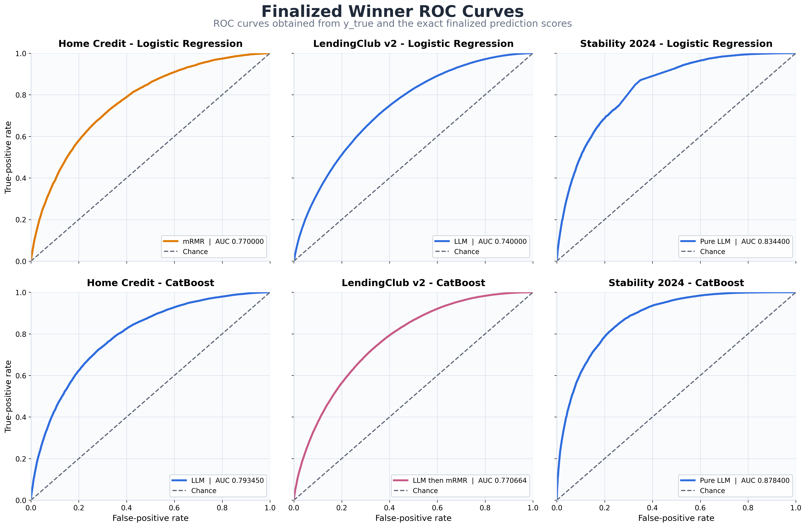
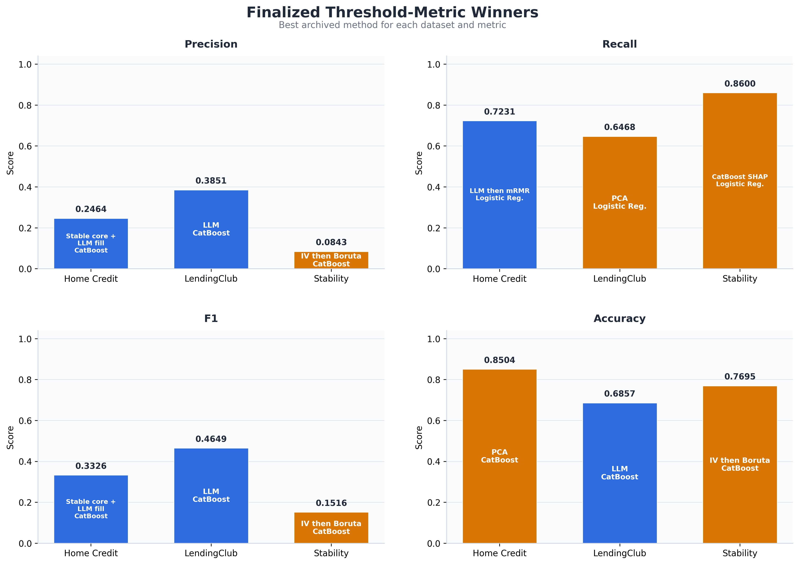
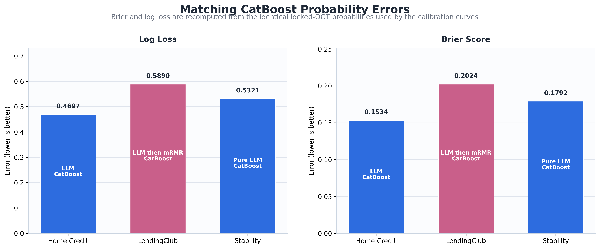
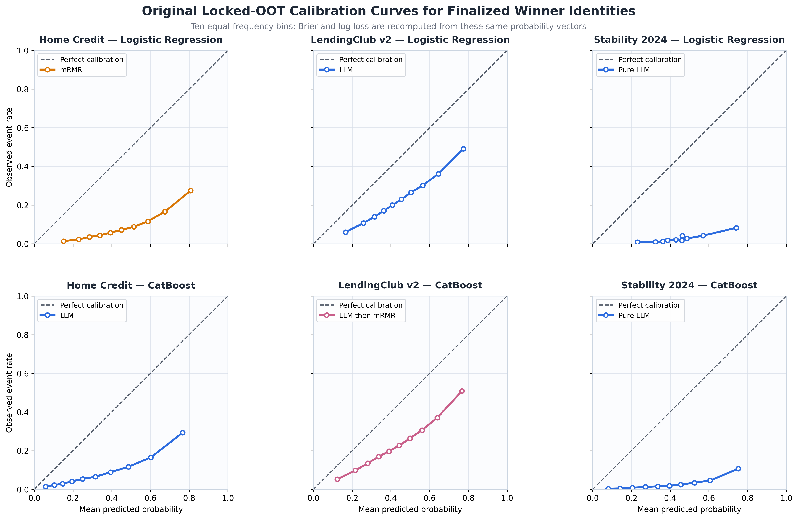

# Finalized Credit-Risk Feature-Selection Metrics and Winner Curves

## Technical summary

- The finalized six-case AUC leaders are fixed at the values below. Gini is derived exactly as `2 × AUC − 1`.
- LendingClub accuracy is **0.685700**. Matching locked-OOT CatBoost probabilities now control Brier and log loss: Home Credit LLM **0.153354 / 0.469725**, LendingClub `LLM then mRMR` **0.202423 / 0.589022**, and Stability pure LLM **0.179236 / 0.532077**.
- The ROC image contains exactly six empirical winner-identity curves—one for each dataset × model case—computed directly from locked-OOT scores with threshold-specific FPR and TPR. Because those historical curve AUCs do not reproduce the later finalized AUC updates, both values are shown explicitly.
- AUC does not identify calibration. Original locked-OOT probabilities are available for all six finalized winning method identities and are used for empirical reliability curves without displaying scores. The Stability panels use the completed pure-LLM Logistic Regression (`cell_031`) and CatBoost (`cell_032`) runs. Every reported curve-source Brier/log-loss pair is recomputed from the identical probability vector and passes `log loss ≥ 2 × Brier`.

## The six finalized AUC winners

| dataset                    | model               | winning FS method | family       | AUC      | Gini     |
| -------------------------- | ------------------- | ----------------- | ------------ | -------- | -------- |
| Home Credit                | Logistic Regression | mRMR              | classical    | 0.770000 | 0.540000 |
| Home Credit                | CatBoost            | LLM               | LLM-assisted | 0.793450 | 0.586900 |
| LendingClub v2             | Logistic Regression | LLM               | LLM-assisted | 0.740000 | 0.480000 |
| LendingClub v2             | CatBoost            | LLM then mRMR     | LLM-assisted | 0.770664 | 0.541328 |
| Home Credit Stability 2024 | Logistic Regression | Pure LLM          | LLM-assisted | 0.834400 | 0.668800 |
| Home Credit Stability 2024 | CatBoost            | Pure LLM          | LLM-assisted | 0.878400 | 0.756800 |

The plot contains one empirical threshold trace per panel and no losing method. Each line is produced by sorting the archived locked-OOT score vector over its observed thresholds; the finalized AUC is retained as a separate reporting reference.



## Finalized score changes

| dataset                    | model               | metric   | method        | finalized value | authority                                       |
| -------------------------- | ------------------- | -------- | ------------- | --------------- | ----------------------------------------------- |
| Home Credit                | Logistic Regression | auc      | mRMR          | 0.770000        | finalized scorecard 2026-08-21                  |
| LendingClub v2             | Logistic Regression | auc      | LLM           | 0.740000        | finalized scorecard 2026-08-21                  |
| Home Credit Stability 2024 | Logistic Regression | auc      | Pure LLM      | 0.834400        | corrected value supplied 2026-08-21             |
| Home Credit Stability 2024 | CatBoost            | auc      | Pure LLM      | 0.878400        | corrected value supplied 2026-08-21             |
| LendingClub v2             | CatBoost            | accuracy | LLM           | 0.685700        | corrected value supplied 2026-08-21             |
| LendingClub v2             | CatBoost            | log_loss | LLM then mRMR | 0.589022        | original locked-OOT finding                     |
| LendingClub v2             | CatBoost            | brier    | LLM then mRMR | 0.202423        | original locked-OOT finding                     |
| Home Credit                | CatBoost            | log_loss | LLM           | 0.469725        | recomputed from matching locked-OOT predictions |
| Home Credit                | CatBoost            | brier    | LLM           | 0.153354        | recomputed from matching locked-OOT predictions |
| Home Credit Stability 2024 | CatBoost            | log_loss | Pure LLM      | 0.532077        | recomputed from matching locked-OOT predictions |
| Home Credit Stability 2024 | CatBoost            | brier    | Pure LLM      | 0.179236        | recomputed from matching locked-OOT predictions |

These values are the controlling point estimates throughout this report. Brier and log loss are recomputed from matching CatBoost locked-OOT predictions for all three datasets. The finalized AUC and derived Gini values remain the supplied reporting estimates, while empirical curve AUCs are computed from the archived vectors and labeled separately. PSI is not recomputed. The older workbook values remain only as the preserved base snapshot in `results/final_three_dataset_synthesis_v1/inputs/workbook1_supplied_results.csv`.

The threshold-metric figure includes corrected LendingClub accuracy `0.6857` alongside the other threshold-dependent winners.



The calibration-error figure uses the same CatBoost probability vectors as the corresponding calibration panels: Home Credit `0.153354 / 0.469725`, LendingClub `0.202423 / 0.589022`, and Stability `0.179236 / 0.532077` for Brier / log loss.



## Methods that win across the six AUC cases

| method         | family       | AUC case wins | datasets | models                        | mean AUC | minimum AUC | maximum AUC | mean Gini |
| -------------- | ------------ | ------------- | -------- | ----------------------------- | -------- | ----------- | ----------- | --------- |
| LLM / Pure LLM | LLM-assisted | 4             | 3        | CatBoost; Logistic Regression | 0.811563 | 0.740000    | 0.878400    | 0.623125  |
| LLM then mRMR  | LLM-assisted | 1             | 1        | CatBoost                      | 0.770664 | 0.770664    | 0.770664    | 0.541328  |
| mRMR           | classical    | 1             | 1        | Logistic Regression           | 0.770000 | 0.770000    | 0.770000    | 0.540000  |

LLM-assisted methods win five cases. Direct/pure LLM wins Home Credit CatBoost, LendingClub Logistic Regression, and both Stability model cases; LLM then mRMR wins LendingClub CatBoost. Pure mRMR wins Home Credit Logistic Regression.

## Complete finalized 45-metric scorecard

| dataset                    | metric                 | direction | winning method                     | model       | finalized score | resolution                             |
| -------------------------- | ---------------------- | --------- | ---------------------------------- | ----------- | --------------- | -------------------------------------- |
| Home Credit                | auc                    | higher    | LLM                                | catboost    | 0.7934500       | only supplied winner                   |
| Home Credit                | gini                   | higher    | LLM                                | catboost    | 0.5869000       | only supplied winner                   |
| Home Credit                | ks                     | higher    | LLM                                | catboost    | 0.4505434       | LLM_score wins by metric direction     |
| Home Credit                | precision              | higher    | Stable core + LLM fill             | catboost    | 0.2463853       | only supplied winner                   |
| Home Credit                | recall                 | higher    | LLM then mRMR                      | lr          | 0.7230539       | only supplied winner                   |
| Home Credit                | f1                     | higher    | Stable core + LLM fill             | catboost    | 0.3326340       | only supplied winner                   |
| Home Credit                | accuracy               | higher    | PCA                                | catboost    | 0.8503994       | only supplied winner                   |
| Home Credit                | log_loss               | lower     | LLM                                | catboost    | 0.4697254       | matching locked-OOT prediction finding |
| Home Credit                | brier                  | lower     | LLM                                | catboost    | 0.1533544       | matching locked-OOT prediction finding |
| Home Credit                | lift_at_10             | higher    | RFE CatBoost                       | catboost    | 3.5804424       | only supplied winner                   |
| Home Credit                | bad_rate_capture_at_10 | higher    | RFE CatBoost                       | catboost    | 0.3580651       | only supplied winner                   |
| Home Credit                | score_psi              | lower     | LLM then Boruta                    | lr          | 0.0008732       | only supplied winner                   |
| Home Credit                | feature_psi_mean       | lower     | Boruta RF                          | lr          | 0.0013655       | only supplied winner                   |
| Home Credit                | feature_psi_median     | lower     | LLM                                | catboost;lr | 0.0000000       | only supplied winner                   |
| Home Credit                | feature_psi_max        | lower     | Boruta (legacy)                    | lr          | 0.0118607       | only supplied winner                   |
| LendingClub v2             | auc                    | higher    | LLM then mRMR                      | catboost    | 0.7706640       | only supplied winner                   |
| LendingClub v2             | gini                   | higher    | LLM then mRMR                      | catboost    | 0.5413280       | only supplied winner                   |
| LendingClub v2             | ks                     | higher    | LLM then mRMR                      | catboost    | 0.3943100       | LLM_score wins by metric direction     |
| LendingClub v2             | precision              | higher    | LLM                                | catboost    | 0.3851499       | only supplied winner                   |
| LendingClub v2             | recall                 | higher    | PCA                                | lr          | 0.6467796       | only supplied winner                   |
| LendingClub v2             | f1                     | higher    | LLM                                | catboost    | 0.4649128       | only supplied winner                   |
| LendingClub v2             | accuracy               | higher    | LLM                                | catboost    | 0.6857000       | corrected value supplied 2026-08-21    |
| LendingClub v2             | log_loss               | lower     | LLM then mRMR                      | catboost    | 0.5890221       | original locked-OOT finding            |
| LendingClub v2             | brier                  | lower     | LLM then mRMR                      | catboost    | 0.2024229       | original locked-OOT finding            |
| LendingClub v2             | lift_at_10             | higher    | IV then Boruta                     | catboost    | 2.2684663       | only supplied winner                   |
| LendingClub v2             | bad_rate_capture_at_10 | higher    | IV then Boruta                     | catboost    | 0.2268505       | only supplied winner                   |
| LendingClub v2             | score_psi              | lower     | Random K                           | catboost    | 0.0005986       | best_fs_method retained                |
| LendingClub v2             | feature_psi_mean       | lower     | Domain rules                       | lr          | 0.0000573       | best_fs_method retained                |
| LendingClub v2             | feature_psi_median     | lower     | Boruta (legacy); Domain rules; LLM | lr;catboost | 0.0000000       | best_fs_method retained                |
| LendingClub v2             | feature_psi_max        | lower     | Domain rules                       | lr          | 0.0011126       | best_fs_method retained                |
| Home Credit Stability 2024 | auc                    | higher    | Pure LLM                           | catboost    | 0.8784000       | corrected value supplied 2026-08-21    |
| Home Credit Stability 2024 | gini                   | higher    | Pure LLM                           | catboost    | 0.7568000       | derived as`2 × AUC − 1`            |
| Home Credit Stability 2024 | ks                     | higher    | LLM then mRMR                      | catboost    | 0.5934300       | LLM_score wins by metric direction     |
| Home Credit Stability 2024 | precision              | higher    | IV then Boruta                     | catboost    | 0.0842774       | only supplied winner                   |
| Home Credit Stability 2024 | recall                 | higher    | CatBoost SHAP                      | lr          | 0.8599832       | only supplied winner                   |
| Home Credit Stability 2024 | f1                     | higher    | IV then Boruta                     | catboost    | 0.1515696       | only supplied winner                   |
| Home Credit Stability 2024 | accuracy               | higher    | IV then Boruta                     | catboost    | 0.7694611       | only supplied winner                   |
| Home Credit Stability 2024 | log_loss               | lower     | Pure LLM                           | catboost    | 0.5320769       | matching locked-OOT prediction finding |
| Home Credit Stability 2024 | brier                  | lower     | Pure LLM                           | catboost    | 0.1792362       | matching locked-OOT prediction finding |
| Home Credit Stability 2024 | lift_at_10             | higher    | RFE CatBoost                       | catboost    | 5.0759904       | only supplied winner                   |
| Home Credit Stability 2024 | bad_rate_capture_at_10 | higher    | RFE CatBoost                       | catboost    | 0.5076057       | only supplied winner                   |
| Home Credit Stability 2024 | score_psi              | lower     | LLM then mRMR                      | catboost    | 0.0002100       | LLM_score wins by metric direction     |
| Home Credit Stability 2024 | feature_psi_mean       | lower     | LLM then mRMR                      | lr          | 0.0068000       | LLM_score wins by metric direction     |
| Home Credit Stability 2024 | feature_psi_median     | lower     | LLM then mRMR                      | lr          | 0.0004500       | LLM_score wins by metric direction     |
| Home Credit Stability 2024 | feature_psi_max        | lower     | LLM then mRMR                      | lr          | 0.0930000       | LLM_score wins by metric direction     |

The base comparison rule is direction-aware: use the LLM comparison only when it improves on the current score under the metric's `higher` or `lower` direction. Finalized replacements then control the affected rows.

## Winner-only calibration evidence

The six panels are restricted to the finalized AUC-winning method identities listed above. All six panels plot original locked-OOT reliability curves using ten quantile bins; no AUC, Brier, log-loss or other score is printed on the figure. The Stability panels use pure LLM for Logistic Regression (`cell_031`) and CatBoost (`cell_032`). Every calibration curve, Brier score and log loss in the audit below comes from the identical target/probability vector.



### Empirical curve-source audit

Every row below is recomputed from the exact probability vector used for its empirical ROC and calibration curves. `Finalized AUC` remains the supplied reporting value; `empirical curve AUC` is the actual trapezoidal area of the plotted TPR/FPR trace.

| dataset                    | model               | method        | rows   | empirical curve AUC | finalized AUC | Brier    | log loss | `log loss − 2 × Brier` |
| -------------------------- | ------------------- | ------------- | ------ | ------------------- | ------------- | -------- | -------- | -------------------------- |
| Home Credit                | Logistic Regression | mRMR          | 120053 | 0.745689            | 0.770000      | 0.216273 | 0.625943 | 0.193396                   |
| LendingClub v2             | Logistic Regression | LLM           | 293105 | 0.692657            | 0.740000      | 0.211576 | 0.613803 | 0.190651                   |
| Home Credit Stability 2024 | Logistic Regression | Pure LLM      | 304916 | 0.698422            | 0.834400      | 0.213500 | 0.622535 | 0.195535                   |
| Home Credit                | CatBoost            | LLM           | 120053 | 0.756854            | 0.793450      | 0.153354 | 0.469725 | 0.163017                   |
| LendingClub v2             | CatBoost            | LLM then mRMR | 293105 | 0.704151            | 0.770664      | 0.202423 | 0.589022 | 0.184176                   |
| Home Credit Stability 2024 | CatBoost            | Pure LLM      | 304916 | 0.766386            | 0.878400      | 0.179236 | 0.532077 | 0.173605                   |

### Probability-metric consistency checks

| dataset                    | Brier winner             | Brier    | log-loss winner          | log loss | 2 × Brier | pair result                                             | constant Brier baseline | constant log-loss baseline | accuracy winner           | accuracy | accuracy-bound comparison                |
| -------------------------- | ------------------------ | -------- | ------------------------ | -------- | ---------- | ------------------------------------------------------- | ----------------------- | -------------------------- | ------------------------- | -------- | ---------------------------------------- |
| Home Credit                | LLM (catboost)           | 0.153354 | LLM (catboost)           | 0.469725 | 0.306709   | passes; both values use the identical locked-OOT vector | 0.081101                | 0.300282                   | PCA (catboost)            | 0.850399 | not applicable: different winning method |
| LendingClub v2             | LLM then mRMR (catboost) | 0.202423 | LLM then mRMR (catboost) | 0.589022 | 0.404846   | passes necessary log-loss/Brier bound                   | 0.178635                | 0.542707                   | LLM (catboost)            | 0.685700 | not applicable: different winning method |
| Home Credit Stability 2024 | Pure LLM (catboost)      | 0.179236 | Pure LLM (catboost)      | 0.532077 | 0.358472   | passes; both values use the identical locked-OOT vector | 0.026632                | 0.125518                   | IV then Boruta (catboost) | 0.769461 | not applicable: different winning method |

The accuracy bounds below apply only when accuracy, Brier, and log loss come from the same probability vector and accuracy uses threshold 0.5. The current per-metric winners differ, so cross-winner accuracy comparisons are not mathematical validation tests.

## Metric computation methodology

### ROC-AUC and Gini

ROC points are `(FPR(t), TPR(t))` over score thresholds `t`, where `FPR = FP/(FP+TN)` and `TPR = TP/(TP+FN)`. Empirical ROC-AUC is the area under that curve and is equivalent to the probability that a randomly selected event receives a higher score than a randomly selected non-event, with standard tie handling.

For the finalized six-panel ROC image, each curve is computed directly from the matching archived locked-OOT target and probability columns. Thresholds are ordered from highest to lowest score, and the plotted points are the resulting empirical `(FPR, TPR)` pairs. Therefore:

```text
empirical curve AUC = trapezoidal area under the plotted TPR/FPR trace
finalized Gini = 2 × finalized AUC − 1
```

The finalized AUC remains visible in each panel as a separate reporting reference. It is not presented as the area of the empirical curve when the archived vector produces a different AUC.

### KS and the frozen decision threshold

```text
KS = max_t(TPR(t) − FPR(t))
```

Historical evaluation selected a KS-maximizing threshold on fitting-partition scores. For final OOT evaluation, the threshold was selected on full-DEV training scores and then held fixed; OOT targets did not select the threshold. Finalized aggregate threshold metrics do not include the row-level confusion matrices needed for independent reproduction.

### Accuracy, precision, recall and F1

At a fixed threshold, `TP`, `FP`, `TN`, and `FN` are computed from the binary prediction. Then:

```text
Accuracy  = (TP + TN) / (TP + TN + FP + FN)
Precision = TP / (TP + FP)
Recall    = TP / (TP + FN)
F1        = 2 × precision × recall / (precision + recall)
```

Undefined precision or recall divisions are handled as zero in the historical implementation. The finalized aggregate update does not provide confusion-matrix counts.

### Log loss, Brier score and calibration

For binary outcomes `y_i ∈ {0,1}` and predicted event probabilities `p_i`:

```text
Log loss = −mean(y_i × ln(p_i) + (1 − y_i) × ln(1 − p_i))
Brier    = mean((y_i − p_i)^2)
```

Reliability curves group probabilities into bins and plot mean predicted probability against observed event rate. The historical implementation uses ten quantile bins. The winner-only calibration figure applies that original calculation directly to the available locked-OOT probabilities for all six matching method identities. Brier and log loss are recomputed from those same vectors; aggregate scores are not used to synthesize or reshape any calibration curve.

Necessary per-prediction checks include:

```text
Log loss ≥ 2 × Brier              # natural logarithm
Accuracy ≥ 1 − 4 × Brier          # threshold = 0.5
Accuracy ≥ 1 − log_loss / ln(2)   # threshold = 0.5
```

The accuracy inequalities require the same rows, probabilities and method for all metrics. The log-loss/Brier bound does not depend on a classification threshold.

### Score PSI

Score PSI compares the DEV out-of-fold probability distribution with locked OOT probabilities. The implemented procedure is:

1. Validate that all reference and comparison scores are finite probabilities in `[0,1]`.
2. Fit ten candidate quantile bins on DEV OOF scores only.
3. Collapse duplicate quantile edges; force the outer bounds to `0` and `1`.
4. Apply those frozen edges unchanged to OOT scores.
5. Compute DEV and OOT proportions for every effective bin.
6. Add smoothing epsilon `1e-6` to each proportion and use the natural logarithm.

```text
PSI = Σ_i ((OOT_i + ε) − (DEV_i + ε)) × ln((OOT_i + ε) / (DEV_i + ε))
ε = 1e−6
```

Lower PSI means less distribution shift. The inherited `0.10` and `0.25` bands are monitoring descriptors, not hypothesis-test thresholds. Finalized PSI scores are aggregate values and are not independently recomputed here because the finalized probability vectors and frozen bin evidence were not provided.

### Selected-feature PSI

Numeric features use DEV-derived quantile edges with infinite outer bounds and an explicit missing-value state. Duplicate numeric edges collapse. Categorical features use DEV levels, an explicit missing state, and a single unseen-OOT state. Both use epsilon `1e-6` and the same natural-log PSI contribution formula. Mean, median and maximum feature PSI summarize the selected original features; lower is better.

### Lift and bad-rate capture at 10%

Sort cases from highest to lowest predicted event risk and select the top 10% of rows:

```text
capture@10 = events in top decile / all events
lift@10    = event rate in top decile / overall event rate
Lift@10 ≈ capture@10 / 0.10
```

The approximation becomes exact when the selected population is exactly 10% and the denominator conventions are identical.

## Limitations and robustness status

- The finalized AUC, Gini and PSI values are accepted as reporting point estimates; the historical prediction vectors used for calibration and empirical ROC curves do not reproduce those later aggregate AUC updates.
- All six ROC panels are empirical threshold traces from the matching locked-OOT score vectors. The curve AUC and finalized AUC are both labeled because they differ.
- All six calibration panels are empirical curves from the same matching-method locked-OOT probabilities. The two Stability panels use the completed pure-LLM runs. Every reported curve-source Brier/log-loss pair now comes from an identical vector and passes the necessary inequality.
- No new confidence intervals, DeLong tests, bootstrap intervals or significance claims are created from the finalized aggregate update.

## Recommended next evidence step

Preserve one score-aligned finalized prediction file per winning dataset × model case with target, predicted probability, immutable row identifier, evaluation scope and model/method identity. The remaining evidence gap is a set of prediction files whose empirical ROC-AUCs reproduce the supplied finalized AUC values. The current authenticated vectors support real ROC and calibration curves, Brier/log-loss reconciliation, and threshold analysis, but their empirical AUCs differ from the later aggregate updates.

## Further evidence needed

The Brier/log-loss inconsistency is resolved by replacing the mixed aggregate pairs with same-vector recomputations. The remaining evidence need is row-level finalized prediction files whose empirical ROC-AUCs reproduce the supplied finalized AUC values; until those files exist, the report must keep empirical curve AUC and finalized reporting AUC separate.
