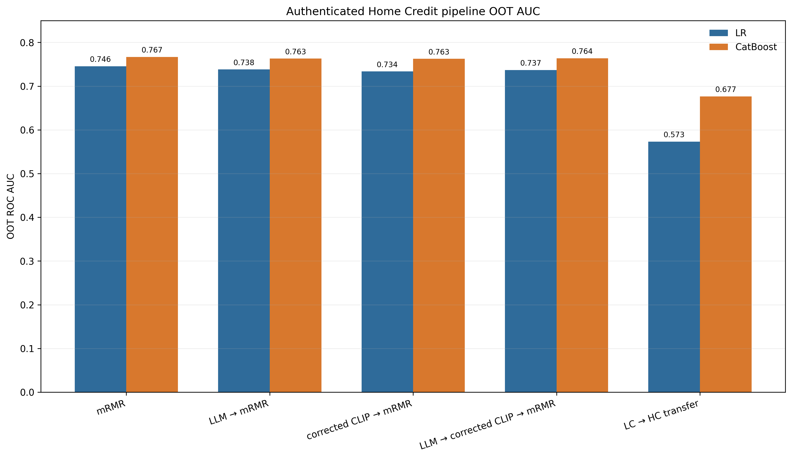
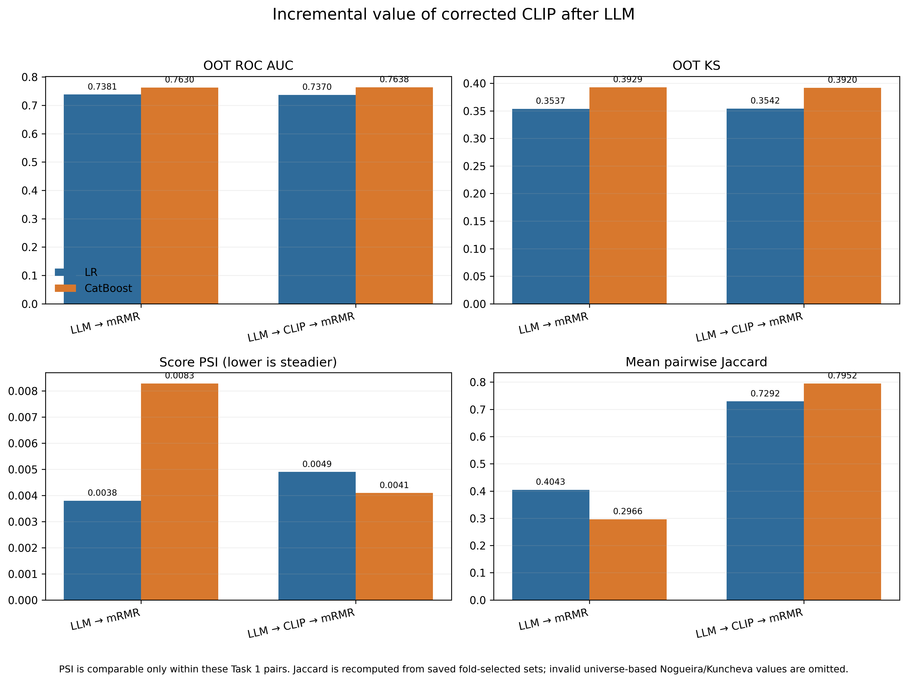
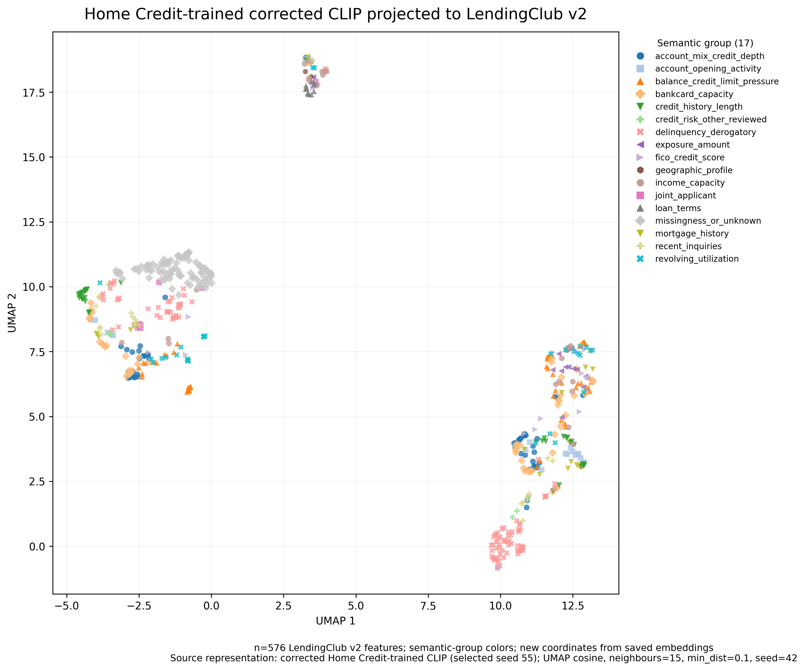
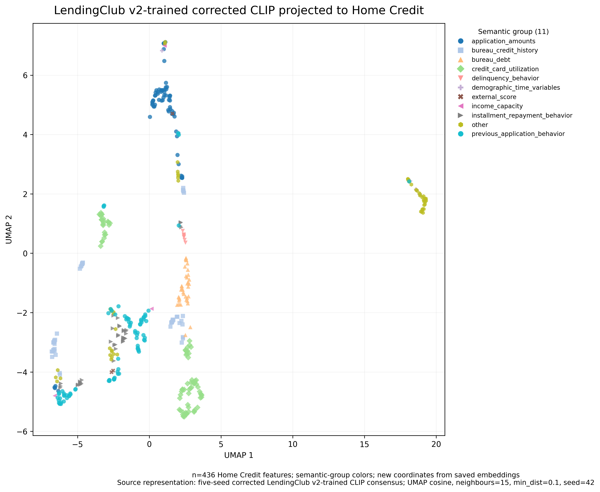
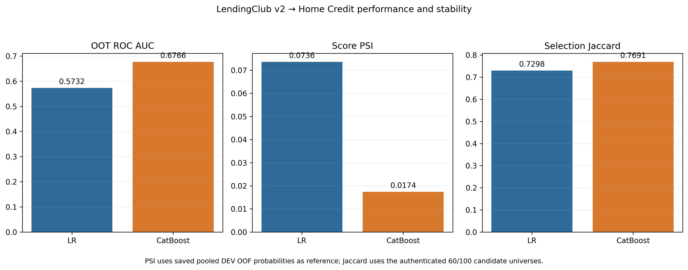

# Corrected CLIP Credit-Feature Research: Complete Task 1 Comparison and Directional Transfer Evidence

## Abstract

This revision closes two reporting gaps in the original final package without rerunning any scientific stage. First, it authenticates the standalone LLM → mRMR pipeline and compares it directly with corrected CLIP → mRMR and LLM → corrected CLIP → mRMR for Home Credit Logistic Regression (LR) and CatBoost. Second, it separates the two representation-transfer directions: a Home Credit-trained corrected CLIP representation projected onto 576 LendingClub v2 features, and a five-seed LendingClub v2-trained corrected CLIP consensus projected onto 436 Home Credit features. All predictive values come from saved row-level OOT predictions or their authenticated metric artifacts; all embedding diagnostics are new read-only calculations from saved matrices.

The central incremental result is mixed. For LR, adding corrected CLIP after LLM changed OOT AUC from 0.738098 to 0.736996 (Δ -0.001102) and KS from 0.353691 to 0.354224 (Δ +0.000533); this is not a predictive improvement. Pairwise feature-selection Jaccard rose from 0.404344 to 0.729185, but score PSI increased slightly from 0.003798 to 0.004898. For CatBoost, AUC rose by only +0.000866, while KS fell by 0.000878; the changes do not establish meaningful predictive improvement. CatBoost stability was clearer: PSI fell from 0.008286 to 0.004094 and Jaccard rose from 0.296557 to 0.795195.

Both directional embedding spaces show local semantic structure far above shuffled-label references, but their taxonomies differ and their UMAP coordinates are not directly comparable. Reverse downstream prediction was materially weaker than Home Credit-trained pipelines. Representation evidence is therefore bidirectional; competitive predictive evidence is not.

## 1. Research questions

The revision answers eight linked but distinct questions. How well does LLM → mRMR perform? How well does corrected CLIP → mRMR perform? How well does their combination perform? Does corrected CLIP add OOT AUC, OOT KS, score stability, or feature-selection stability after the LLM? Does that answer depend on the downstream learner? What structure is visible in each transfer direction? Does either direction support competitive downstream predictive transfer? Finally, is the evidence for bidirectional representation structure stronger than the evidence for bidirectional prediction?

These questions must remain separate. An embedding can preserve semantic neighbourhoods without preserving outcome discrimination. A candidate selector can become more stable while AUC remains unchanged. A low PSI can indicate a steady score distribution even when the score ranks risk poorly. A UMAP can faithfully display local geometry without proving that any displayed cluster has predictive value. The report therefore treats OOT discrimination, score distribution stability, feature-set reproducibility, and embedding structure as different evidence classes.

The source hierarchy follows the audit specification. Saved row-level predictions receive priority, followed by prediction and metric manifests, completed stage manifests, feature-selection manifests, embedding manifests, registries, and finally the v1 report as a writing reference. The deleted 182-run matrix was not restored or used. Old-policy CLIP checkpoints and their dependent results were excluded.

## 2. Data and validation design

Home Credit combines borrower application data with bureau, previous-application, installment, point-of-sale, and credit-card aggregates. LendingClub v2 represents a different lending process and feature vocabulary, including revolving utilization, inquiry, delinquency, credit-depth, FICO, mortgage, exposure, and loan-term groups. The domains overlap conceptually but not by row identity or feature taxonomy.

The Home Credit comparison uses the same declared DEV interval, days [-600, -240), and OOT interval, days [-240, 0). Every authenticated Home Credit OOT prediction file contains 120,053 rows. Task 1 files retain targets and probabilities but not stable borrower identifiers. Their OOT AUC and KS can be reproduced exactly, but dataframe row position is not treated as identity, cross-method paired testing is not attempted, and historical mean fold AUC is not relabelled as pooled OOF AUC. DEV OOF rows, pooled OOF AUC, and AUC drop are therefore blank for the four Home Credit-trained pipelines.

The reverse-transfer workflow has stronger row provenance. Its prediction files retain `SK_ID_CURR`; 82,647 pooled DEV OOF rows reconcile to validation folds, and 120,053 OOT rows are authenticated through prediction and metric manifests. Its AUC drop is DEV OOF AUC minus OOT AUC. LR has DEV OOF AUC 0.589015 and OOT AUC 0.573203, giving +0.015813. CatBoost has DEV OOF AUC 0.656325 and OOT AUC 0.676603, giving -0.020278.

Task 1 PSI is calculated by the shared historical pipeline from final DEV-fit in-sample scores versus OOT scores. Because the standalone and combined methods use the same Home Credit windows and implementation, PSI is methodologically comparable within each Task 1 model pair. Reverse-transfer PSI instead uses saved pooled DEV OOF probabilities as reference, frozen DEV-quantile bins, and OOT probabilities as comparison. Task 1 and reverse PSI are retained but not compared numerically as if their reference scopes were identical.

## 3. Methodology

### LLM semantic screening

The LLM stage is a domain-facing screen. It uses names, descriptions, and semantic context to prioritize plausible credit-risk features before supervised selection. It does not learn borrower-level predictions and does not authenticate temporal performance. In the saved LLM → mRMR workflow, each LR fold and final-DEV selection uses a 60-feature LLM candidate list; CatBoost uses 100. The trace contains six scopes per model—five folds and final DEV—and confirms these widths.

Semantic screening can remove obviously irrelevant or redundant concepts early, reducing the supervised search space. It can also be imperfect because a feature name may conceal useful transformations or because semantically plausible variables may carry little incremental target signal. Its value must therefore be judged downstream and cannot be inferred from prompt quality alone.

### Corrected CLIP representation filtering

Corrected CLIP aligns text descriptions with target-free statistical descriptors. The corrected negative policy is `identity_equivalence_v2`: only verified identity-equivalent pairs are masked as non-negatives. Same source table, broad family, text similarity, or statistical similarity are diagnostic relations rather than broad exclusions. Five corrected seeds are available for both representation programmes, and old invalid checkpoints were rejected.

For the Home Credit-trained representation, LendingClub v2 supplied external-validation pairs only. It was not used for training or checkpoint selection. The selected seed-55 checkpoint projects each of 576 LendingClub features into a saved 32-dimensional joint space. For reverse transfer, five LendingClub-trained seed spaces were aligned to seed 11 by orthogonal Procrustes transformation, averaged after normalization, and normalized again. Frozen projection produced a 436-row Home Credit consensus matrix without external refitting.

### mRMR supervised selection

mRMR supplies the target-aware stage. It selects variables that are relevant to the Home Credit outcome while penalizing redundancy. It operates inside DEV only and reduces 60 candidates to 20 for LR or 100 candidates to 40 for CatBoost. The baseline mRMR rows begin from all 529 authenticated Home Credit candidates.

### Why the three roles are complementary

The LLM answers whether a feature is semantically plausible; corrected CLIP answers whether semantic and target-free statistical views form a coherent representation; mRMR answers whether candidates add supervised relevance without excessive duplication. These are complementary filters, not interchangeable estimators. The incremental experiment is necessary precisely because conceptual complementarity does not guarantee an empirical gain.

## 4. Complete Home Credit pipeline comparison

The complete table is [final_results_tables.csv](final_results_tables.csv). Figure 1 uses only authenticated OOT AUC values and begins at zero.

*Figure 1. OOT ROC AUC for the Home Credit mRMR baseline, LLM → mRMR, corrected CLIP → mRMR, LLM → corrected CLIP → mRMR, and LendingClub → Home Credit reverse transfer. Bars are grouped by LR and CatBoost. Sources: saved OOT prediction paths recorded in `final_results_tables.csv`; the y-axis begins at zero.*

The full mRMR baseline reached LR AUC 0.745689, KS 0.361827, and Jaccard 0.641672 with 20 of 529 features. CatBoost reached AUC 0.766839, KS 0.401700, and Jaccard 0.603699 with 40 features. These were the strongest AUC values among the required Home Credit-trained rows, though no paired significance claim is possible.

LLM → mRMR reached LR AUC 0.738098, KS 0.353691, score PSI 0.003798, and Jaccard 0.404344. CatBoost reached AUC 0.762954, KS 0.392924, PSI 0.008286, and Jaccard 0.296557. The candidate pools were 60 and 100, not 529.

Corrected CLIP → mRMR reached LR AUC 0.733640, KS 0.339043, PSI 0.022295, and Jaccard 0.764257. CatBoost reached AUC 0.762676, KS 0.392483, PSI 0.024615, and Jaccard 0.802773. Corrected CLIP alone therefore produced a stable selector but did not exceed the full mRMR baseline.

The combined LLM → corrected CLIP → mRMR pipeline reached LR AUC 0.736996, KS 0.354224, PSI 0.004898, and Jaccard 0.729185. CatBoost reached AUC 0.763820, KS 0.392046, PSI 0.004094, and Jaccard 0.795195.

The saved Task 1 Nogueira and Kuncheva values are not reported. Their files specify a 529-feature universe, but the authenticated selection manifests show 60 and 100 candidates. Those measures depend on the universe size. Mean pairwise Jaccard was independently recomputed from the five saved fold-selected sets and matched the saved Jaccard scalar exactly, so it is the valid stability comparator.

## 5. Incremental value of corrected CLIP after LLM

[task1_incremental_comparison.csv](task1_incremental_comparison.csv) records each input value, difference, direction, comparability decision, and required categorical conclusion.

*Figure 2. Direct LLM → mRMR versus LLM → corrected CLIP → mRMR comparison. AUC, KS, comparable within-Task-1 PSI, and independently verified pairwise Jaccard are shown separately. Sources are the saved OOT metrics and fold-selected feature sets listed in `final_results_tables.csv`.*

### LR result

For LR, combined minus LLM-only AUC is -0.001102; AUC became slightly lower. KS changed by +0.000533, a tiny increase. These changes point in opposite directions and are too small, without paired testing, to support a meaningful predictive improvement. The correct predictive conclusion is that LR did not benefit.

Score PSI changed by +0.001100; because lower is preferred, score stability was slightly worse. Pairwise Jaccard changed by +0.324841, a large increase in fold-to-fold feature overlap. LR therefore shows improved feature-selection stability but not improved score stability. Under the required categories, the overall available evidence is inconclusive rather than uniformly positive.

### CatBoost result

For CatBoost, combined minus LLM-only AUC is +0.000866. KS changed by -0.000878. The AUC increase is under one-thousandth and KS moved in the opposite direction. With no stable row IDs for a paired test, this is not evidence of a meaningful predictive improvement or equivalence.

CatBoost score PSI changed by -0.004192, a lower and therefore better value. Jaccard changed by +0.498638. CatBoost consequently supports improved score and feature-selection stability, but not clear predictive improvement. The required category is “corrected CLIP improved stability but not prediction.”

Across models, corrected CLIP after LLM primarily regularized which features were selected. It did not produce a consistent incremental AUC or KS gain. This is a mixed result: representation filtering contributed reproducibility, especially for CatBoost, without guaranteeing stronger discrimination.

## 6. Forward transfer: Home Credit-trained corrected CLIP → LendingClub v2

The forward matrix is `results/corrected_homecredit_clip/training/lendingclub_v2_joint_embeddings.parquet`. It contains 576 unique LendingClub v2 feature names, 32 saved joint dimensions, complete semantic-group labels, the corrected policy identifier, and the selected corrected checkpoint hash. The training manifests state that LendingClub v2 was external validation and was not used for training or checkpoint selection. The UMAP was newly calculated from this immutable matrix; no embedding was regenerated.

*Figure 3. Home Credit-trained corrected CLIP projected to 576 LendingClub v2 features, colored by 17 LendingClub semantic groups. Coordinates were newly calculated from the saved 32-dimensional embedding matrix using cosine UMAP, 15 neighbours, minimum distance 0.1, two components, and seed 42. UMAP axes have no direct substantive interpretation. Source: `results/corrected_homecredit_clip/training/lendingclub_v2_joint_embeddings.parquet`.*

Original-space cosine kNN purity at k=10 is 0.528125. With labels shuffled 200 times and embeddings fixed, the mean is 0.101023, the 95th percentile is 0.108186, and the 97.5th percentile is 0.110430. UMAP trustworthiness at k=10 is 0.979712. The observed local agreement is far above chance and the two-dimensional plot preserves local neighbourhoods well.

This supports forward representation transfer: a Home Credit-trained mapping organizes LendingClub features in a way that corresponds to LendingClub semantic labels. It does not support a downstream performance claim because no valid corrected Home Credit → LendingClub downstream prediction run is available. Forward representation success is therefore stronger than forward predictive evidence.

## 7. Reverse transfer: LendingClub v2-trained corrected CLIP → Home Credit

The reverse matrix is `results/corrected_lendingclub_to_homecredit_transfer/reverse_projection/homecredit_reverse_embeddings.parquet`. All five seed files exist and contain the same 436 feature IDs. Their spaces were aligned to seed 11 using orthogonal Procrustes alignment and aggregated by normalized mean. Feature IDs reconcile one-to-one to the saved Home Credit semantic metadata. Of 531 reverse-reconciliation records, 436 are compatible and 95 are excluded for missing semantic text embeddings.

*Figure 4. Five-seed LendingClub v2-trained corrected CLIP consensus projected without refitting to 436 Home Credit features, colored by 11 represented Home Credit semantic groups. UMAP settings match Figure 3. Axes have no direct substantive interpretation, and coordinates cannot be compared geometrically with Figure 3. Source: `results/corrected_lendingclub_to_homecredit_transfer/reverse_projection/homecredit_reverse_embeddings.parquet`.*

Reverse original-space kNN purity is 0.753899; the shuffled mean is 0.140146, the 95th percentile is 0.151204, and the 97.5th percentile is 0.153905. Trustworthiness is 0.987602. This supports reverse representation transfer. The higher numerical purity than the forward direction must not be treated as a ranking because group definitions, counts, and class imbalance differ materially.

Downstream results are weaker. LR reverse transfer produced OOT AUC 0.573203, KS 0.105769, PSI 0.073590, and Jaccard 0.729844. CatBoost produced AUC 0.676603, KS 0.261132, PSI 0.017395, and Jaccard 0.769056. The direct saved-prediction PSI values supersede older `model_score_psi.csv` scalars that used a different historical calculation.

*Figure 5. Reverse-transfer OOT AUC, pooled-OOF-reference score PSI, and corrected pairwise Jaccard. Sources: direct prediction metrics and corrected stability files under `results/corrected_lendingclub_to_homecredit_transfer/downstream/`.*

Reverse LR is not useful as a competitive predictor: its AUC is only 0.573203. CatBoost recovers more discrimination but remains 0.090236 below the Home Credit mRMR baseline and 0.087216 below the combined Task 1 pipeline. Reverse transfer is therefore technically valid and representationally structured, but not competitive downstream.

## 8. Bidirectional evidence synthesis

At the representation level, both directions pass a meaningful test. Each saved external matrix maps uniquely to feature identities and labels. In both spaces, observed kNN semantic purity is several times the shuffled-label upper reference, and UMAP trustworthiness is high. This is stronger evidence than visual clustering alone because the diagnostic is calculated in the original 32-dimensional space.

At the predictive level, the evidence is asymmetric. Reverse LendingClub → Home Credit has complete downstream OOF/OOT evaluation, but performance is weaker than within-Home-Credit alternatives. Forward Home Credit → LendingClub has an authenticated external embedding matrix but no corrected downstream prediction run. The absence of a forward model is not filled with scalar similarity scores or inferred from UMAP.

Accordingly, bidirectional representation evidence is stronger than bidirectional predictive evidence. General credit-feature signatures may have been learned at a moderate level, but robust bidirectional downstream prediction is not established. The most defensible wording is that corrected CLIP transferred semantic-statistical structure in both directions while competitive predictive transfer was not demonstrated.

## 9. Discussion

The main incremental experiment shows why layered methods must be evaluated rather than presumed superior. Adding a representation filter after the LLM made fold-selected sets much more reproducible, particularly for CatBoost. This suggests that corrected CLIP imposed a coherent ordering within the semantic candidate pool. Yet the predictive changes were negligible and inconsistent: LR AUC declined, CatBoost AUC rose by less than 0.001, and KS did not improve consistently.

One explanation is that the LLM pool already contained the strongest Home Credit signals, leaving little room for a representation layer to improve discrimination. Another is that CLIP optimizes semantic-statistical alignment, not target ranking. A feature can occupy a meaningful representation neighbourhood while contributing little additional outcome information after stronger variables enter the model. mRMR can also recover target relevance from a broader pool without requiring representation proximity.

The model difference is informative but not causal proof. CatBoost can exploit nonlinear thresholds and interactions, and it showed clearer stability gains than LR. Nevertheless, its tiny AUC change and lower KS prevent a claim that corrected CLIP improved prediction. The proper conclusion is model-dependent stability benefit, not model-dependent predictive superiority.

The directional diagnostics suggest that credit-feature concepts cross datasets despite different schemas. LendingClub groups such as revolving utilization, delinquency, account depth, inquiries, and FICO form a taxonomy different from Home Credit’s application, bureau, installment, previous-application, and credit-card aggregates. Because purity depends on taxonomy granularity and class balance, separate significance against shuffled labels is appropriate; direct ranking is not.

The reverse predictive weakness also demonstrates that representation coherence is not sufficient. Feature-level semantic alignment does not align borrower populations, underwriting regimes, target definitions, missingness processes, or temporal drift. A transferred ranking may identify intelligible features while failing to preserve the dataset-specific relationship between those features and default.

### Evidence reconciliation and practical interpretation

The audit also illustrates why provenance can change the interpretation of an apparently simple metric table. The central reusable registry correctly identifies the required runs and reproduces their OOT values, but it is still an index rather than the most direct evidence. For each required row, this revision opened the saved OOT prediction file, counted its records, and recalculated AUC and KS. It then matched those values to the run summary and registry. This process protects the comparison from similarly named invalid historical CLIP runs and from accidental substitution of aggregate fold values for pooled predictions.

The reverse-transfer PSI discrepancy is a concrete example. The legacy scalar `results/model_score_psi.csv` reflects the older final-fit-score calculation, whereas the later authenticated prediction-metric manifest derives PSI from saved pooled DEV OOF probabilities and saved OOT probabilities. The direct saved-prediction definition has stronger provenance and is used here. Both values remain scientifically explainable within their scopes, but they answer different drift questions. Reporting one without its reference population would create a false contradiction.

The stability reconciliation is equally important. Universe-dependent stability measures can look precise while using the wrong denominator. The Task 1 fold selections are real, and their overlaps are reproducible, but the stored Nogueira/Kuncheva calculation retained the 529-feature upstream universe after screening reduced the selectable set to 60 or 100. Pairwise Jaccard avoids that denominator and exactly reproduces from the five saved fold sets. Consequently, the conclusion that corrected CLIP improved selection reproducibility is supported even though the invalid universe-dependent measures are withheld.

For practical model development, the result argues against automatically adding representation layers to a strong semantic-plus-supervised pipeline. If the objective is discrimination, the combined method needs a prospectively defined minimum gain and paired prediction provenance. If the objective includes governance, reproducible feature sets, or resistance to fold-specific choices, the Jaccard improvement may still be operationally valuable. Those objectives should be declared before model selection rather than retrofitted after observing small AUC changes.

The transfer results suggest a similarly staged decision rule. Representation diagnostics can establish that projection is coherent enough to inspect, but downstream deployment requires a separate threshold for discrimination and temporal behaviour on the external dataset. Here the representation gate is passed in both directions; the predictive gate is not. This distinction prevents a visually persuasive embedding from being promoted into an unsupported model-performance claim.

## 10. Limitations

Task 1 lacks stable borrower IDs and pooled DEV OOF predictions. OOT metrics are exact, but paired method tests and authenticated Task 1 AUC drops are unavailable. Tiny AUC differences cannot be labelled significant or equivalent. The historical PSI uses final DEV-fit scores as reference rather than pooled OOF scores, so Task 1 PSI is comparable within Task 1 pairs but not directly to reverse-transfer PSI.

Task 1’s saved Nogueira and Kuncheva values used the wrong universe size and were excluded. Jaccard remains valid because it depends only on saved fold sets. Corrected CLIP candidate manifests show 60 and 100 actual candidates even where internal stability summaries retain 529.

UMAP is stochastic dimensionality reduction. A fixed seed and common settings make each plot reproducible, but absolute coordinates, rotation, cluster position, and cross-panel location have no substantive interpretation. Quantitative claims rely on original-space kNN purity and shuffled-label controls. Different taxonomies prevent a simple forward-versus-reverse quality ranking.

Forward corrected downstream prediction is absent. Reverse prediction alone cannot establish bidirectional predictive robustness. The package does not reconstruct missing predictions, generate new embeddings, or treat row order as identity. It also does not estimate causal contributions of the LLM, corrected CLIP, or mRMR beyond the saved pipeline contrasts.

## 11. Conclusion

LLM → mRMR is a strong compact Home Credit pipeline, but the full 529-feature mRMR baseline remains descriptively stronger in OOT AUC. Adding corrected CLIP after LLM did not provide a clear incremental predictive gain for either model. LR showed substantially higher feature-selection Jaccard but slightly worse score PSI; CatBoost showed better score and feature-selection stability with only a tiny, untested AUC increase and a small KS decrease. Corrected CLIP therefore contributed representation structure and selector reproducibility without guaranteeing stronger discrimination.

Both transfer directions contain non-random semantic structure in their saved embedding spaces. Reverse downstream prediction is not competitive, and forward downstream evidence is unavailable. The study supports bidirectional representation transfer, not bidirectional predictive robustness.

## Appendix A. Complete result table

The machine-readable table is [final_results_tables.csv](final_results_tables.csv). Empty DEV OOF fields are intentional and prevent mean fold AUC from being substituted for pooled OOF AUC.

## Appendix B. Selected features

Final selected-feature artifacts remain immutable at the source paths recorded in `artifact_inventory.md`. LR uses 20 features and CatBoost 40 for every required pipeline. The report package does not copy or modify those scientific files. Common high-ranked Home Credit signals include external scores, installment repayment behaviour, bureau debt and history, application amounts, and employment or age variables.

## Appendix C. Stable-core members and top-ranked features

The Home Credit stable-core source is `results/corrected_homecredit_clip/stable_core/anchor_members.csv`. The LendingClub reverse anchor source is `results/corrected_lendingclub_to_homecredit_transfer/source_anchor/anchor_members.csv`. Forward learned rankings remain in `results/corrected_homecredit_clip/training/lendingclub_v2_learned_scores.csv`; reverse rankings remain in `results/corrected_lendingclub_to_homecredit_transfer/reverse_projection/homecredit_reverse_scores.csv`. These rankings are representation outputs, not substitutes for downstream performance.

## Appendix D. Directional UMAP settings

Both plots use umap-learn 0.5.12, cosine distance, 15 neighbours, minimum distance 0.1, two components, and random seed 42. Coordinates were newly calculated from saved embeddings. kNN purity uses the validated Task 3 operational implementation at k=10. Shuffled references use 200 label permutations with seed 20260625. Exact coordinates and manifests are under `diagnostics/`.

## Appendix E. Claims matrix

The complete rating, evidence, contrary evidence, limitation, allowed wording, and prohibited wording matrix is [claims_and_evidence.csv](claims_and_evidence.csv).
