# Final Three-Dataset Experiment Synthesis: Complete Metrics and Figures

This report is the quantitative paper-writing reference. DEV and OOT are kept separate; folds are not independent datasets; every unavailable value is NA with an explicit status/reason; and the Prompt 14 classical extension remains a distinct cohort. Exact machine-readable values, including all registered metrics not displayed in compact Markdown, are in the linked CSV tables.

## Metric dictionary

| metric_name | exact_definition | direction_of_improvement | calculation_population | scope | threshold_dependent | confidence_interval_or_test | unavailable_handling |
| --- | --- | --- | --- | --- | --- | --- | --- |
| roc_auc | Area under the ROC curve: probability a random event receives a higher score than a random non-event. | higher | held-out fold or locked OOT | DEV and OOT | no | paired DeLong plus paired target-stratified 2,000-repetition percentile bootstrap where registered | Leave blank/NA with explicit status and reason; never substitute zero. |
| gini | 2 × ROC-AUC − 1. | higher | same as ROC-AUC | DEV and OOT | no | not separately tested | Leave blank/NA with explicit status and reason; never substitute zero. |
| ks | Maximum empirical true-positive-rate minus false-positive-rate across score thresholds. | higher | held-out fold or locked OOT | DEV and OOT | no for maximum statistic | paired bootstrap for registered third-dataset comparisons | Leave blank/NA with explicit status and reason; never substitute zero. |
| ks_threshold | Score threshold at which the empirical KS maximum occurs; descriptive held-out diagnostic. | neither | held-out fold or locked OOT | DEV and OOT | yes | none | Leave blank/NA with explicit status and reason; never substitute zero. |
| frozen_decision_threshold | KS-maximizing threshold learned on the fitting partition; full-DEV training scores for OOT; never optimized on OOT. | neither | training scores then held-out application | DEV and OOT | yes | none | Leave blank/NA with explicit status and reason; never substitute zero. |
| log_loss | Mean negative Bernoulli log likelihood of predicted probabilities. | lower | held-out fold or locked OOT | DEV and OOT | no | descriptive | Leave blank/NA with explicit status and reason; never substitute zero. |
| brier | Mean squared error between event indicator and predicted probability. | lower | held-out fold or locked OOT | DEV and OOT | no | descriptive | Leave blank/NA with explicit status and reason; never substitute zero. |
| accuracy | Share of frozen-threshold class predictions equal to target. | higher, prevalence-dependent | held-out fold or locked OOT | DEV and OOT | yes | descriptive | Leave blank/NA with explicit status and reason; never substitute zero. |
| precision | TP/(TP+FP) at the frozen decision threshold. | higher | held-out fold or locked OOT | DEV and OOT | yes | descriptive | Leave blank/NA with explicit status and reason; never substitute zero. |
| recall_sensitivity | TP/(TP+FN) at the frozen decision threshold. | higher | held-out fold or locked OOT | DEV and OOT | yes | descriptive | Leave blank/NA with explicit status and reason; never substitute zero. |
| f1 | Harmonic mean of precision and recall at the frozen threshold. | higher | held-out fold or locked OOT | DEV and OOT | yes | descriptive | Leave blank/NA with explicit status and reason; never substitute zero. |
| lift_at_10 | Event rate in highest-risk score decile divided by overall event rate. | higher | held-out fold or locked OOT | DEV and OOT | rank cutoff | paired bootstrap where registered | Leave blank/NA with explicit status and reason; never substitute zero. |
| bad_rate_capture_at_10 | Share of all events captured in the highest-risk score decile. | higher | held-out fold or locked OOT | DEV and OOT | rank cutoff | descriptive | Leave blank/NA with explicit status and reason; never substitute zero. |
| score_psi | Population Stability Index comparing DEV out-of-fold score bins with locked OOT scores. | lower drift | DEV OOF reference versus OOT | OOT drift | no | descriptive; original 0.10/0.25 bands are monitoring descriptors, not tests | Leave blank/NA with explicit status and reason; never substitute zero. |
| selected_feature_psi | Type-aware PSI for selected original features between DEV and OOT; numeric and categorical definitions remain distinct. | lower drift | selected features with DEV reference | OOT drift | no | descriptive | Leave blank/NA with explicit status and reason; never substitute zero. |
| mean_pairwise_jaccard | Mean \|A∩B\|/\|A∪B\| over available fold selection sets. | higher stability | fold-selected feature sets | DEV | no | descriptive | Leave blank/NA with explicit status and reason; never substitute zero. |
| nogueira_stability | Registered chance-corrected feature-selection stability estimator. | higher stability | fold-selected feature sets | DEV | no | descriptive where authenticated | Leave blank/NA with explicit status and reason; never substitute zero. |
| kuncheva_stability | Chance-adjusted overlap for fixed-size selection sets. | higher stability | equal-size fold selections | DEV | no | descriptive; unavailable for inapplicable natural support | Leave blank/NA with explicit status and reason; never substitute zero. |
| selection_frequency | Number of folds selecting a feature divided by available authenticated fold sets; companion field also divides by all five registered folds. | context-dependent | authenticated fold selection sets | DEV | no | descriptive | Leave blank/NA with explicit status and reason; never substitute zero. |
| runtime_seconds | Recorded wall-clock or component elapsed seconds. | lower resource use | fit/evaluation cell | DEV and OOT | no | descriptive | Leave blank/NA with explicit status and reason; never substitute zero. |
| peak_process_tree_rss | Maximum resident bytes for the monitored process tree. | lower resource use | authenticated worker/controller scope | DEV and OOT where recorded | no | descriptive | Leave blank/NA with explicit status and reason; never substitute zero. |
| llm_requests_tokens_cost | Authenticated physical/logical request counts, provider tokens, and bounded monetary cost where recorded. | lower resource use | LLM ranking generation | selection | no | descriptive; missing token/cost remains unavailable | Leave blank/NA with explicit status and reason; never substitute zero. |
| auc_effect_size | Comparator ROC-AUC minus registered reference ROC-AUC on identical OOT rows, or paired-fold mean delta in the original diagnostic. | positive favors comparator | registered pair | DEV diagnostic or OOT | no | paired bootstrap interval for OOT; none for five-fold Wilcoxon diagnostic | Leave blank/NA with explicit status and reason; never substitute zero. |
| delong_p_value | Two-sided paired DeLong test for AUC difference on identical OOT rows. | smaller against null | paired OOT predictions | OOT | no | Holm adjusted within frozen dataset-model-reference family | Leave blank/NA with explicit status and reason; never substitute zero. |
| holm_adjusted_p | Step-down Holm familywise-error adjusted p-value. | smaller against null | frozen comparison family | DEV diagnostic or OOT | no | strict adjusted p < .05 where registered | Leave blank/NA with explicit status and reason; never substitute zero. |
| pr_auc | Not registered in the final evidence; therefore not calculated or plotted. | not applicable | not applicable | not registered | no | not registered | Leave blank/NA with explicit status and reason; never substitute zero. |
| specificity | Not registered as a reported final metric; confusion counts remain available where sealed. | not applicable | not applicable | not registered | yes | not registered | Leave blank/NA with explicit status and reason; never substitute zero. |

Source: [`tables/metric_dictionary.csv`](tables/metric_dictionary.csv). PR-AUC and specificity are explicitly marked not registered and are not newly calculated.

## Complete DEV results

The primary three-dataset evidence contains 330 registered fold identities: 283 numeric and 47 explicitly unavailable. The exact fold-level rows—including every registered metric, feature count, runtime component, source path, source hash, status, and reason—are in [`tables/dev_fold_metrics.csv`](tables/dev_fold_metrics.csv). No unsuccessful identity is removed. The table below gives the complete identity-level distribution (mean, sample SD, median, minimum, maximum, valid/unavailable fold counts); the companion fold CSV is authoritative for individual folds.

| evidence_cohort | dataset | configuration_id | method_id | model | requested_k | registered_fold_count | valid_fold_count | unavailable_fold_count | auc_mean | auc_sd | auc_median | auc_min | auc_max | ks_mean | log_loss_mean | brier_mean | runtime_seconds_mean | unavailable_reasons |
| --- | --- | --- | --- | --- | --- | --- | --- | --- | --- | --- | --- | --- | --- | --- | --- | --- | --- | --- |
| canonical_llm_matrix_v2 | homecredit | lr_statistical_mrmr_53a793cb32fe | mrmr | lr | 20 | 5 | 5 | 0 | 0.7362 | 0.0109 | 0.7350 | 0.7200 | 0.7486 | 0.3567 | 0.6048 | 0.2072 | 114.0860 |  |
| canonical_llm_matrix_v2 | homecredit | lr_statistical_boruta_80d39f8dcf68 | boruta | lr | 20 | 5 | 5 | 0 | 0.6416 | 0.0442 | 0.6385 | 0.6011 | 0.7152 | 0.2134 | 0.6602 | 0.2332 | 141.9240 |  |
| canonical_llm_matrix_v2 | homecredit | lr_statistical_pca_7d168b078e9c | pca | lr | 20 | 5 | 5 | 0 | 0.6568 | 0.0129 | 0.6610 | 0.6391 | 0.6717 | 0.2394 | 0.6729 | 0.2389 | 2.1881 |  |
| canonical_llm_matrix_v2 | homecredit | lr_statistical_domain_rule_baseline_cfdde445ea74 | domain_rule_baseline | lr | 20 | 5 | 5 | 0 | 0.7136 | 0.0083 | 0.7158 | 0.7007 | 0.7233 | 0.3156 | 0.6308 | 0.2187 | 2.4079 |  |
| canonical_llm_matrix_v2 | homecredit | lr_llm_llm_66fabfd650a1 | llm | lr | 20 | 5 | 5 | 0 | 0.7232 | 0.0135 | 0.7322 | 0.7043 | 0.7335 | 0.3302 | 0.6162 | 0.2128 | 6.7547 |  |
| canonical_llm_matrix_v2 | homecredit | lr_hybrid_llm_then_mrmr_f69e1a0cffc2 | llm_then_mrmr | lr | 20 | 5 | 5 | 0 | 0.7328 | 0.0117 | 0.7311 | 0.7193 | 0.7511 | 0.3524 | 0.6065 | 0.2083 | 13.2156 |  |
| canonical_llm_matrix_v2 | homecredit | lr_hybrid_llm_then_boruta_9ceedb78b89f | llm_then_boruta | lr | 20 | 5 | 5 | 0 | 0.7197 | 0.0174 | 0.7246 | 0.6935 | 0.7403 | 0.3302 | 0.6187 | 0.2139 | 36.1438 |  |
| canonical_llm_matrix_v2 | homecredit | lr_hybrid_stable_core_llm_fill_1ddd0142e614 | stable_core_llm_fill | lr | 20 | 5 | 5 | 0 | 0.7317 | 0.0144 | 0.7329 | 0.7089 | 0.7477 | 0.3479 | 0.6101 | 0.2098 | 221.6114 |  |
| canonical_llm_matrix_v2 | homecredit | catboost_statistical_mrmr_3858b721e537 | mrmr | catboost | 40 | 5 | 5 | 0 | 0.7518 | 0.0143 | 0.7564 | 0.7354 | 0.7655 | 0.3785 | 0.3921 | 0.1226 | 143.8789 |  |
| canonical_llm_matrix_v2 | homecredit | catboost_statistical_boruta_486630bccdb9 | boruta | catboost | 40 | 5 | 5 | 0 | 0.7281 | 0.0235 | 0.7301 | 0.6892 | 0.7495 | 0.3457 | 0.4198 | 0.1335 | 174.3926 |  |
| canonical_llm_matrix_v2 | homecredit | catboost_statistical_pca_26fcebfff558 | pca | catboost | 40 | 5 | 5 | 0 | 0.6940 | 0.0144 | 0.6974 | 0.6735 | 0.7070 | 0.2886 | 0.3795 | 0.1150 | 82.8598 |  |
| canonical_llm_matrix_v2 | homecredit | catboost_statistical_domain_rule_baseline_b0a57bf51d1f | domain_rule_baseline | catboost | 40 | 5 | 5 | 0 | 0.7085 | 0.0101 | 0.7130 | 0.6919 | 0.7177 | 0.3125 | 0.4931 | 0.1639 | 60.9818 |  |
| canonical_llm_matrix_v2 | homecredit | catboost_llm_llm_d54c966a1d6e | llm | catboost | 40 | 5 | 5 | 0 | 0.7368 | 0.0194 | 0.7493 | 0.7139 | 0.7536 | 0.3563 | 0.4233 | 0.1351 | 72.6643 |  |
| canonical_llm_matrix_v2 | homecredit | catboost_hybrid_llm_then_mrmr_87fbcccf4952 | llm_then_mrmr | catboost | 40 | 5 | 5 | 0 | 0.7501 | 0.0117 | 0.7492 | 0.7319 | 0.7625 | 0.3755 | 0.3938 | 0.1232 | 108.1831 |  |
| canonical_llm_matrix_v2 | homecredit | catboost_hybrid_llm_then_boruta_159b47a7bfa0 | llm_then_boruta | catboost | 40 | 5 | 5 | 0 | 0.7431 | 0.0113 | 0.7412 | 0.7311 | 0.7588 | 0.3681 | 0.4021 | 0.1261 | 119.2327 |  |
| canonical_llm_matrix_v2 | homecredit | catboost_hybrid_stable_core_llm_fill_8993eae5a4f7 | stable_core_llm_fill | catboost | 40 | 5 | 5 | 0 | 0.7480 | 0.0165 | 0.7543 | 0.7265 | 0.7628 | 0.3734 | 0.3990 | 0.1253 | 651.6447 |  |
| canonical_llm_matrix_v2 | lendingclub_v2 | lr_statistical_mrmr_c30cd6aff377 | mrmr | lr | 20 | 5 | 5 | 0 | 0.7122 | 0.0074 | 0.7118 | 0.7049 | 0.7211 | 0.3090 | 0.6258 | 0.2177 | 139.6240 |  |
| canonical_llm_matrix_v2 | lendingclub_v2 | lr_statistical_boruta_a5cb18c42069 | boruta | lr | 20 | 5 | 5 | 0 | 0.6411 | 0.0114 | 0.6415 | 0.6296 | 0.6540 | 0.2061 | 0.6725 | 0.2402 | 1203.7353 |  |
| canonical_llm_matrix_v2 | lendingclub_v2 | lr_statistical_pca_7247c89ceae5 | pca | lr | 20 | 5 | 5 | 0 | 0.6848 | 0.0093 | 0.6855 | 0.6752 | 0.6941 | 0.2690 | 0.6374 | 0.2242 | 17.6986 |  |
| canonical_llm_matrix_v2 | lendingclub_v2 | lr_statistical_domain_rule_baseline_97d75bbd34ef | domain_rule_baseline | lr | 20 | 5 | 5 | 0 | 0.5308 | 0.0063 | 0.5270 | 0.5250 | 0.5390 | 0.0531 | 0.6918 | 0.2493 | 15.3347 |  |
| canonical_llm_matrix_v2 | lendingclub_v2 | lr_llm_llm_bb103e2ac012 | llm | lr | 20 | 5 | 5 | 0 | 0.7170 | 0.0096 | 0.7174 | 0.7046 | 0.7264 | 0.3150 | 0.6228 | 0.2166 | 54.1622 |  |
| canonical_llm_matrix_v2 | lendingclub_v2 | lr_hybrid_llm_then_mrmr_45d98f9ad95c | llm_then_mrmr | lr | 20 | 5 | 5 | 0 | 0.7138 | 0.0074 | 0.7135 | 0.7054 | 0.7222 | 0.3119 | 0.6251 | 0.2175 | 189.1438 |  |
| canonical_llm_matrix_v2 | lendingclub_v2 | lr_hybrid_llm_then_boruta_4ecceaa878fc | llm_then_boruta | lr | 20 | 5 | 5 | 0 | 0.6782 | 0.0173 | 0.6757 | 0.6540 | 0.6990 | 0.2586 | 0.6499 | 0.2289 | 287.8942 |  |
| canonical_llm_matrix_v2 | lendingclub_v2 | lr_hybrid_stable_core_llm_fill_497f694ad76d | stable_core_llm_fill | lr | 20 | 5 | 5 | 0 | 0.7124 | 0.0062 | 0.7111 | 0.7058 | 0.7205 | 0.3093 | 0.6254 | 0.2175 | 655.1210 |  |
| canonical_llm_matrix_v2 | lendingclub_v2 | catboost_statistical_mrmr_94a6a14a53a4 | mrmr | catboost | 40 | 5 | 5 | 0 | 0.7201 | 0.0102 | 0.7224 | 0.7082 | 0.7308 | 0.3184 | 0.5823 | 0.1995 | 561.2469 |  |
| canonical_llm_matrix_v2 | lendingclub_v2 | catboost_statistical_boruta_effd06e32b3d | boruta | catboost | 40 | 5 | 5 | 0 | 0.6896 | 0.0091 | 0.6907 | 0.6768 | 0.7011 | 0.2741 | 0.6082 | 0.2110 | 1339.9375 |  |
| canonical_llm_matrix_v2 | lendingclub_v2 | catboost_statistical_pca_0e10cf48968e | pca | catboost | 40 | 5 | 5 | 0 | 0.7071 | 0.0128 | 0.7073 | 0.6924 | 0.7215 | 0.2999 | 0.5755 | 0.1966 | 712.7374 |  |
| canonical_llm_matrix_v2 | lendingclub_v2 | catboost_statistical_domain_rule_baseline_9f4a8907eaf7 | domain_rule_baseline | catboost | 40 | 5 | 5 | 0 | 0.5996 | 0.0123 | 0.6000 | 0.5821 | 0.6119 | 0.1441 | 0.6717 | 0.2397 | 448.4731 |  |
| canonical_llm_matrix_v2 | lendingclub_v2 | catboost_llm_llm_e6489647a93c | llm | catboost | 40 | 5 | 5 | 0 | 0.7291 | 0.0125 | 0.7294 | 0.7137 | 0.7418 | 0.3338 | 0.5777 | 0.1976 | 617.2158 |  |
| canonical_llm_matrix_v2 | lendingclub_v2 | catboost_hybrid_llm_then_mrmr_59865aa71763 | llm_then_mrmr | catboost | 40 | 5 | 5 | 0 | 0.7216 | 0.0110 | 0.7239 | 0.7071 | 0.7329 | 0.3214 | 0.5822 | 0.1995 | 628.5504 |  |
| canonical_llm_matrix_v2 | lendingclub_v2 | catboost_hybrid_llm_then_boruta_10179060705b | llm_then_boruta | catboost | 40 | 5 | 5 | 0 | 0.7143 | 0.0104 | 0.7162 | 0.7002 | 0.7272 | 0.3108 | 0.5916 | 0.2034 | 883.8822 |  |
| canonical_llm_matrix_v2 | lendingclub_v2 | catboost_hybrid_stable_core_llm_fill_8da7f3b51c4a | stable_core_llm_fill | catboost | 40 | 5 | 5 | 0 | 0.7219 | 0.0097 | 0.7240 | 0.7089 | 0.7313 | 0.3219 | 0.5806 | 0.1987 | 2471.8357 |  |
| prompt16_final_amended | homecredit_model_stability_2024 | p16v1-c001 | full_features | lr | 20 | 5 | 0 | 5 | NA | NA | NA | NA | NA | NA | NA | NA | NA | resource_infeasible |
| prompt16_final_amended | homecredit_model_stability_2024 | p16v1-c002 | full_features | catboost | 40 | 5 | 0 | 5 | NA | NA | NA | NA | NA | NA | NA | NA | NA | resource_infeasible |
| prompt16_final_amended | homecredit_model_stability_2024 | p16v1-c003 | random_k | lr | 20 | 5 | 2 | 3 | 0.6284 | 0.0130 | 0.6284 | 0.6192 | 0.6376 | 0.2025 | 0.6406 | 0.2248 | 18.8657 | resource_infeasible |
| prompt16_final_amended | homecredit_model_stability_2024 | p16v1-c004 | random_k | catboost | 40 | 5 | 3 | 2 | 0.7414 | 0.0216 | 0.7472 | 0.7175 | 0.7595 | 0.3634 | 0.4910 | 0.1628 | 159.5251 | resource_infeasible |
| prompt16_final_amended | homecredit_model_stability_2024 | p16v1-c005 | iv_woe | lr | 20 | 5 | 5 | 0 | 0.7124 | 0.0071 | 0.7135 | 0.7035 | 0.7210 | 0.3185 | 0.7233 | 0.2572 | 6.6332 |  |
| prompt16_final_amended | homecredit_model_stability_2024 | p16v1-c006 | iv_woe | catboost | 40 | 5 | 5 | 0 | 0.7649 | 0.0045 | 0.7642 | 0.7589 | 0.7695 | 0.3951 | 0.5141 | 0.1724 | 249.6542 |  |
| prompt16_final_amended | homecredit_model_stability_2024 | p16v1-c007 | mrmr_mutual_information | lr | 20 | 5 | 5 | 0 | 0.7141 | 0.0113 | 0.7137 | 0.7028 | 0.7267 | 0.3198 | 0.6851 | 0.2402 | 52.9587 |  |
| prompt16_final_amended | homecredit_model_stability_2024 | p16v1-c008 | mrmr_mutual_information | catboost | 40 | 5 | 5 | 0 | 0.7607 | 0.0115 | 0.7580 | 0.7461 | 0.7773 | 0.3920 | 0.5400 | 0.1840 | 279.9372 |  |
| prompt16_final_amended | homecredit_model_stability_2024 | p16v1-c009 | lasso_l1_logistic | lr | 20 | 5 | 1 | 4 | 0.7684 | NA | 0.7684 | 0.7684 | 0.7684 | 0.3956 | 0.6296 | 0.2172 | 6.1292 | selector_resource_infeasible |
| prompt16_final_amended | homecredit_model_stability_2024 | p16v1-c010 | lasso_l1_logistic | catboost | 40 | 5 | 1 | 4 | 0.8082 | NA | 0.8082 | 0.8082 | 0.8082 | 0.4685 | 0.3896 | 0.1250 | 120.1217 | selector_resource_infeasible |
| prompt16_final_amended | homecredit_model_stability_2024 | p16v1-c011 | legacy_rf_relevance_corr | lr | 20 | 5 | 5 | 0 | 0.7230 | 0.0122 | 0.7185 | 0.7110 | 0.7423 | 0.3330 | 0.6688 | 0.2320 | 10.6023 |  |
| prompt16_final_amended | homecredit_model_stability_2024 | p16v1-c012 | legacy_rf_relevance_corr | catboost | 40 | 5 | 5 | 0 | 0.8043 | 0.0089 | 0.8084 | 0.7931 | 0.8133 | 0.4613 | 0.4736 | 0.1570 | 318.5725 |  |
| prompt16_final_amended | homecredit_model_stability_2024 | p16v1-c013 | catboost_shap | lr | 20 | 5 | 5 | 0 | 0.7376 | 0.0207 | 0.7474 | 0.7069 | 0.7568 | 0.3547 | 0.7001 | 0.2481 | 12.4985 |  |
| prompt16_final_amended | homecredit_model_stability_2024 | p16v1-c014 | catboost_shap | catboost | 40 | 5 | 5 | 0 | 0.8189 | 0.0039 | 0.8181 | 0.8147 | 0.8237 | 0.4870 | 0.4145 | 0.1350 | 433.3866 |  |
| prompt16_final_amended | homecredit_model_stability_2024 | p16v1-c015 | boruta_random_forest | lr | 20 | 5 | 3 | 2 | 0.6871 | 0.0152 | 0.6929 | 0.6699 | 0.6986 | 0.2931 | 0.6495 | 0.2236 | 12.7804 | selector_resource_infeasible |
| prompt16_final_amended | homecredit_model_stability_2024 | p16v1-c016 | boruta_random_forest | catboost | 40 | 5 | 3 | 2 | 0.7461 | 0.0168 | 0.7457 | 0.7295 | 0.7630 | 0.3632 | 0.4677 | 0.1536 | 306.8164 | selector_resource_infeasible |
| prompt16_final_amended | homecredit_model_stability_2024 | p16v1-c017 | rfe_catboost | lr | 20 | 5 | 4 | 1 | 0.7692 | 0.0100 | 0.7736 | 0.7543 | 0.7753 | 0.4092 | 0.6165 | 0.2099 | 18.9848 | selector_resource_infeasible |
| prompt16_final_amended | homecredit_model_stability_2024 | p16v1-c018 | rfe_catboost | catboost | 40 | 5 | 4 | 1 | 0.8318 | 0.0061 | 0.8331 | 0.8239 | 0.8372 | 0.5093 | 0.3791 | 0.1223 | 410.4941 | selector_resource_infeasible |
| prompt16_final_amended | homecredit_model_stability_2024 | p16v1-c019 | statistical_normalized_average_rank | lr | 20 | 5 | 1 | 4 | 0.7655 | NA | 0.7655 | 0.7655 | 0.7655 | 0.4046 | 0.6554 | 0.2277 | 1.4940 | selector_resource_infeasible |
| prompt16_final_amended | homecredit_model_stability_2024 | p16v1-c020 | statistical_normalized_average_rank | catboost | 40 | 5 | 1 | 4 | 0.8037 | NA | 0.8037 | 0.8037 | 0.8037 | 0.4608 | 0.3734 | 0.1185 | 171.0458 | selector_resource_infeasible |
| prompt16_final_amended | homecredit_model_stability_2024 | p16v1-c021 | iv_then_boruta | lr | 20 | 5 | 5 | 0 | 0.7573 | 0.0122 | 0.7608 | 0.7427 | 0.7736 | 0.3925 | 0.6524 | 0.2246 | 366.7166 |  |
| prompt16_final_amended | homecredit_model_stability_2024 | p16v1-c022 | iv_then_boruta | catboost | 40 | 5 | 5 | 0 | 0.7829 | 0.0074 | 0.7813 | 0.7738 | 0.7920 | 0.4293 | 0.4962 | 0.1654 | 691.8407 |  |
| prompt16_final_amended | homecredit_model_stability_2024 | p16v1-c023 | iv_then_boruta | lr | 20 | 5 | 4 | 1 | 0.7756 | 0.0080 | 0.7779 | 0.7646 | 0.7819 | 0.4208 | 0.6080 | 0.2056 | 660.8337 | resource_infeasible |
| prompt16_final_amended | homecredit_model_stability_2024 | p16v1-c024 | iv_then_boruta | catboost | 40 | 5 | 5 | 0 | 0.8045 | 0.0112 | 0.8092 | 0.7887 | 0.8146 | 0.4644 | 0.4546 | 0.1495 | 1006.6081 |  |
| prompt16_final_amended | homecredit_model_stability_2024 | p16v1-c025 | iv_then_boruta | lr | 20 | 5 | 4 | 1 | 0.7831 | 0.0123 | 0.7863 | 0.7658 | 0.7941 | 0.4329 | 0.5923 | 0.1994 | 847.9712 | resource_infeasible |
| prompt16_final_amended | homecredit_model_stability_2024 | p16v1-c026 | iv_then_boruta | catboost | 40 | 5 | 5 | 0 | 0.8101 | 0.0128 | 0.8136 | 0.7928 | 0.8248 | 0.4754 | 0.4307 | 0.1402 | 1325.4966 |  |
| prompt16_final_amended | homecredit_model_stability_2024 | p16v1-c027 | boruta_then_mrmr_mutual_information | lr | 20 | 5 | 3 | 2 | 0.7407 | 0.0144 | 0.7485 | 0.7241 | 0.7494 | 0.3639 | 0.6433 | 0.2205 | 10.6395 | selector_resource_infeasible |
| prompt16_final_amended | homecredit_model_stability_2024 | p16v1-c028 | boruta_then_mrmr_mutual_information | catboost | 40 | 5 | 3 | 2 | 0.7991 | 0.0080 | 0.8001 | 0.7906 | 0.8066 | 0.4509 | 0.4641 | 0.1535 | 292.0122 | selector_resource_infeasible |
| prompt16_final_amended | homecredit_model_stability_2024 | p16v1-c029 | boruta_then_rfe_catboost | lr | 20 | 5 | 3 | 2 | 0.7633 | 0.0106 | 0.7654 | 0.7518 | 0.7727 | 0.3955 | 0.6261 | 0.2147 | 6.1009 | selector_resource_infeasible |
| prompt16_final_amended | homecredit_model_stability_2024 | p16v1-c030 | boruta_then_rfe_catboost | catboost | 40 | 5 | 3 | 2 | 0.8189 | 0.0137 | 0.8262 | 0.8032 | 0.8274 | 0.4886 | 0.3799 | 0.1214 | 325.0408 | selector_resource_infeasible |
| prompt16_final_amended | homecredit_model_stability_2024 | p16v1-c031 | llm | lr | 20 | 5 | 5 | 0 | 0.6783 | 0.0050 | 0.6796 | 0.6699 | 0.6834 | 0.2751 | 0.6431 | 0.2228 | 3.1020 |  |
| prompt16_final_amended | homecredit_model_stability_2024 | p16v1-c032 | llm | catboost | 40 | 5 | 5 | 0 | 0.7262 | 0.0162 | 0.7303 | 0.6998 | 0.7435 | 0.3247 | 0.4982 | 0.1653 | 332.3414 |  |
| prompt16_final_amended | homecredit_model_stability_2024 | p16v1-c033 | stable_core_llm_fill | lr | 20 | 5 | 5 | 0 | 0.6827 | 0.0245 | 0.6704 | 0.6630 | 0.7177 | 0.2750 | 0.6910 | 0.2422 | 3.3532 |  |
| prompt16_final_amended | homecredit_model_stability_2024 | p16v1-c034 | stable_core_llm_fill | catboost | 40 | 5 | 5 | 0 | 0.7905 | 0.0112 | 0.7942 | 0.7740 | 0.8030 | 0.4370 | 0.4937 | 0.1644 | 371.3490 |  |

Source: [`tables/dev_summary.csv`](tables/dev_summary.csv). Summaries use only numeric authenticated folds; unavailable folds stay in the denominator columns. Prompt 14 aggregate DEV means and SDs are retained separately in the generalization table because that extension is a distinct sealed cohort.

## Complete OOT results

The table contains all 130 OOT identities across the original LLM matrix, the separately labelled Prompt 14 classical extension, and the final third benchmark. It includes 118 numeric and 12 unavailable rows. NA resource/metric fields were not registered or not captured for that cohort; they are never zero-filled.

| evidence_cohort | dataset | cell_id | method_id | model | requested_k | realized_k | oot_rows | oot_events | event_rate | auc | gini | ks | decision_threshold | precision | recall | f1 | accuracy | log_loss | brier | lift_at_10 | bad_rate_capture_at_10 | score_psi | feature_psi_mean | runtime_seconds | peak_rss_bytes | status | reason |
| --- | --- | --- | --- | --- | --- | --- | --- | --- | --- | --- | --- | --- | --- | --- | --- | --- | --- | --- | --- | --- | --- | --- | --- | --- | --- | --- | --- |
| canonical_llm_matrix_v2 | homecredit | lr_statistical_mrmr_53a793cb32fe | mrmr | lr | 20.0000 | 20.0000 | 120,053 | 10,688 | 0.0890 | 0.7457 | 0.4914 | 0.3618 | 0.4888 | 0.1640 | 0.7142 | 0.2668 | 0.6505 | 0.6259 | 0.2163 | 3.0958 | 0.3096 | 0.0065 | 0.0133 | 728.3589 | NA | completed |  |
| canonical_llm_matrix_v2 | homecredit | lr_statistical_boruta_80d39f8dcf68 | boruta | lr | 20.0000 | 20.0000 | 120,053 | 10,688 | 0.0890 | 0.6306 | 0.2612 | 0.1874 | 0.5002 | 0.1220 | 0.6297 | 0.2044 | 0.5637 | 0.6765 | 0.2415 | 2.0358 | 0.2036 | 0.0024 | 0.0041 | 1011.1587 | NA | completed |  |
| canonical_llm_matrix_v2 | homecredit | lr_statistical_pca_7d168b078e9c | pca | lr | 20.0000 | 20.0000 | 120,053 | 10,688 | 0.0890 | 0.6729 | 0.3458 | 0.2597 | 0.4988 | 0.1308 | 0.7062 | 0.2208 | 0.5562 | 0.7006 | 0.2476 | 2.2697 | 0.2270 | 0.0291 | 0.0360 | 17.5848 | NA | completed |  |
| canonical_llm_matrix_v2 | homecredit | lr_statistical_domain_rule_baseline_cfdde445ea74 | domain_rule_baseline | lr | 20.0000 | 20.0000 | 120,053 | 10,688 | 0.0890 | 0.7249 | 0.4498 | 0.3346 | 0.4896 | 0.1536 | 0.7071 | 0.2524 | 0.6270 | 0.6486 | 0.2268 | 2.8713 | 0.2871 | 0.0112 | 0.0030 | 17.8531 | NA | completed |  |
| canonical_llm_matrix_v2 | homecredit | lr_llm_llm_66fabfd650a1 | llm | lr | 20.0000 | 20.0000 | 120,053 | 10,688 | 0.0890 | 0.7400 | 0.4799 | 0.3573 | 0.5049 | 0.1669 | 0.6955 | 0.2692 | 0.6638 | 0.6298 | 0.2186 | 3.0322 | 0.3032 | 0.0066 | 0.0015 | 47.6981 | NA | completed |  |
| canonical_llm_matrix_v2 | homecredit | lr_hybrid_llm_then_mrmr_f69e1a0cffc2 | llm_then_mrmr | lr | 20.0000 | 20.0000 | 120,053 | 10,688 | 0.0890 | 0.7381 | 0.4762 | 0.3537 | 0.4774 | 0.1592 | 0.7231 | 0.2609 | 0.6353 | 0.6227 | 0.2155 | 2.9508 | 0.2951 | 0.0038 | 0.0118 | 85.9960 | NA | completed |  |
| canonical_llm_matrix_v2 | homecredit | lr_hybrid_llm_then_boruta_9ceedb78b89f | llm_then_boruta | lr | 20.0000 | 20.0000 | 120,053 | 10,688 | 0.0890 | 0.6488 | 0.2976 | 0.2151 | 0.5105 | 0.1328 | 0.5927 | 0.2170 | 0.6192 | 0.6653 | 0.2366 | 2.1584 | 0.2158 | 0.0009 | 0.0047 | 248.9272 | NA | completed |  |
| canonical_llm_matrix_v2 | homecredit | lr_hybrid_stable_core_llm_fill_1ddd0142e614 | stable_core_llm_fill | lr | 20.0000 | 20.0000 | 120,053 | 10,688 | 0.0890 | 0.7489 | 0.4977 | 0.3688 | 0.4882 | 0.1663 | 0.7164 | 0.2700 | 0.6551 | 0.6202 | 0.2138 | 3.1033 | 0.3103 | 0.0050 | 0.0125 | 1475.4382 | NA | completed |  |
| canonical_llm_matrix_v2 | homecredit | catboost_statistical_mrmr_3858b721e537 | mrmr | catboost | 40.0000 | 40.0000 | 120,053 | 10,688 | 0.0890 | 0.7668 | 0.5337 | 0.4017 | 0.5212 | 0.2398 | 0.5259 | 0.3294 | 0.8093 | 0.4413 | 0.1419 | 3.4036 | 0.3404 | 0.0102 | 0.0187 | 960.1895 | NA | completed |  |
| canonical_llm_matrix_v2 | homecredit | catboost_statistical_boruta_486630bccdb9 | boruta | catboost | 40.0000 | 40.0000 | 120,053 | 10,688 | 0.0890 | 0.6852 | 0.3704 | 0.2713 | 0.5039 | 0.1660 | 0.4859 | 0.2475 | 0.7369 | 0.5172 | 0.1717 | 2.5045 | 0.2505 | 0.0032 | 0.0062 | 1239.3889 | NA | completed |  |
| canonical_llm_matrix_v2 | homecredit | catboost_statistical_pca_26fcebfff558 | pca | catboost | 40.0000 | 40.0000 | 120,053 | 10,688 | 0.0890 | 0.7042 | 0.4083 | 0.3022 | 0.5483 | 0.2271 | 0.2830 | 0.2520 | 0.8504 | 0.4205 | 0.1315 | 2.6149 | 0.2615 | 0.0382 | 0.0292 | 588.3895 | NA | completed |  |
| canonical_llm_matrix_v2 | homecredit | catboost_statistical_domain_rule_baseline_b0a57bf51d1f | domain_rule_baseline | catboost | 40.0000 | 40.0000 | 120,053 | 10,688 | 0.0890 | 0.7306 | 0.4612 | 0.3408 | 0.4886 | 0.1750 | 0.6184 | 0.2728 | 0.7065 | 0.5325 | 0.1794 | 3.0359 | 0.3036 | 0.0054 | 0.0033 | 407.9447 | NA | completed |  |
| canonical_llm_matrix_v2 | homecredit | catboost_llm_llm_d54c966a1d6e | llm | catboost | 40.0000 | 40.0000 | 120,053 | 10,688 | 0.0890 | 0.7569 | 0.5137 | 0.3822 | 0.4981 | 0.2132 | 0.5689 | 0.3101 | 0.7747 | 0.4697 | 0.1534 | 3.2904 | 0.3291 | 0.0054 | 0.0022 | 520.9378 | NA | completed |  |
| canonical_llm_matrix_v2 | homecredit | catboost_hybrid_llm_then_mrmr_87fbcccf4952 | llm_then_mrmr | catboost | 40.0000 | 40.0000 | 120,053 | 10,688 | 0.0890 | 0.7630 | 0.5259 | 0.3929 | 0.5031 | 0.2289 | 0.5447 | 0.3223 | 0.7961 | 0.4465 | 0.1438 | 3.3718 | 0.3372 | 0.0083 | 0.0108 | 725.9166 | NA | completed |  |
| canonical_llm_matrix_v2 | homecredit | catboost_hybrid_llm_then_boruta_159b47a7bfa0 | llm_then_boruta | catboost | 40.0000 | 40.0000 | 120,053 | 10,688 | 0.0890 | 0.7592 | 0.5185 | 0.3872 | 0.5114 | 0.2308 | 0.5196 | 0.3197 | 0.8031 | 0.4426 | 0.1423 | 3.3325 | 0.3333 | 0.0094 | 0.0133 | 812.0996 | NA | completed |  |
| canonical_llm_matrix_v2 | homecredit | catboost_hybrid_stable_core_llm_fill_8993eae5a4f7 | stable_core_llm_fill | catboost | 40.0000 | 40.0000 | 120,053 | 10,688 | 0.0890 | 0.7683 | 0.5367 | 0.4022 | 0.5296 | 0.2464 | 0.5118 | 0.3326 | 0.8172 | 0.4371 | 0.1402 | 3.4270 | 0.3427 | 0.0076 | 0.0121 | 4111.4814 | NA | completed |  |
| canonical_llm_matrix_v2 | lendingclub_v2 | lr_statistical_mrmr_c30cd6aff377 | mrmr | lr | 20.0000 | 20.0000 | 293,105 | 68,252 | 0.2329 | 0.6886 | 0.3773 | 0.2705 | 0.4836 | 0.3560 | 0.5919 | 0.4446 | 0.6556 | 0.6180 | 0.2135 | 2.0954 | 0.2095 | 0.0052 | 0.0060 | 1159.6849 | NA | completed |  |
| canonical_llm_matrix_v2 | lendingclub_v2 | lr_statistical_boruta_a5cb18c42069 | boruta | lr | 20.0000 | 20.0000 | 293,105 | 68,252 | 0.2329 | 0.6224 | 0.2449 | 0.1792 | 0.5042 | 0.3003 | 0.6112 | 0.4027 | 0.5778 | 0.6772 | 0.2421 | 1.6200 | 0.1620 | 0.0117 | 0.0054 | 9114.7647 | NA | completed |  |
| canonical_llm_matrix_v2 | lendingclub_v2 | lr_statistical_pca_7247c89ceae5 | pca | lr | 20.0000 | 20.0000 | 293,105 | 68,252 | 0.2329 | 0.6707 | 0.3414 | 0.2493 | 0.5080 | 0.3300 | 0.6468 | 0.4370 | 0.6119 | 0.6567 | 0.2321 | 1.9302 | 0.1930 | 0.0449 | 1.3332 | 143.1068 | NA | completed |  |
| canonical_llm_matrix_v2 | lendingclub_v2 | lr_statistical_domain_rule_baseline_97d75bbd34ef | domain_rule_baseline | lr | 20.0000 | 20.0000 | 293,105 | 68,252 | 0.2329 | 0.5383 | 0.0766 | 0.0666 | 0.5038 | 0.2748 | 0.3346 | 0.3018 | 0.6395 | 0.6905 | 0.2487 | 1.2105 | 0.1211 | 0.0008 | 0.0001 | 119.0100 | NA | completed |  |
| canonical_llm_matrix_v2 | lendingclub_v2 | lr_llm_llm_bb103e2ac012 | llm | lr | 20.0000 | 20.0000 | 293,105 | 68,252 | 0.2329 | 0.6927 | 0.3853 | 0.2764 | 0.4952 | 0.3652 | 0.5730 | 0.4460 | 0.6686 | 0.6138 | 0.2116 | 2.1095 | 0.2110 | 0.0065 | 0.0044 | 357.3504 | NA | completed |  |
| canonical_llm_matrix_v2 | lendingclub_v2 | lr_hybrid_llm_then_mrmr_45d98f9ad95c | llm_then_mrmr | lr | 20.0000 | 20.0000 | 293,105 | 68,252 | 0.2329 | 0.6907 | 0.3814 | 0.2744 | 0.4962 | 0.3659 | 0.5626 | 0.4434 | 0.6711 | 0.6122 | 0.2109 | 2.1061 | 0.2106 | 0.0081 | 0.0089 | 1072.8285 | NA | completed |  |
| canonical_llm_matrix_v2 | lendingclub_v2 | lr_hybrid_llm_then_boruta_4ecceaa878fc | llm_then_boruta | lr | 20.0000 | 20.0000 | 293,105 | 68,252 | 0.2329 | 0.6479 | 0.2957 | 0.2129 | 0.4968 | 0.3145 | 0.6279 | 0.4191 | 0.5946 | 0.6588 | 0.2332 | 1.7333 | 0.1733 | 0.0011 | 0.0095 | 2187.0535 | NA | completed |  |
| canonical_llm_matrix_v2 | lendingclub_v2 | lr_hybrid_stable_core_llm_fill_497f694ad76d | stable_core_llm_fill | lr | 20.0000 | 20.0000 | 293,105 | 68,252 | 0.2329 | 0.6840 | 0.3681 | 0.2634 | 0.4827 | 0.3518 | 0.5885 | 0.4403 | 0.6517 | 0.6217 | 0.2150 | 2.0932 | 0.2093 | 0.0056 | 0.0081 | 4356.0783 | NA | completed |  |
| canonical_llm_matrix_v2 | lendingclub_v2 | catboost_statistical_mrmr_94a6a14a53a4 | mrmr | catboost | 40.0000 | 40.0000 | 293,105 | 68,252 | 0.2329 | 0.7008 | 0.4017 | 0.2864 | 0.4878 | 0.3701 | 0.5863 | 0.4538 | 0.6713 | 0.5919 | 0.2036 | 2.1672 | 0.2167 | 0.0065 | 0.0078 | 3918.9326 | NA | completed |  |
| canonical_llm_matrix_v2 | lendingclub_v2 | catboost_statistical_boruta_effd06e32b3d | boruta | catboost | 40.0000 | 40.0000 | 293,105 | 68,252 | 0.2329 | 0.6813 | 0.3627 | 0.2612 | 0.4845 | 0.3437 | 0.6136 | 0.4406 | 0.6372 | 0.6138 | 0.2134 | 1.9907 | 0.1991 | 0.0017 | 0.0069 | 10357.8946 | NA | completed |  |
| canonical_llm_matrix_v2 | lendingclub_v2 | catboost_statistical_pca_0e10cf48968e | pca | catboost | 40.0000 | 40.0000 | 293,105 | 68,252 | 0.2329 | 0.6708 | 0.3417 | 0.2459 | 0.4881 | 0.3561 | 0.5131 | 0.4204 | 0.6706 | 0.5882 | 0.2020 | 1.9079 | 0.1908 | 0.0323 | 1.2135 | 5277.1995 | NA | completed |  |
| canonical_llm_matrix_v2 | lendingclub_v2 | catboost_statistical_domain_rule_baseline_9f4a8907eaf7 | domain_rule_baseline | catboost | 40.0000 | 40.0000 | 293,105 | 68,252 | 0.2329 | 0.6009 | 0.2018 | 0.1446 | 0.4912 | 0.2856 | 0.5978 | 0.3865 | 0.5581 | 0.6722 | 0.2399 | 1.5274 | 0.1527 | 0.0024 | 0.0004 | 2980.4724 | NA | completed |  |
| canonical_llm_matrix_v2 | lendingclub_v2 | catboost_llm_llm_e6489647a93c | llm | catboost | 40.0000 | 40.0000 | 293,105 | 68,252 | 0.2329 | 0.7137 | 0.4275 | 0.3076 | 0.4964 | 0.3851 | 0.5863 | 0.4649 | 0.6857 | 0.5838 | 0.2002 | 2.2326 | 0.2233 | 0.0058 | 0.0058 | 4427.8900 | NA | completed |  |
| canonical_llm_matrix_v2 | lendingclub_v2 | catboost_hybrid_llm_then_mrmr_59865aa71763 | llm_then_mrmr | catboost | 40.0000 | 40.0000 | 293,105 | 68,252 | 0.2329 | 0.7042 | 0.4083 | 0.2916 | 0.4915 | 0.3739 | 0.5816 | 0.4552 | 0.6758 | 0.5890 | 0.2024 | 2.1841 | 0.2184 | 0.0063 | 0.0081 | 4365.6043 | NA | completed |  |
| canonical_llm_matrix_v2 | lendingclub_v2 | catboost_hybrid_llm_then_boruta_10179060705b | llm_then_boruta | catboost | 40.0000 | 40.0000 | 293,105 | 68,252 | 0.2329 | 0.6850 | 0.3701 | 0.2659 | 0.4923 | 0.3486 | 0.6099 | 0.4437 | 0.6438 | 0.6144 | 0.2138 | 2.0169 | 0.2017 | 0.0007 | 0.0083 | 6629.6676 | NA | completed |  |
| canonical_llm_matrix_v2 | lendingclub_v2 | catboost_hybrid_stable_core_llm_fill_8da7f3b51c4a | stable_core_llm_fill | catboost | 40.0000 | 40.0000 | 293,105 | 68,252 | 0.2329 | 0.7028 | 0.4057 | 0.2899 | 0.4880 | 0.3723 | 0.5837 | 0.4546 | 0.6739 | 0.5898 | 0.2026 | 2.1872 | 0.2187 | 0.0062 | 0.0090 | 15359.5088 | NA | completed |  |
| prompt14_classical_extension | homecredit | result__homecredit__lr__full_features__full | full_features | lr | NA | 529.0000 | 120,053 | 10,688 | 0.0890 | 0.7715 | 0.5430 | 0.4136 | NA | NA | NA | NA | NA | 0.6047 | 0.2033 | 3.3812 | 0.3381 | 0.0064 | 0.0445 | 1102.1028 | 9692770304.0000 | completed |  |
| prompt14_classical_extension | homecredit | result__homecredit__catboost__full_features__full | full_features | catboost | NA | 529.0000 | 120,053 | 10,688 | 0.0890 | 0.7860 | 0.5721 | 0.4342 | NA | NA | NA | NA | NA | 0.4311 | 0.1373 | 3.6253 | 0.3626 | 0.0114 | 0.0445 | 1910.5232 | 11224301568.0000 | completed |  |
| prompt14_classical_extension | homecredit | result__homecredit__lr__random_k__k20 | random_k | lr | 20.0000 | 20.0000 | 120,053 | 10,688 | 0.0890 | 0.6278 | 0.2556 | 0.1882 | NA | NA | NA | NA | NA | 0.6559 | 0.2318 | 1.8618 | 0.1862 | 0.0070 | 0.0081 | 18.5406 | 8523079680.0000 | completed |  |
| prompt14_classical_extension | homecredit | result__homecredit__catboost__random_k__k40 | random_k | catboost | 40.0000 | 40.0000 | 120,053 | 10,688 | 0.0890 | 0.6854 | 0.3708 | 0.2751 | NA | NA | NA | NA | NA | 0.5288 | 0.1750 | 2.5036 | 0.2504 | 0.0036 | 0.0100 | 168.0611 | 8536035328.0000 | completed |  |
| prompt14_classical_extension | homecredit | result__homecredit__lr__iv_woe__k20 | iv_woe | lr | 20.0000 | 20.0000 | 120,053 | 10,688 | 0.0890 | 0.7381 | 0.4763 | 0.3482 | NA | NA | NA | NA | NA | 0.6300 | 0.2185 | 3.0060 | 0.3006 | 0.0063 | 0.0087 | 100.2528 | 8517279744.0000 | completed |  |
| prompt14_classical_extension | homecredit | result__homecredit__catboost__iv_woe__k40 | iv_woe | catboost | 40.0000 | 40.0000 | 120,053 | 10,688 | 0.0890 | 0.7686 | 0.5371 | 0.4012 | NA | NA | NA | NA | NA | 0.4890 | 0.1609 | 3.4476 | 0.3448 | 0.0036 | 0.0046 | 275.0642 | 7803187200.0000 | completed |  |
| prompt14_classical_extension | homecredit | result__homecredit__lr__mrmr_mutual_information__k20 | mrmr_mutual_information | lr | 20.0000 | 20.0000 | 120,053 | 10,688 | 0.0890 | 0.7351 | 0.4702 | 0.3486 | NA | NA | NA | NA | NA | 0.6240 | 0.2156 | 3.0125 | 0.3013 | 0.0037 | 0.0107 | 204.2408 | 8534069248.0000 | completed |  |
| prompt14_classical_extension | homecredit | result__homecredit__catboost__mrmr_mutual_information__k40 | mrmr_mutual_information | catboost | 40.0000 | 40.0000 | 120,053 | 10,688 | 0.0890 | 0.7599 | 0.5198 | 0.3868 | NA | NA | NA | NA | NA | 0.5029 | 0.1671 | 3.3250 | 0.3325 | 0.0019 | 0.1924 | 544.2770 | 8527388672.0000 | completed |  |
| prompt14_classical_extension | homecredit | result__homecredit__lr__lasso_l1_logistic__k20 | lasso_l1_logistic | lr | 20.0000 | 20.0000 | 120,053 | 10,688 | 0.0890 | 0.7453 | 0.4907 | 0.3635 | NA | NA | NA | NA | NA | 0.6155 | 0.2124 | 3.0500 | 0.3050 | 0.0035 | 0.0095 | 330.4392 | 8523292672.0000 | completed |  |
| prompt14_classical_extension | homecredit | result__homecredit__catboost__lasso_l1_logistic__k40 | lasso_l1_logistic | catboost | 40.0000 | 40.0000 | 120,053 | 10,688 | 0.0890 | 0.7742 | 0.5485 | 0.4128 | NA | NA | NA | NA | NA | 0.4741 | 0.1552 | 3.4962 | 0.3496 | 0.0065 | 0.0420 | 497.5840 | 8528003072.0000 | completed |  |
| prompt14_classical_extension | homecredit | result__homecredit__lr__legacy_rf_relevance_corr__k20 | legacy_rf_relevance_corr | lr | 20.0000 | 20.0000 | 120,053 | 10,688 | 0.0890 | 0.7448 | 0.4895 | 0.3597 | NA | NA | NA | NA | NA | 0.6244 | 0.2157 | 3.0949 | 0.3095 | 0.0058 | 0.0151 | 1535.2602 | 9514078208.0000 | completed |  |
| prompt14_classical_extension | homecredit | result__homecredit__catboost__legacy_rf_relevance_corr__k40 | legacy_rf_relevance_corr | catboost | 40.0000 | 40.0000 | 120,053 | 10,688 | 0.0890 | 0.7698 | 0.5396 | 0.4070 | NA | NA | NA | NA | NA | 0.4782 | 0.1564 | 3.4326 | 0.3433 | 0.0041 | 0.0144 | 1824.3529 | 9204674560.0000 | completed |  |
| prompt14_classical_extension | homecredit | result__homecredit__lr__catboost_shap__k20 | catboost_shap | lr | 20.0000 | 20.0000 | 120,053 | 10,688 | 0.0890 | 0.7501 | 0.5003 | 0.3704 | NA | NA | NA | NA | NA | 0.6329 | 0.2197 | 3.1239 | 0.3124 | 0.0124 | 0.0097 | 186.1041 | 8518180864.0000 | completed |  |
| prompt14_classical_extension | homecredit | result__homecredit__catboost__catboost_shap__k40 | catboost_shap | catboost | 40.0000 | 40.0000 | 120,053 | 10,688 | 0.0890 | 0.7795 | 0.5591 | 0.4200 | NA | NA | NA | NA | NA | 0.4604 | 0.1495 | 3.5608 | 0.3561 | 0.0065 | 0.0110 | 435.6667 | 8516366336.0000 | completed |  |
| prompt14_classical_extension | homecredit | result__homecredit__lr__boruta_random_forest__k20 | boruta_random_forest | lr | 20.0000 | 20.0000 | 120,053 | 10,688 | 0.0890 | 0.7397 | 0.4795 | 0.3534 | NA | NA | NA | NA | NA | 0.6304 | 0.2192 | 3.0341 | 0.3034 | 0.0072 | 0.0014 | 1560.8615 | 8517042176.0000 | completed |  |
| prompt14_classical_extension | homecredit | result__homecredit__catboost__boruta_random_forest__k40 | boruta_random_forest | catboost | 40.0000 | 40.0000 | 120,053 | 10,688 | 0.0890 | 0.7542 | 0.5084 | 0.3761 | NA | NA | NA | NA | NA | 0.5049 | 0.1674 | 3.2539 | 0.3254 | 0.0036 | 0.0017 | 1718.7256 | 8534106112.0000 | completed |  |
| prompt14_classical_extension | homecredit | result__homecredit__lr__rfe_catboost__k20 | rfe_catboost | lr | 20.0000 | 20.0000 | 120,053 | 10,688 | 0.0890 | 0.7465 | 0.4931 | 0.3656 | NA | NA | NA | NA | NA | 0.6275 | 0.2173 | 3.1201 | 0.3120 | 0.0082 | 0.0389 | 1096.7510 | 8496623616.0000 | completed |  |
| prompt14_classical_extension | homecredit | result__homecredit__catboost__rfe_catboost__k40 | rfe_catboost | catboost | 40.0000 | 40.0000 | 120,053 | 10,688 | 0.0890 | 0.7814 | 0.5629 | 0.4226 | NA | NA | NA | NA | NA | 0.4581 | 0.1487 | 3.5804 | 0.3581 | 0.0062 | 0.0218 | 1156.3134 | 8528240640.0000 | completed |  |
| prompt14_classical_extension | homecredit | result__homecredit__lr__statistical_normalized_average_rank__k20 | statistical_normalized_average_rank | lr | 20.0000 | 20.0000 | 120,053 | 10,688 | 0.0890 | 0.7497 | 0.4994 | 0.3719 | NA | NA | NA | NA | NA | 0.6274 | 0.2175 | 3.1276 | 0.3128 | 0.0087 | NA | NA | 3677650944.0000 | completed |  |
| prompt14_classical_extension | homecredit | result__homecredit__catboost__statistical_normalized_average_rank__k40 | statistical_normalized_average_rank | catboost | 40.0000 | 40.0000 | 120,053 | 10,688 | 0.0890 | 0.7786 | 0.5572 | 0.4207 | NA | NA | NA | NA | NA | 0.4747 | 0.1552 | 3.5468 | 0.3547 | 0.0494 | NA | NA | 3673305088.0000 | completed |  |
| prompt14_classical_extension | homecredit | result__homecredit__lr__iv_then_boruta__pool100 | iv_then_boruta | lr | NA | 75.0000 | 120,053 | 10,688 | 0.0890 | 0.7561 | 0.5123 | 0.3814 | NA | NA | NA | NA | NA | 0.6237 | 0.2149 | 3.1894 | 0.3190 | 0.0157 | NA | NA | 2724077568.0000 | completed |  |
| prompt14_classical_extension | homecredit | result__homecredit__catboost__iv_then_boruta__pool100 | iv_then_boruta | catboost | NA | 75.0000 | 120,053 | 10,688 | 0.0890 | 0.7686 | 0.5373 | 0.4052 | NA | NA | NA | NA | NA | 0.4806 | 0.1573 | 3.4242 | 0.3424 | 0.0404 | NA | NA | 2811527168.0000 | completed |  |
| prompt14_classical_extension | homecredit | result__homecredit__lr__iv_then_boruta__pool200 | iv_then_boruta | lr | NA | 107.0000 | 120,053 | 10,688 | 0.0890 | 0.7620 | 0.5240 | 0.3915 | NA | NA | NA | NA | NA | 0.6319 | 0.2171 | 3.2539 | 0.3254 | 0.0188 | NA | NA | 2798465024.0000 | completed |  |
| prompt14_classical_extension | homecredit | result__homecredit__catboost__iv_then_boruta__pool200 | iv_then_boruta | catboost | NA | 107.0000 | 120,053 | 10,688 | 0.0890 | 0.7767 | 0.5533 | 0.4164 | NA | NA | NA | NA | NA | 0.4578 | 0.1483 | 3.5346 | 0.3535 | 0.0159 | NA | NA | 3225952256.0000 | completed |  |
| prompt14_classical_extension | homecredit | result__homecredit__lr__iv_then_boruta__pool300 | iv_then_boruta | lr | NA | 136.0000 | 120,053 | 10,688 | 0.0890 | 0.7646 | 0.5291 | 0.3987 | NA | NA | NA | NA | NA | 0.6195 | 0.2117 | 3.2689 | 0.3269 | 0.0256 | NA | NA | 3194458112.0000 | completed |  |
| prompt14_classical_extension | homecredit | result__homecredit__catboost__iv_then_boruta__pool300 | iv_then_boruta | catboost | NA | 136.0000 | 120,053 | 10,688 | 0.0890 | 0.7797 | 0.5594 | 0.4191 | NA | NA | NA | NA | NA | 0.4544 | 0.1468 | 3.5542 | 0.3554 | 0.0235 | NA | NA | 2823467008.0000 | completed |  |
| prompt14_classical_extension | homecredit | result__homecredit__lr__boruta_then_mrmr_mutual_information__k20 | boruta_then_mrmr_mutual_information | lr | 20.0000 | 20.0000 | 120,053 | 10,688 | 0.0890 | 0.7438 | 0.4877 | 0.3609 | NA | NA | NA | NA | NA | 0.6439 | 0.2243 | 3.0425 | 0.3043 | 0.0080 | NA | NA | 2660405248.0000 | completed |  |
| prompt14_classical_extension | homecredit | result__homecredit__catboost__boruta_then_mrmr_mutual_information__k40 | boruta_then_mrmr_mutual_information | catboost | 40.0000 | 40.0000 | 120,053 | 10,688 | 0.0890 | 0.7713 | 0.5426 | 0.4076 | NA | NA | NA | NA | NA | 0.4863 | 0.1599 | 3.3999 | 0.3400 | 0.0418 | NA | NA | 3045527552.0000 | completed |  |
| prompt14_classical_extension | homecredit | result__homecredit__lr__boruta_then_rfe_catboost__k20 | boruta_then_rfe_catboost | lr | 20.0000 | 20.0000 | 120,053 | 10,688 | 0.0890 | 0.7478 | 0.4956 | 0.3673 | NA | NA | NA | NA | NA | 0.6379 | 0.2216 | 3.1061 | 0.3106 | 0.0132 | NA | NA | 3050823680.0000 | completed |  |
| prompt14_classical_extension | homecredit | result__homecredit__catboost__boruta_then_rfe_catboost__k40 | boruta_then_rfe_catboost | catboost | 40.0000 | 40.0000 | 120,053 | 10,688 | 0.0890 | 0.7759 | 0.5518 | 0.4118 | NA | NA | NA | NA | NA | 0.4713 | 0.1539 | 3.5112 | 0.3511 | 0.0236 | NA | NA | 3191750656.0000 | completed |  |
| prompt14_classical_extension | homecredit | result__homecredit__lr__cross_dataset_rank_voting_v1_primary_pool_200__pool200 | cross_dataset_rank_voting_v1_primary_pool_200 | lr | 20.0000 | 20.0000 | 120,053 | 10,688 | 0.0890 | 0.7492 | 0.4985 | 0.3706 | NA | NA | NA | NA | NA | 0.6325 | 0.2192 | 3.1417 | 0.3142 | 0.0099 | 0.0344 | 1344.1768 | 3142127616.0000 | completed |  |
| prompt14_classical_extension | homecredit | result__homecredit__catboost__cross_dataset_rank_voting_v1_primary_pool_200__pool200 | cross_dataset_rank_voting_v1_primary_pool_200 | catboost | 40.0000 | 40.0000 | 120,053 | 10,688 | 0.0890 | 0.7786 | 0.5571 | 0.4183 | NA | NA | NA | NA | NA | 0.4654 | 0.1515 | 3.5692 | 0.3569 | 0.0577 | 0.0274 | 1613.5974 | 3141316608.0000 | completed |  |
| prompt14_classical_extension | lendingclub_v2 | result__lendingclub_v2__lr__full_features__full | full_features | lr | NA | 675.0000 | 293,105 | 68,252 | 0.2329 | 0.7109 | 0.4218 | 0.3034 | NA | NA | NA | NA | NA | 0.6193 | 0.2147 | 2.2088 | 0.2209 | 0.0021 | 0.1276 | 6845.2291 | 24228782080.0000 | completed |  |
| prompt14_classical_extension | lendingclub_v2 | result__lendingclub_v2__catboost__full_features__full | full_features | catboost | NA | 675.0000 | 293,105 | 68,252 | 0.2329 | 0.7230 | 0.4459 | 0.3203 | NA | NA | NA | NA | NA | 0.5883 | 0.2020 | 2.2868 | 0.2287 | 0.0028 | 0.1276 | 14534.8371 | 22089527296.0000 | completed |  |
| prompt14_classical_extension | lendingclub_v2 | result__lendingclub_v2__lr__random_k__k20 | random_k | lr | 20.0000 | 20.0000 | 293,105 | 68,252 | 0.2329 | 0.6038 | 0.2076 | 0.1498 | NA | NA | NA | NA | NA | 0.6909 | 0.2485 | 1.4604 | 0.1460 | 0.0695 | 0.1637 | 135.5650 | 25867874304.0000 | completed |  |
| prompt14_classical_extension | lendingclub_v2 | result__lendingclub_v2__catboost__random_k__k40 | random_k | catboost | 40.0000 | 40.0000 | 293,105 | 68,252 | 0.2329 | 0.6718 | 0.3437 | 0.2477 | NA | NA | NA | NA | NA | 0.6293 | 0.2201 | 1.9294 | 0.1929 | 0.0006 | 0.1332 | 1185.8041 | 21020590080.0000 | completed |  |
| prompt14_classical_extension | lendingclub_v2 | result__lendingclub_v2__lr__iv_woe__k20 | iv_woe | lr | 20.0000 | 20.0000 | 293,105 | 68,252 | 0.2329 | 0.6821 | 0.3642 | 0.2614 | NA | NA | NA | NA | NA | 0.6218 | 0.2155 | 2.0535 | 0.2054 | 0.0064 | 0.0040 | 716.6761 | 24851845120.0000 | completed |  |
| prompt14_classical_extension | lendingclub_v2 | result__lendingclub_v2__catboost__iv_woe__k40 | iv_woe | catboost | 40.0000 | 40.0000 | 293,105 | 68,252 | 0.2329 | 0.7027 | 0.4053 | 0.2891 | NA | NA | NA | NA | NA | 0.5966 | 0.2055 | 2.1813 | 0.2181 | 0.0050 | 0.0054 | 2077.4543 | 26242699264.0000 | completed |  |
| prompt14_classical_extension | lendingclub_v2 | result__lendingclub_v2__lr__mrmr_mutual_information__k20 | mrmr_mutual_information | lr | 20.0000 | 20.0000 | 293,105 | 68,252 | 0.2329 | 0.6859 | 0.3718 | 0.2645 | NA | NA | NA | NA | NA | 0.6118 | 0.2113 | 2.0796 | 0.2080 | 0.0113 | 0.0380 | 1214.5054 | 25584939008.0000 | completed |  |
| prompt14_classical_extension | lendingclub_v2 | result__lendingclub_v2__catboost__mrmr_mutual_information__k40 | mrmr_mutual_information | catboost | 40.0000 | 40.0000 | 293,105 | 68,252 | 0.2329 | 0.7020 | 0.4040 | 0.2871 | NA | NA | NA | NA | NA | 0.6081 | 0.2106 | 2.1769 | 0.2177 | 0.0018 | 0.0394 | 2986.3286 | 23416221696.0000 | completed |  |
| prompt14_classical_extension | lendingclub_v2 | result__lendingclub_v2__lr__lasso_l1_logistic__k20 | lasso_l1_logistic | lr | 20.0000 | 20.0000 | 293,105 | 68,252 | 0.2329 | 0.6811 | 0.3622 | 0.2570 | NA | NA | NA | NA | NA | 0.6113 | 0.2114 | 2.0584 | 0.2058 | 0.0154 | 0.0004 | 4086.9276 | 30439686144.0000 | completed |  |
| prompt14_classical_extension | lendingclub_v2 | result__lendingclub_v2__catboost__lasso_l1_logistic__k40 | lasso_l1_logistic | catboost | 40.0000 | 40.0000 | 293,105 | 68,252 | 0.2329 | 0.7096 | 0.4193 | 0.3007 | NA | NA | NA | NA | NA | 0.5892 | 0.2025 | 2.2059 | 0.2206 | 0.0058 | 0.0022 | 8776.8542 | 30350200832.0000 | completed |  |
| prompt14_classical_extension | lendingclub_v2 | result__lendingclub_v2__lr__legacy_rf_relevance_corr__k20 | legacy_rf_relevance_corr | lr | 20.0000 | 20.0000 | 293,105 | 68,252 | 0.2329 | 0.6915 | 0.3831 | 0.2747 | NA | NA | NA | NA | NA | 0.6172 | 0.2133 | 2.1079 | 0.2108 | 0.0045 | 0.0050 | 1369.0125 | 24633499648.0000 | completed |  |
| prompt14_classical_extension | lendingclub_v2 | result__lendingclub_v2__catboost__legacy_rf_relevance_corr__k40 | legacy_rf_relevance_corr | catboost | 40.0000 | 40.0000 | 293,105 | 68,252 | 0.2329 | 0.7072 | 0.4144 | 0.2972 | NA | NA | NA | NA | NA | 0.5907 | 0.2031 | 2.1949 | 0.2195 | 0.0070 | 0.0039 | 2368.2625 | 19984916480.0000 | completed |  |
| prompt14_classical_extension | lendingclub_v2 | result__lendingclub_v2__lr__catboost_shap__k20 | catboost_shap | lr | 20.0000 | 20.0000 | 293,105 | 68,252 | 0.2329 | 0.6965 | 0.3931 | 0.2815 | NA | NA | NA | NA | NA | 0.6161 | 0.2128 | 2.1360 | 0.2136 | 0.0035 | 0.0017 | 550.5564 | 24013172736.0000 | completed |  |
| prompt14_classical_extension | lendingclub_v2 | result__lendingclub_v2__catboost__catboost_shap__k40 | catboost_shap | catboost | 40.0000 | 40.0000 | 293,105 | 68,252 | 0.2329 | 0.7151 | 0.4303 | 0.3086 | NA | NA | NA | NA | NA | 0.5874 | 0.2017 | 2.2469 | 0.2247 | 0.0050 | 0.0020 | 1746.7419 | 25333518336.0000 | completed |  |
| prompt14_classical_extension | lendingclub_v2 | result__lendingclub_v2__lr__boruta_random_forest__k20 | boruta_random_forest | lr | 20.0000 | 20.0000 | 293,105 | 68,252 | 0.2329 | 0.6557 | 0.3115 | 0.2258 | NA | NA | NA | NA | NA | 0.6490 | 0.2292 | 1.7908 | 0.1791 | 0.0078 | 0.0074 | 9657.1893 | 22340837376.0000 | completed |  |
| prompt14_classical_extension | lendingclub_v2 | result__lendingclub_v2__catboost__boruta_random_forest__k40 | boruta_random_forest | catboost | 40.0000 | 40.0000 | 293,105 | 68,252 | 0.2329 | 0.6857 | 0.3715 | 0.2673 | NA | NA | NA | NA | NA | 0.6168 | 0.2147 | 2.0238 | 0.2024 | 0.0008 | 0.0061 | 10790.4030 | 26123284480.0000 | completed |  |
| prompt14_classical_extension | lendingclub_v2 | result__lendingclub_v2__lr__rfe_catboost__k20 | rfe_catboost | lr | 20.0000 | 20.0000 | 293,105 | 68,252 | 0.2329 | 0.6989 | 0.3978 | 0.2845 | NA | NA | NA | NA | NA | 0.6115 | 0.2109 | 2.1505 | 0.2151 | 0.0050 | 0.0015 | 3087.9082 | 22483668992.0000 | completed |  |
| prompt14_classical_extension | lendingclub_v2 | result__lendingclub_v2__catboost__rfe_catboost__k40 | rfe_catboost | catboost | 40.0000 | 40.0000 | 293,105 | 68,252 | 0.2329 | 0.7190 | 0.4379 | 0.3153 | NA | NA | NA | NA | NA | 0.5847 | 0.2006 | 2.2565 | 0.2256 | 0.0046 | 0.0024 | 4301.7670 | 24997699584.0000 | completed |  |
| prompt14_classical_extension | lendingclub_v2 | result__lendingclub_v2__lr__statistical_normalized_average_rank__k20 | statistical_normalized_average_rank | lr | 20.0000 | 20.0000 | 293,105 | 68,252 | 0.2329 | 0.6931 | 0.3863 | 0.2774 | NA | NA | NA | NA | NA | 0.6114 | 0.2109 | 2.1274 | 0.2127 | 0.0148 | NA | NA | 23595495424.0000 | completed |  |
| prompt14_classical_extension | lendingclub_v2 | result__lendingclub_v2__catboost__statistical_normalized_average_rank__k40 | statistical_normalized_average_rank | catboost | 40.0000 | 40.0000 | 293,105 | 68,252 | 0.2329 | 0.7130 | 0.4261 | 0.3061 | NA | NA | NA | NA | NA | 0.5870 | 0.2015 | 2.2220 | 0.2222 | 0.0021 | NA | NA | 23593996288.0000 | completed |  |
| prompt14_classical_extension | lendingclub_v2 | result__lendingclub_v2__lr__iv_then_boruta__pool100 | iv_then_boruta | lr | NA | 100.0000 | 293,105 | 68,252 | 0.2329 | 0.7028 | 0.4056 | 0.2917 | NA | NA | NA | NA | NA | 0.6025 | 0.2071 | 2.1637 | 0.2164 | 0.0144 | NA | NA | 7333982208.0000 | completed |  |
| prompt14_classical_extension | lendingclub_v2 | result__lendingclub_v2__catboost__iv_then_boruta__pool100 | iv_then_boruta | catboost | NA | 100.0000 | 293,105 | 68,252 | 0.2329 | 0.7132 | 0.4264 | 0.3067 | NA | NA | NA | NA | NA | 0.5848 | 0.2005 | 2.2277 | 0.2228 | 0.0018 | NA | NA | 7333982208.0000 | completed |  |
| prompt14_classical_extension | lendingclub_v2 | result__lendingclub_v2__lr__iv_then_boruta__pool200 | iv_then_boruta | lr | NA | 182.0000 | 293,105 | 68,252 | 0.2329 | 0.7064 | 0.4128 | 0.2981 | NA | NA | NA | NA | NA | 0.6006 | 0.2063 | 2.1816 | 0.2182 | 0.0100 | NA | NA | 8457224192.0000 | completed |  |
| prompt14_classical_extension | lendingclub_v2 | result__lendingclub_v2__catboost__iv_then_boruta__pool200 | iv_then_boruta | catboost | NA | 182.0000 | 293,105 | 68,252 | 0.2329 | 0.7163 | 0.4326 | 0.3121 | NA | NA | NA | NA | NA | 0.5811 | 0.1989 | 2.2493 | 0.2249 | 0.0014 | NA | NA | 8457224192.0000 | completed |  |
| prompt14_classical_extension | lendingclub_v2 | result__lendingclub_v2__lr__iv_then_boruta__pool300 | iv_then_boruta | lr | NA | 219.0000 | 293,105 | 68,252 | 0.2329 | 0.7098 | 0.4196 | 0.3027 | NA | NA | NA | NA | NA | 0.5997 | 0.2060 | 2.2031 | 0.2203 | 0.0092 | NA | NA | 9650401280.0000 | completed |  |
| prompt14_classical_extension | lendingclub_v2 | result__lendingclub_v2__catboost__iv_then_boruta__pool300 | iv_then_boruta | catboost | NA | 219.0000 | 293,105 | 68,252 | 0.2329 | 0.7201 | 0.4403 | 0.3171 | NA | NA | NA | NA | NA | 0.5783 | 0.1977 | 2.2685 | 0.2269 | 0.0010 | NA | NA | 9650401280.0000 | completed |  |
| prompt14_classical_extension | lendingclub_v2 | result__lendingclub_v2__lr__boruta_then_mrmr_mutual_information__k20 | boruta_then_mrmr_mutual_information | lr | 20.0000 | 20.0000 | 293,105 | 68,252 | 0.2329 | 0.6929 | 0.3857 | 0.2759 | NA | NA | NA | NA | NA | 0.6095 | 0.2099 | 2.1143 | 0.2114 | 0.0102 | NA | NA | 12464017408.0000 | completed |  |
| prompt14_classical_extension | lendingclub_v2 | result__lendingclub_v2__catboost__boruta_then_mrmr_mutual_information__k40 | boruta_then_mrmr_mutual_information | catboost | 40.0000 | 40.0000 | 293,105 | 68,252 | 0.2329 | 0.7085 | 0.4169 | 0.3006 | NA | NA | NA | NA | NA | 0.5902 | 0.2027 | 2.2071 | 0.2207 | 0.0047 | NA | NA | 12464328704.0000 | completed |  |
| prompt14_classical_extension | lendingclub_v2 | result__lendingclub_v2__lr__boruta_then_rfe_catboost__k20 | boruta_then_rfe_catboost | lr | 20.0000 | 20.0000 | 293,105 | 68,252 | 0.2329 | 0.6962 | 0.3923 | 0.2816 | NA | NA | NA | NA | NA | 0.6135 | 0.2117 | 2.1277 | 0.2128 | 0.0060 | NA | NA | 12463915008.0000 | completed |  |
| prompt14_classical_extension | lendingclub_v2 | result__lendingclub_v2__catboost__boruta_then_rfe_catboost__k40 | boruta_then_rfe_catboost | catboost | 40.0000 | 40.0000 | 293,105 | 68,252 | 0.2329 | 0.7174 | 0.4349 | 0.3132 | NA | NA | NA | NA | NA | 0.5828 | 0.1997 | 2.2452 | 0.2245 | 0.0014 | NA | NA | 12466589696.0000 | completed |  |
| prompt14_classical_extension | lendingclub_v2 | result__lendingclub_v2__lr__cross_dataset_rank_voting_v1_primary_pool_200__pool200 | cross_dataset_rank_voting_v1_primary_pool_200 | lr | 20.0000 | 20.0000 | 293,105 | 68,252 | 0.2329 | 0.6951 | 0.3902 | 0.2810 | NA | NA | NA | NA | NA | 0.6150 | 0.2125 | 2.1236 | 0.2124 | 0.0058 | 0.0151 | 5319.4243 | 12544684032.0000 | completed |  |
| prompt14_classical_extension | lendingclub_v2 | result__lendingclub_v2__catboost__cross_dataset_rank_voting_v1_primary_pool_200__pool200 | cross_dataset_rank_voting_v1_primary_pool_200 | catboost | 40.0000 | 40.0000 | 293,105 | 68,252 | 0.2329 | 0.7173 | 0.4346 | 0.3128 | NA | NA | NA | NA | NA | 0.5835 | 0.2000 | 2.2541 | 0.2254 | 0.0020 | 0.0123 | 6694.2035 | 12544032768.0000 | completed |  |
| prompt16_final_amended | homecredit_model_stability_2024 | p16v1-c001 | full_features | lr | NA | 1959.0000 | 304,916 | 8,349 | 0.0274 | NA | NA | NA | NA | NA | NA | NA | NA | NA | NA | NA | NA | NA | 0.4279 | NA | NA | unavailable | inherited_from_all_five_authenticated_dev_resource_stops |
| prompt16_final_amended | homecredit_model_stability_2024 | p16v1-c002 | full_features | catboost | NA | 1959.0000 | 304,916 | 8,349 | 0.0274 | NA | NA | NA | NA | NA | NA | NA | NA | NA | NA | NA | NA | NA | 0.4279 | NA | NA | unavailable | inherited_from_all_five_authenticated_dev_resource_stops |
| prompt16_final_amended | homecredit_model_stability_2024 | p16v1-c003 | random_k | lr | 20.0000 | 20.0000 | 304,916 | 8,349 | 0.0274 | 0.6615 | 0.3230 | 0.2432 | 0.4675 | 0.0411 | 0.6925 | 0.0776 | 0.5493 | 0.6591 | 0.2329 | 2.3416 | 0.2342 | 0.0347 | 0.1908 | 70.1545 | NA | completed |  |
| prompt16_final_amended | homecredit_model_stability_2024 | p16v1-c004 | random_k | catboost | 40.0000 | 40.0000 | 304,916 | 8,349 | 0.0274 | 0.7726 | 0.5452 | 0.4110 | 0.5177 | 0.0650 | 0.6857 | 0.1188 | 0.7214 | 0.5411 | 0.1844 | 3.6172 | 0.3617 | 0.0262 | 0.3280 | 599.6043 | NA | completed |  |
| prompt16_final_amended | homecredit_model_stability_2024 | p16v1-c005 | iv_woe | lr | 20.0000 | 20.0000 | 304,916 | 8,349 | 0.0274 | 0.7009 | 0.4018 | 0.2925 | 0.4755 | 0.0375 | 0.8294 | 0.0718 | 0.4126 | 0.8533 | 0.3138 | 2.9189 | 0.2919 | 0.1922 | 0.3518 | 31.2457 | NA | completed |  |
| prompt16_final_amended | homecredit_model_stability_2024 | p16v1-c006 | iv_woe | catboost | 40.0000 | 40.0000 | 304,916 | 8,349 | 0.0274 | 0.7822 | 0.5643 | 0.4209 | 0.5061 | 0.0582 | 0.7633 | 0.1081 | 0.6551 | 0.6311 | 0.2212 | 4.0124 | 0.4012 | 0.0969 | 0.3342 | 644.7240 | NA | completed |  |
| prompt16_final_amended | homecredit_model_stability_2024 | p16v1-c007 | mrmr_mutual_information | lr | 20.0000 | 20.0000 | 304,916 | 8,349 | 0.0274 | 0.7399 | 0.4798 | 0.3597 | 0.4894 | 0.0596 | 0.6421 | 0.1091 | 0.7129 | 0.6089 | 0.2053 | 3.3153 | 0.3315 | 0.1012 | 0.0755 | 215.0906 | NA | completed |  |
| prompt16_final_amended | homecredit_model_stability_2024 | p16v1-c008 | mrmr_mutual_information | catboost | 40.0000 | 40.0000 | 304,916 | 8,349 | 0.0274 | 0.7870 | 0.5740 | 0.4317 | 0.4976 | 0.0594 | 0.7728 | 0.1103 | 0.6586 | 0.5999 | 0.2081 | 4.0471 | 0.4047 | 0.0886 | 0.1131 | 596.9747 | NA | completed |  |
| prompt16_final_amended | homecredit_model_stability_2024 | p16v1-c009 | lasso_l1_logistic | lr | 20.0000 | 0.0000 | 304,916 | 8,349 | 0.0274 | NA | NA | NA | NA | NA | NA | NA | NA | NA | NA | NA | NA | NA | NA | NA | NA | unavailable | selector_resource_infeasible |
| prompt16_final_amended | homecredit_model_stability_2024 | p16v1-c010 | lasso_l1_logistic | catboost | 40.0000 | 0.0000 | 304,916 | 8,349 | 0.0274 | NA | NA | NA | NA | NA | NA | NA | NA | NA | NA | NA | NA | NA | NA | NA | NA | unavailable | selector_resource_infeasible |
| prompt16_final_amended | homecredit_model_stability_2024 | p16v1-c011 | legacy_rf_relevance_corr | lr | 20.0000 | 20.0000 | 304,916 | 8,349 | 0.0274 | 0.7222 | 0.4443 | 0.3373 | 0.4873 | 0.0415 | 0.8007 | 0.0789 | 0.4883 | 0.7909 | 0.2845 | 3.2483 | 0.3248 | 0.1488 | 0.1848 | 36.8434 | NA | completed |  |
| prompt16_final_amended | homecredit_model_stability_2024 | p16v1-c012 | legacy_rf_relevance_corr | catboost | 40.0000 | 40.0000 | 304,916 | 8,349 | 0.0274 | 0.8206 | 0.6411 | 0.4910 | 0.5442 | 0.0717 | 0.7703 | 0.1313 | 0.7208 | 0.5900 | 0.2046 | 4.6089 | 0.4609 | 0.0785 | 0.2111 | 549.3723 | NA | completed |  |
| prompt16_final_amended | homecredit_model_stability_2024 | p16v1-c013 | catboost_shap | lr | 20.0000 | 20.0000 | 304,916 | 8,349 | 0.0274 | 0.7336 | 0.4672 | 0.3440 | 0.4792 | 0.0403 | 0.8600 | 0.0770 | 0.4355 | 0.8595 | 0.3127 | 3.2423 | 0.3242 | 0.1135 | 1.3556 | 56.3917 | NA | completed |  |
| prompt16_final_amended | homecredit_model_stability_2024 | p16v1-c014 | catboost_shap | catboost | 40.0000 | 40.0000 | 304,916 | 8,349 | 0.0274 | 0.8382 | 0.6764 | 0.5213 | 0.5111 | 0.0732 | 0.8040 | 0.1343 | 0.7161 | 0.5459 | 0.1869 | 4.9203 | 0.4920 | 0.0963 | 0.8485 | 464.9150 | NA | completed |  |
| prompt16_final_amended | homecredit_model_stability_2024 | p16v1-c015 | boruta_random_forest | lr | 20.0000 | 0.0000 | 304,916 | 8,349 | 0.0274 | NA | NA | NA | NA | NA | NA | NA | NA | NA | NA | NA | NA | NA | NA | NA | NA | unavailable | selector_resource_infeasible |
| prompt16_final_amended | homecredit_model_stability_2024 | p16v1-c016 | boruta_random_forest | catboost | 40.0000 | 0.0000 | 304,916 | 8,349 | 0.0274 | NA | NA | NA | NA | NA | NA | NA | NA | NA | NA | NA | NA | NA | NA | NA | NA | unavailable | selector_resource_infeasible |
| prompt16_final_amended | homecredit_model_stability_2024 | p16v1-c017 | rfe_catboost | lr | 20.0000 | 20.0000 | 304,916 | 8,349 | 0.0274 | 0.7386 | 0.4773 | 0.3552 | 0.4977 | 0.0471 | 0.7789 | 0.0888 | 0.5622 | 0.7424 | 0.2635 | 3.3069 | 0.3307 | 0.2208 | 0.4841 | 17.3067 | NA | completed |  |
| prompt16_final_amended | homecredit_model_stability_2024 | p16v1-c018 | rfe_catboost | catboost | 40.0000 | 40.0000 | 304,916 | 8,349 | 0.0274 | 0.8500 | 0.6999 | 0.5455 | 0.5124 | 0.0787 | 0.8086 | 0.1435 | 0.7356 | 0.5183 | 0.1761 | 5.0760 | 0.5076 | 0.1242 | 0.7616 | 477.1253 | NA | completed |  |
| prompt16_final_amended | homecredit_model_stability_2024 | p16v1-c019 | statistical_normalized_average_rank | lr | 20.0000 | 0.0000 | 304,916 | 8,349 | 0.0274 | NA | NA | NA | NA | NA | NA | NA | NA | NA | NA | NA | NA | NA | NA | NA | NA | unavailable | selector_resource_infeasible |
| prompt16_final_amended | homecredit_model_stability_2024 | p16v1-c020 | statistical_normalized_average_rank | catboost | 40.0000 | 0.0000 | 304,916 | 8,349 | 0.0274 | NA | NA | NA | NA | NA | NA | NA | NA | NA | NA | NA | NA | NA | NA | NA | NA | unavailable | selector_resource_infeasible |
| prompt16_final_amended | homecredit_model_stability_2024 | p16v1-c021 | iv_then_boruta | lr | NA | 95.0000 | 304,916 | 8,349 | 0.0274 | 0.7608 | 0.5216 | 0.3922 | 0.5003 | 0.0517 | 0.7852 | 0.0971 | 0.6001 | 0.7491 | 0.2630 | 3.6531 | 0.3653 | 0.0545 | 0.2858 | 1870.3577 | NA | completed |  |
| prompt16_final_amended | homecredit_model_stability_2024 | p16v1-c022 | iv_then_boruta | catboost | NA | 95.0000 | 304,916 | 8,349 | 0.0274 | 0.7975 | 0.5949 | 0.4486 | 0.5239 | 0.0653 | 0.7456 | 0.1202 | 0.7010 | 0.6006 | 0.2082 | 4.3394 | 0.4339 | 0.1245 | 0.2858 | 792.5886 | NA | completed |  |
| prompt16_final_amended | homecredit_model_stability_2024 | p16v1-c023 | iv_then_boruta | lr | NA | 178.0000 | 304,916 | 8,349 | 0.0274 | 0.7921 | 0.5841 | 0.4444 | 0.4659 | 0.0558 | 0.8269 | 0.1046 | 0.6122 | 0.6942 | 0.2361 | 4.0148 | 0.4015 | 0.0325 | 0.3296 | 3903.5260 | NA | completed |  |
| prompt16_final_amended | homecredit_model_stability_2024 | p16v1-c024 | iv_then_boruta | catboost | NA | 178.0000 | 304,916 | 8,349 | 0.0274 | 0.8290 | 0.6579 | 0.5082 | 0.5037 | 0.0794 | 0.7501 | 0.1436 | 0.7549 | 0.4886 | 0.1633 | 4.6759 | 0.4676 | 0.0071 | 0.3296 | 1494.4198 | NA | completed |  |
| prompt16_final_amended | homecredit_model_stability_2024 | p16v1-c025 | iv_then_boruta | lr | NA | 231.0000 | 304,916 | 8,349 | 0.0274 | 0.8030 | 0.6059 | 0.4613 | 0.4679 | 0.0584 | 0.8286 | 0.1090 | 0.6292 | 0.6728 | 0.2276 | 4.2148 | 0.4215 | 0.0309 | 0.3270 | 7481.9619 | NA | completed |  |
| prompt16_final_amended | homecredit_model_stability_2024 | p16v1-c026 | iv_then_boruta | catboost | NA | 231.0000 | 304,916 | 8,349 | 0.0274 | 0.8386 | 0.6773 | 0.5271 | 0.5226 | 0.0843 | 0.7521 | 0.1516 | 0.7695 | 0.4891 | 0.1633 | 4.9131 | 0.4913 | 0.0242 | 0.3270 | 1910.5726 | NA | completed |  |
| prompt16_final_amended | homecredit_model_stability_2024 | p16v1-c027 | boruta_then_mrmr_mutual_information | lr | 20.0000 | 0.0000 | 304,916 | 8,349 | 0.0274 | NA | NA | NA | NA | NA | NA | NA | NA | NA | NA | NA | NA | NA | NA | NA | NA | unavailable | selector_resource_infeasible |
| prompt16_final_amended | homecredit_model_stability_2024 | p16v1-c028 | boruta_then_mrmr_mutual_information | catboost | 40.0000 | 0.0000 | 304,916 | 8,349 | 0.0274 | NA | NA | NA | NA | NA | NA | NA | NA | NA | NA | NA | NA | NA | NA | NA | NA | unavailable | selector_resource_infeasible |
| prompt16_final_amended | homecredit_model_stability_2024 | p16v1-c029 | boruta_then_rfe_catboost | lr | 20.0000 | 0.0000 | 304,916 | 8,349 | 0.0274 | NA | NA | NA | NA | NA | NA | NA | NA | NA | NA | NA | NA | NA | NA | NA | NA | unavailable | selector_resource_infeasible |
| prompt16_final_amended | homecredit_model_stability_2024 | p16v1-c030 | boruta_then_rfe_catboost | catboost | 40.0000 | 0.0000 | 304,916 | 8,349 | 0.0274 | NA | NA | NA | NA | NA | NA | NA | NA | NA | NA | NA | NA | NA | NA | NA | NA | unavailable | selector_resource_infeasible |
| prompt16_final_amended | homecredit_model_stability_2024 | p16v2-c031-llm-lr | llm | lr | 20.0000 | 20.0000 | 304,916 | 8,349 | 0.0274 | 0.6984 | 0.3968 | 0.3128 | 0.4621 | 0.0507 | 0.6607 | 0.0942 | 0.6519 | 0.6225 | 0.2135 | 3.0051 | 0.3005 | 0.3187 | 0.0529 | 14.2907 | NA | completed |  |
| prompt16_final_amended | homecredit_model_stability_2024 | p16v2-c032-llm-catboost | llm | catboost | 40.0000 | 40.0000 | 304,916 | 8,349 | 0.0274 | 0.7664 | 0.5328 | 0.3934 | 0.4776 | 0.0607 | 0.6959 | 0.1116 | 0.6966 | 0.5321 | 0.1792 | 3.8914 | 0.3891 | 0.0171 | 0.0536 | 473.1644 | NA | completed |  |
| prompt16_final_amended | homecredit_model_stability_2024 | p16v2-c033-stable_core_llm_fill-lr | stable_core_llm_fill | lr | 20.0000 | 20.0000 | 304,916 | 8,349 | 0.0274 | 0.6815 | 0.3630 | 0.2779 | 0.5016 | 0.0355 | 0.8199 | 0.0680 | 0.3846 | 0.8816 | 0.3279 | 2.9069 | 0.2907 | 0.5221 | 0.1182 | 35.2571 | NA | completed |  |
| prompt16_final_amended | homecredit_model_stability_2024 | p16v2-c034-stable_core_llm_fill-catboost | stable_core_llm_fill | catboost | 40.0000 | 40.0000 | 304,916 | 8,349 | 0.0274 | 0.8146 | 0.6291 | 0.4798 | 0.5434 | 0.0683 | 0.7752 | 0.1256 | 0.7045 | 0.6195 | 0.2163 | 4.5849 | 0.4585 | 0.0869 | 0.2867 | 480.9196 | NA | completed |  |

Source: [`tables/oot_metrics.csv`](tables/oot_metrics.csv). Full precision values and source hashes are preserved in CSV. Frozen thresholds apply only where the upstream evidence exposed them.

## DEV-to-OOT generalization

Absolute difference is locked OOT AUC minus DEV mean AUC. Relative change is that difference divided by DEV mean and is descriptive. Ranks are computed within evidence cohort, dataset, and model; they do not pool cohorts. Missing DEV or OOT makes the contrast unavailable.

| evidence_cohort | dataset | cell_id | method_id | model | dev_auc_mean | auc | oot_minus_dev_auc | relative_auc_change | dev_rank | oot_rank | rank_change_oot_minus_dev | score_psi | feature_psi_mean | status | reason |
| --- | --- | --- | --- | --- | --- | --- | --- | --- | --- | --- | --- | --- | --- | --- | --- |
| canonical_llm_matrix_v2 | homecredit | lr_statistical_mrmr_53a793cb32fe | mrmr | lr | 0.7362 | 0.7457 | 0.0095 | 0.0130 | 1.0000 | 2.0000 | 1.0000 | 0.0065 | 0.0133 | completed |  |
| canonical_llm_matrix_v2 | homecredit | lr_statistical_boruta_80d39f8dcf68 | boruta | lr | 0.6416 | 0.6306 | -0.0110 | -0.0171 | 8.0000 | 8.0000 | 0.0000 | 0.0024 | 0.0041 | completed |  |
| canonical_llm_matrix_v2 | homecredit | lr_statistical_pca_7d168b078e9c | pca | lr | 0.6568 | 0.6729 | 0.0161 | 0.0245 | 7.0000 | 6.0000 | -1.0000 | 0.0291 | 0.0360 | completed |  |
| canonical_llm_matrix_v2 | homecredit | lr_statistical_domain_rule_baseline_cfdde445ea74 | domain_rule_baseline | lr | 0.7136 | 0.7249 | 0.0113 | 0.0159 | 6.0000 | 5.0000 | -1.0000 | 0.0112 | 0.0030 | completed |  |
| canonical_llm_matrix_v2 | homecredit | lr_llm_llm_66fabfd650a1 | llm | lr | 0.7232 | 0.7400 | 0.0167 | 0.0231 | 4.0000 | 3.0000 | -1.0000 | 0.0066 | 0.0015 | completed |  |
| canonical_llm_matrix_v2 | homecredit | lr_hybrid_llm_then_mrmr_f69e1a0cffc2 | llm_then_mrmr | lr | 0.7328 | 0.7381 | 0.0053 | 0.0072 | 2.0000 | 4.0000 | 2.0000 | 0.0038 | 0.0118 | completed |  |
| canonical_llm_matrix_v2 | homecredit | lr_hybrid_llm_then_boruta_9ceedb78b89f | llm_then_boruta | lr | 0.7197 | 0.6488 | -0.0709 | -0.0986 | 5.0000 | 7.0000 | 2.0000 | 0.0009 | 0.0047 | completed |  |
| canonical_llm_matrix_v2 | homecredit | lr_hybrid_stable_core_llm_fill_1ddd0142e614 | stable_core_llm_fill | lr | 0.7317 | 0.7489 | 0.0172 | 0.0235 | 3.0000 | 1.0000 | -2.0000 | 0.0050 | 0.0125 | completed |  |
| canonical_llm_matrix_v2 | homecredit | catboost_statistical_mrmr_3858b721e537 | mrmr | catboost | 0.7518 | 0.7668 | 0.0151 | 0.0200 | 1.0000 | 2.0000 | 1.0000 | 0.0102 | 0.0187 | completed |  |
| canonical_llm_matrix_v2 | homecredit | catboost_statistical_boruta_486630bccdb9 | boruta | catboost | 0.7281 | 0.6852 | -0.0429 | -0.0589 | 6.0000 | 8.0000 | 2.0000 | 0.0032 | 0.0062 | completed |  |
| canonical_llm_matrix_v2 | homecredit | catboost_statistical_pca_26fcebfff558 | pca | catboost | 0.6940 | 0.7042 | 0.0101 | 0.0146 | 8.0000 | 7.0000 | -1.0000 | 0.0382 | 0.0292 | completed |  |
| canonical_llm_matrix_v2 | homecredit | catboost_statistical_domain_rule_baseline_b0a57bf51d1f | domain_rule_baseline | catboost | 0.7085 | 0.7306 | 0.0221 | 0.0312 | 7.0000 | 6.0000 | -1.0000 | 0.0054 | 0.0033 | completed |  |
| canonical_llm_matrix_v2 | homecredit | catboost_llm_llm_d54c966a1d6e | llm | catboost | 0.7368 | 0.7569 | 0.0200 | 0.0272 | 5.0000 | 5.0000 | 0.0000 | 0.0054 | 0.0022 | completed |  |
| canonical_llm_matrix_v2 | homecredit | catboost_hybrid_llm_then_mrmr_87fbcccf4952 | llm_then_mrmr | catboost | 0.7501 | 0.7630 | 0.0129 | 0.0171 | 2.0000 | 3.0000 | 1.0000 | 0.0083 | 0.0108 | completed |  |
| canonical_llm_matrix_v2 | homecredit | catboost_hybrid_llm_then_boruta_159b47a7bfa0 | llm_then_boruta | catboost | 0.7431 | 0.7592 | 0.0162 | 0.0217 | 4.0000 | 4.0000 | 0.0000 | 0.0094 | 0.0133 | completed |  |
| canonical_llm_matrix_v2 | homecredit | catboost_hybrid_stable_core_llm_fill_8993eae5a4f7 | stable_core_llm_fill | catboost | 0.7480 | 0.7683 | 0.0204 | 0.0272 | 3.0000 | 1.0000 | -2.0000 | 0.0076 | 0.0121 | completed |  |
| canonical_llm_matrix_v2 | lendingclub_v2 | lr_statistical_mrmr_c30cd6aff377 | mrmr | lr | 0.7122 | 0.6886 | -0.0236 | -0.0331 | 4.0000 | 3.0000 | -1.0000 | 0.0052 | 0.0060 | completed |  |
| canonical_llm_matrix_v2 | lendingclub_v2 | lr_statistical_boruta_a5cb18c42069 | boruta | lr | 0.6411 | 0.6224 | -0.0187 | -0.0292 | 7.0000 | 7.0000 | 0.0000 | 0.0117 | 0.0054 | completed |  |
| canonical_llm_matrix_v2 | lendingclub_v2 | lr_statistical_pca_7247c89ceae5 | pca | lr | 0.6848 | 0.6707 | -0.0141 | -0.0205 | 5.0000 | 5.0000 | 0.0000 | 0.0449 | 1.3332 | completed |  |
| canonical_llm_matrix_v2 | lendingclub_v2 | lr_statistical_domain_rule_baseline_97d75bbd34ef | domain_rule_baseline | lr | 0.5308 | 0.5383 | 0.0075 | 0.0141 | 8.0000 | 8.0000 | 0.0000 | 0.0008 | 0.0001 | completed |  |
| canonical_llm_matrix_v2 | lendingclub_v2 | lr_llm_llm_bb103e2ac012 | llm | lr | 0.7170 | 0.6927 | -0.0243 | -0.0339 | 1.0000 | 1.0000 | 0.0000 | 0.0065 | 0.0044 | completed |  |
| canonical_llm_matrix_v2 | lendingclub_v2 | lr_hybrid_llm_then_mrmr_45d98f9ad95c | llm_then_mrmr | lr | 0.7138 | 0.6907 | -0.0231 | -0.0324 | 2.0000 | 2.0000 | 0.0000 | 0.0081 | 0.0089 | completed |  |
| canonical_llm_matrix_v2 | lendingclub_v2 | lr_hybrid_llm_then_boruta_4ecceaa878fc | llm_then_boruta | lr | 0.6782 | 0.6479 | -0.0303 | -0.0447 | 6.0000 | 6.0000 | 0.0000 | 0.0011 | 0.0095 | completed |  |
| canonical_llm_matrix_v2 | lendingclub_v2 | lr_hybrid_stable_core_llm_fill_497f694ad76d | stable_core_llm_fill | lr | 0.7124 | 0.6840 | -0.0284 | -0.0399 | 3.0000 | 4.0000 | 1.0000 | 0.0056 | 0.0081 | completed |  |
| canonical_llm_matrix_v2 | lendingclub_v2 | catboost_statistical_mrmr_94a6a14a53a4 | mrmr | catboost | 0.7201 | 0.7008 | -0.0193 | -0.0268 | 4.0000 | 4.0000 | 0.0000 | 0.0065 | 0.0078 | completed |  |
| canonical_llm_matrix_v2 | lendingclub_v2 | catboost_statistical_boruta_effd06e32b3d | boruta | catboost | 0.6896 | 0.6813 | -0.0082 | -0.0119 | 7.0000 | 6.0000 | -1.0000 | 0.0017 | 0.0069 | completed |  |
| canonical_llm_matrix_v2 | lendingclub_v2 | catboost_statistical_pca_0e10cf48968e | pca | catboost | 0.7071 | 0.6708 | -0.0362 | -0.0512 | 6.0000 | 7.0000 | 1.0000 | 0.0323 | 1.2135 | completed |  |
| canonical_llm_matrix_v2 | lendingclub_v2 | catboost_statistical_domain_rule_baseline_9f4a8907eaf7 | domain_rule_baseline | catboost | 0.5996 | 0.6009 | 0.0013 | 0.0022 | 8.0000 | 8.0000 | 0.0000 | 0.0024 | 0.0004 | completed |  |
| canonical_llm_matrix_v2 | lendingclub_v2 | catboost_llm_llm_e6489647a93c | llm | catboost | 0.7291 | 0.7137 | -0.0154 | -0.0211 | 1.0000 | 1.0000 | 0.0000 | 0.0058 | 0.0058 | completed |  |
| canonical_llm_matrix_v2 | lendingclub_v2 | catboost_hybrid_llm_then_mrmr_59865aa71763 | llm_then_mrmr | catboost | 0.7216 | 0.7042 | -0.0174 | -0.0241 | 3.0000 | 2.0000 | -1.0000 | 0.0063 | 0.0081 | completed |  |
| canonical_llm_matrix_v2 | lendingclub_v2 | catboost_hybrid_llm_then_boruta_10179060705b | llm_then_boruta | catboost | 0.7143 | 0.6850 | -0.0293 | -0.0410 | 5.0000 | 5.0000 | 0.0000 | 0.0007 | 0.0083 | completed |  |
| canonical_llm_matrix_v2 | lendingclub_v2 | catboost_hybrid_stable_core_llm_fill_8da7f3b51c4a | stable_core_llm_fill | catboost | 0.7219 | 0.7028 | -0.0191 | -0.0265 | 2.0000 | 3.0000 | 1.0000 | 0.0062 | 0.0090 | completed |  |
| prompt16_final_amended | homecredit_model_stability_2024 | p16v1-c001 | full_features | lr | NA | NA | NA | NA | NA | NA | NA | NA | 0.4279 | unavailable | inherited_from_all_five_authenticated_dev_resource_stops |
| prompt16_final_amended | homecredit_model_stability_2024 | p16v1-c002 | full_features | catboost | NA | NA | NA | NA | NA | NA | NA | NA | 0.4279 | unavailable | inherited_from_all_five_authenticated_dev_resource_stops |
| prompt16_final_amended | homecredit_model_stability_2024 | p16v1-c003 | random_k | lr | 0.6284 | 0.6615 | 0.0331 | 0.0527 | 14.0000 | 11.0000 | -3.0000 | 0.0347 | 0.1908 | completed |  |
| prompt16_final_amended | homecredit_model_stability_2024 | p16v1-c004 | random_k | catboost | 0.7414 | 0.7726 | 0.0312 | 0.0421 | 14.0000 | 10.0000 | -4.0000 | 0.0262 | 0.3280 | completed |  |
| prompt16_final_amended | homecredit_model_stability_2024 | p16v1-c005 | iv_woe | lr | 0.7124 | 0.7009 | -0.0115 | -0.0161 | 12.0000 | 8.0000 | -4.0000 | 0.1922 | 0.3518 | completed |  |
| prompt16_final_amended | homecredit_model_stability_2024 | p16v1-c006 | iv_woe | catboost | 0.7649 | 0.7822 | 0.0172 | 0.0225 | 11.0000 | 9.0000 | -2.0000 | 0.0969 | 0.3342 | completed |  |
| prompt16_final_amended | homecredit_model_stability_2024 | p16v1-c007 | mrmr_mutual_information | lr | 0.7141 | 0.7399 | 0.0258 | 0.0362 | 11.0000 | 4.0000 | -7.0000 | 0.1012 | 0.0755 | completed |  |
| prompt16_final_amended | homecredit_model_stability_2024 | p16v1-c008 | mrmr_mutual_information | catboost | 0.7607 | 0.7870 | 0.0263 | 0.0346 | 12.0000 | 8.0000 | -4.0000 | 0.0886 | 0.1131 | completed |  |
| prompt16_final_amended | homecredit_model_stability_2024 | p16v1-c009 | lasso_l1_logistic | lr | 0.7684 | NA | NA | NA | 4.0000 | NA | NA | NA | NA | unavailable | selector_resource_infeasible |
| prompt16_final_amended | homecredit_model_stability_2024 | p16v1-c010 | lasso_l1_logistic | catboost | 0.8082 | NA | NA | NA | 5.0000 | NA | NA | NA | NA | unavailable | selector_resource_infeasible |
| prompt16_final_amended | homecredit_model_stability_2024 | p16v1-c011 | legacy_rf_relevance_corr | lr | 0.7230 | 0.7222 | -0.0008 | -0.0012 | 10.0000 | 7.0000 | -3.0000 | 0.1488 | 0.1848 | completed |  |
| prompt16_final_amended | homecredit_model_stability_2024 | p16v1-c012 | legacy_rf_relevance_corr | catboost | 0.8043 | 0.8206 | 0.0163 | 0.0202 | 7.0000 | 5.0000 | -2.0000 | 0.0785 | 0.2111 | completed |  |
| prompt16_final_amended | homecredit_model_stability_2024 | p16v1-c013 | catboost_shap | lr | 0.7376 | 0.7336 | -0.0040 | -0.0054 | 9.0000 | 6.0000 | -3.0000 | 0.1135 | 1.3556 | completed |  |
| prompt16_final_amended | homecredit_model_stability_2024 | p16v1-c014 | catboost_shap | catboost | 0.8189 | 0.8382 | 0.0193 | 0.0235 | 3.0000 | 3.0000 | 0.0000 | 0.0963 | 0.8485 | completed |  |
| prompt16_final_amended | homecredit_model_stability_2024 | p16v1-c015 | boruta_random_forest | lr | 0.6871 | NA | NA | NA | 13.0000 | NA | NA | NA | NA | unavailable | selector_resource_infeasible |
| prompt16_final_amended | homecredit_model_stability_2024 | p16v1-c016 | boruta_random_forest | catboost | 0.7461 | NA | NA | NA | 13.0000 | NA | NA | NA | NA | unavailable | selector_resource_infeasible |
| prompt16_final_amended | homecredit_model_stability_2024 | p16v1-c017 | rfe_catboost | lr | 0.7692 | 0.7386 | -0.0306 | -0.0397 | 3.0000 | 5.0000 | 2.0000 | 0.2208 | 0.4841 | completed |  |
| prompt16_final_amended | homecredit_model_stability_2024 | p16v1-c018 | rfe_catboost | catboost | 0.8318 | 0.8500 | 0.0182 | 0.0218 | 1.0000 | 1.0000 | 0.0000 | 0.1242 | 0.7616 | completed |  |
| prompt16_final_amended | homecredit_model_stability_2024 | p16v1-c019 | statistical_normalized_average_rank | lr | 0.7655 | NA | NA | NA | 5.0000 | NA | NA | NA | NA | unavailable | selector_resource_infeasible |
| prompt16_final_amended | homecredit_model_stability_2024 | p16v1-c020 | statistical_normalized_average_rank | catboost | 0.8037 | NA | NA | NA | 8.0000 | NA | NA | NA | NA | unavailable | selector_resource_infeasible |
| prompt16_final_amended | homecredit_model_stability_2024 | p16v1-c021 | iv_then_boruta | lr | 0.7573 | 0.7608 | 0.0034 | 0.0046 | 7.0000 | 3.0000 | -4.0000 | 0.0545 | 0.2858 | completed |  |
| prompt16_final_amended | homecredit_model_stability_2024 | p16v1-c022 | iv_then_boruta | catboost | 0.7829 | 0.7975 | 0.0145 | 0.0185 | 10.0000 | 7.0000 | -3.0000 | 0.1245 | 0.2858 | completed |  |
| prompt16_final_amended | homecredit_model_stability_2024 | p16v1-c023 | iv_then_boruta | lr | 0.7756 | 0.7921 | 0.0165 | 0.0213 | 2.0000 | 2.0000 | 0.0000 | 0.0325 | 0.3296 | completed |  |
| prompt16_final_amended | homecredit_model_stability_2024 | p16v1-c024 | iv_then_boruta | catboost | 0.8045 | 0.8290 | 0.0244 | 0.0304 | 6.0000 | 4.0000 | -2.0000 | 0.0071 | 0.3296 | completed |  |
| prompt16_final_amended | homecredit_model_stability_2024 | p16v1-c025 | iv_then_boruta | lr | 0.7831 | 0.8030 | 0.0198 | 0.0253 | 1.0000 | 1.0000 | 0.0000 | 0.0309 | 0.3270 | completed |  |
| prompt16_final_amended | homecredit_model_stability_2024 | p16v1-c026 | iv_then_boruta | catboost | 0.8101 | 0.8386 | 0.0286 | 0.0352 | 4.0000 | 2.0000 | -2.0000 | 0.0242 | 0.3270 | completed |  |
| prompt16_final_amended | homecredit_model_stability_2024 | p16v1-c027 | boruta_then_mrmr_mutual_information | lr | 0.7407 | NA | NA | NA | 8.0000 | NA | NA | NA | NA | unavailable | selector_resource_infeasible |
| prompt16_final_amended | homecredit_model_stability_2024 | p16v1-c028 | boruta_then_mrmr_mutual_information | catboost | 0.7991 | NA | NA | NA | 9.0000 | NA | NA | NA | NA | unavailable | selector_resource_infeasible |
| prompt16_final_amended | homecredit_model_stability_2024 | p16v1-c029 | boruta_then_rfe_catboost | lr | 0.7633 | NA | NA | NA | 6.0000 | NA | NA | NA | NA | unavailable | selector_resource_infeasible |
| prompt16_final_amended | homecredit_model_stability_2024 | p16v1-c030 | boruta_then_rfe_catboost | catboost | 0.8189 | NA | NA | NA | 2.0000 | NA | NA | NA | NA | unavailable | selector_resource_infeasible |
| prompt16_final_amended | homecredit_model_stability_2024 | p16v2-c031-llm-lr | llm | lr | NA | 0.6984 | NA | NA | NA | 9.0000 | NA | 0.3187 | 0.0529 | completed |  |
| prompt16_final_amended | homecredit_model_stability_2024 | p16v2-c032-llm-catboost | llm | catboost | NA | 0.7664 | NA | NA | NA | 11.0000 | NA | 0.0171 | 0.0536 | completed |  |
| prompt16_final_amended | homecredit_model_stability_2024 | p16v2-c033-stable_core_llm_fill-lr | stable_core_llm_fill | lr | NA | 0.6815 | NA | NA | NA | 10.0000 | NA | 0.5221 | 0.1182 | completed |  |
| prompt16_final_amended | homecredit_model_stability_2024 | p16v2-c034-stable_core_llm_fill-catboost | stable_core_llm_fill | catboost | NA | 0.8146 | NA | NA | NA | 6.0000 | NA | 0.0869 | 0.2867 | completed |  |
| prompt14_classical_extension | homecredit | result__homecredit__lr__full_features__full | full_features | lr | 0.7492 | 0.7715 | 0.0223 | 0.0298 | 1.0000 | 1.0000 | 0.0000 | 0.0064 | 0.0445 | completed |  |
| prompt14_classical_extension | homecredit | result__homecredit__catboost__full_features__full | full_features | catboost | 0.7717 | 0.7860 | 0.0144 | 0.0186 | 1.0000 | 1.0000 | 0.0000 | 0.0114 | 0.0445 | completed |  |
| prompt14_classical_extension | homecredit | result__homecredit__lr__random_k__k20 | random_k | lr | 0.6203 | 0.6278 | 0.0075 | 0.0121 | 16.0000 | 16.0000 | 0.0000 | 0.0070 | 0.0081 | completed |  |
| prompt14_classical_extension | homecredit | result__homecredit__catboost__random_k__k40 | random_k | catboost | 0.6625 | 0.6854 | 0.0229 | 0.0346 | 16.0000 | 16.0000 | 0.0000 | 0.0036 | 0.0100 | completed |  |
| prompt14_classical_extension | homecredit | result__homecredit__lr__iv_woe__k20 | iv_woe | lr | 0.7248 | 0.7381 | 0.0133 | 0.0184 | 14.0000 | 14.0000 | 0.0000 | 0.0063 | 0.0087 | completed |  |
| prompt14_classical_extension | homecredit | result__homecredit__catboost__iv_woe__k40 | iv_woe | catboost | 0.7505 | 0.7686 | 0.0180 | 0.0240 | 12.0000 | 13.0000 | 1.0000 | 0.0036 | 0.0046 | completed |  |
| prompt14_classical_extension | homecredit | result__homecredit__lr__mrmr_mutual_information__k20 | mrmr_mutual_information | lr | 0.7245 | 0.7351 | 0.0106 | 0.0146 | 15.0000 | 15.0000 | 0.0000 | 0.0037 | 0.0107 | completed |  |
| prompt14_classical_extension | homecredit | result__homecredit__catboost__mrmr_mutual_information__k40 | mrmr_mutual_information | catboost | 0.7385 | 0.7599 | 0.0214 | 0.0290 | 14.0000 | 14.0000 | 0.0000 | 0.0019 | 0.1924 | completed |  |
| prompt14_classical_extension | homecredit | result__homecredit__lr__lasso_l1_logistic__k20 | lasso_l1_logistic | lr | 0.7451 | 0.7453 | 0.0002 | 0.0003 | 2.0000 | 10.0000 | 8.0000 | 0.0035 | 0.0095 | completed |  |
| prompt14_classical_extension | homecredit | result__homecredit__catboost__lasso_l1_logistic__k40 | lasso_l1_logistic | catboost | 0.7616 | 0.7742 | 0.0127 | 0.0166 | 5.0000 | 9.0000 | 4.0000 | 0.0065 | 0.0420 | completed |  |
| prompt14_classical_extension | homecredit | result__homecredit__lr__legacy_rf_relevance_corr__k20 | legacy_rf_relevance_corr | lr | 0.7343 | 0.7448 | 0.0105 | 0.0143 | 11.0000 | 11.0000 | 0.0000 | 0.0058 | 0.0151 | completed |  |
| prompt14_classical_extension | homecredit | result__homecredit__catboost__legacy_rf_relevance_corr__k40 | legacy_rf_relevance_corr | catboost | 0.7523 | 0.7698 | 0.0175 | 0.0233 | 9.0000 | 11.0000 | 2.0000 | 0.0041 | 0.0144 | completed |  |
| prompt14_classical_extension | homecredit | result__homecredit__lr__catboost_shap__k20 | catboost_shap | lr | 0.7433 | 0.7501 | 0.0068 | 0.0092 | 6.0000 | 5.0000 | -1.0000 | 0.0124 | 0.0097 | completed |  |
| prompt14_classical_extension | homecredit | result__homecredit__catboost__catboost_shap__k40 | catboost_shap | catboost | 0.7639 | 0.7795 | 0.0157 | 0.0205 | 2.0000 | 4.0000 | 2.0000 | 0.0065 | 0.0110 | completed |  |
| prompt14_classical_extension | homecredit | result__homecredit__lr__boruta_random_forest__k20 | boruta_random_forest | lr | 0.7267 | 0.7397 | 0.0130 | 0.0179 | 13.0000 | 13.0000 | 0.0000 | 0.0072 | 0.0014 | completed |  |
| prompt14_classical_extension | homecredit | result__homecredit__catboost__boruta_random_forest__k40 | boruta_random_forest | catboost | 0.7369 | 0.7542 | 0.0173 | 0.0234 | 15.0000 | 15.0000 | 0.0000 | 0.0036 | 0.0017 | completed |  |
| prompt14_classical_extension | homecredit | result__homecredit__lr__rfe_catboost__k20 | rfe_catboost | lr | 0.7372 | 0.7465 | 0.0093 | 0.0127 | 9.0000 | 9.0000 | 0.0000 | 0.0082 | 0.0389 | completed |  |
| prompt14_classical_extension | homecredit | result__homecredit__catboost__rfe_catboost__k40 | rfe_catboost | catboost | 0.7630 | 0.7814 | 0.0185 | 0.0242 | 3.0000 | 2.0000 | -1.0000 | 0.0062 | 0.0218 | completed |  |
| prompt14_classical_extension | homecredit | result__homecredit__lr__statistical_normalized_average_rank__k20 | statistical_normalized_average_rank | lr | 0.7439 | 0.7497 | 0.0058 | 0.0078 | 4.0000 | 6.0000 | 2.0000 | 0.0087 | NA | completed |  |
| prompt14_classical_extension | homecredit | result__homecredit__catboost__statistical_normalized_average_rank__k40 | statistical_normalized_average_rank | catboost | 0.7610 | 0.7786 | 0.0176 | 0.0231 | 6.0000 | 5.0000 | -1.0000 | 0.0494 | NA | completed |  |
| prompt14_classical_extension | homecredit | result__homecredit__lr__iv_then_boruta__pool100 | iv_then_boruta | lr | 0.7395 | 0.7561 | 0.0166 | 0.0225 | 7.0000 | 4.0000 | -3.0000 | 0.0157 | NA | completed |  |
| prompt14_classical_extension | homecredit | result__homecredit__catboost__iv_then_boruta__pool100 | iv_then_boruta | catboost | 0.7477 | 0.7686 | 0.0209 | 0.0280 | 13.0000 | 12.0000 | -1.0000 | 0.0404 | NA | completed |  |
| prompt14_classical_extension | homecredit | result__homecredit__lr__iv_then_boruta__pool200 | iv_then_boruta | lr | 0.7435 | 0.7620 | 0.0185 | 0.0249 | 5.0000 | 3.0000 | -2.0000 | 0.0188 | NA | completed |  |
| prompt14_classical_extension | homecredit | result__homecredit__catboost__iv_then_boruta__pool200 | iv_then_boruta | catboost | 0.7509 | 0.7767 | 0.0258 | 0.0344 | 11.0000 | 7.0000 | -4.0000 | 0.0159 | NA | completed |  |
| prompt14_classical_extension | homecredit | result__homecredit__lr__iv_then_boruta__pool300 | iv_then_boruta | lr | 0.7447 | 0.7646 | 0.0199 | 0.0267 | 3.0000 | 2.0000 | -1.0000 | 0.0256 | NA | completed |  |
| prompt14_classical_extension | homecredit | result__homecredit__catboost__iv_then_boruta__pool300 | iv_then_boruta | catboost | 0.7532 | 0.7797 | 0.0265 | 0.0352 | 8.0000 | 3.0000 | -5.0000 | 0.0235 | NA | completed |  |
| prompt14_classical_extension | homecredit | result__homecredit__lr__boruta_then_mrmr_mutual_information__k20 | boruta_then_mrmr_mutual_information | lr | 0.7328 | 0.7438 | 0.0111 | 0.0151 | 12.0000 | 12.0000 | 0.0000 | 0.0080 | NA | completed |  |
| prompt14_classical_extension | homecredit | result__homecredit__catboost__boruta_then_mrmr_mutual_information__k40 | boruta_then_mrmr_mutual_information | catboost | 0.7514 | 0.7713 | 0.0199 | 0.0264 | 10.0000 | 10.0000 | 0.0000 | 0.0418 | NA | completed |  |
| prompt14_classical_extension | homecredit | result__homecredit__lr__boruta_then_rfe_catboost__k20 | boruta_then_rfe_catboost | lr | 0.7359 | 0.7478 | 0.0119 | 0.0162 | 10.0000 | 8.0000 | -2.0000 | 0.0132 | NA | completed |  |
| prompt14_classical_extension | homecredit | result__homecredit__catboost__boruta_then_rfe_catboost__k40 | boruta_then_rfe_catboost | catboost | 0.7543 | 0.7759 | 0.0216 | 0.0287 | 7.0000 | 8.0000 | 1.0000 | 0.0236 | NA | completed |  |
| prompt14_classical_extension | homecredit | result__homecredit__lr__cross_dataset_rank_voting_v1_primary_pool_200__pool200 | cross_dataset_rank_voting_v1_primary_pool_200 | lr | 0.7387 | 0.7492 | 0.0105 | 0.0143 | 8.0000 | 7.0000 | -1.0000 | 0.0099 | 0.0344 | completed |  |
| prompt14_classical_extension | homecredit | result__homecredit__catboost__cross_dataset_rank_voting_v1_primary_pool_200__pool200 | cross_dataset_rank_voting_v1_primary_pool_200 | catboost | 0.7620 | 0.7786 | 0.0166 | 0.0217 | 4.0000 | 6.0000 | 2.0000 | 0.0577 | 0.0274 | completed |  |
| prompt14_classical_extension | lendingclub_v2 | result__lendingclub_v2__lr__full_features__full | full_features | lr | 0.7320 | 0.7109 | -0.0211 | -0.0288 | 1.0000 | 1.0000 | 0.0000 | 0.0021 | 0.1276 | completed |  |
| prompt14_classical_extension | lendingclub_v2 | result__lendingclub_v2__catboost__full_features__full | full_features | catboost | 0.7372 | 0.7230 | -0.0142 | -0.0193 | 1.0000 | 1.0000 | 0.0000 | 0.0028 | 0.1276 | completed |  |
| prompt14_classical_extension | lendingclub_v2 | result__lendingclub_v2__lr__random_k__k20 | random_k | lr | 0.5934 | 0.6038 | 0.0104 | 0.0176 | 16.0000 | 16.0000 | 0.0000 | 0.0695 | 0.1637 | completed |  |
| prompt14_classical_extension | lendingclub_v2 | result__lendingclub_v2__catboost__random_k__k40 | random_k | catboost | 0.6720 | 0.6718 | -0.0001 | -0.0002 | 16.0000 | 16.0000 | 0.0000 | 0.0006 | 0.1332 | completed |  |
| prompt14_classical_extension | lendingclub_v2 | result__lendingclub_v2__lr__iv_woe__k20 | iv_woe | lr | 0.7011 | 0.6821 | -0.0190 | -0.0271 | 14.0000 | 13.0000 | -1.0000 | 0.0064 | 0.0040 | completed |  |
| prompt14_classical_extension | lendingclub_v2 | result__lendingclub_v2__catboost__iv_woe__k40 | iv_woe | catboost | 0.7216 | 0.7027 | -0.0190 | -0.0263 | 13.0000 | 13.0000 | 0.0000 | 0.0050 | 0.0054 | completed |  |
| prompt14_classical_extension | lendingclub_v2 | result__lendingclub_v2__lr__mrmr_mutual_information__k20 | mrmr_mutual_information | lr | 0.7044 | 0.6859 | -0.0185 | -0.0263 | 13.0000 | 12.0000 | -1.0000 | 0.0113 | 0.0380 | completed |  |
| prompt14_classical_extension | lendingclub_v2 | result__lendingclub_v2__catboost__mrmr_mutual_information__k40 | mrmr_mutual_information | catboost | 0.7203 | 0.7020 | -0.0183 | -0.0254 | 14.0000 | 14.0000 | 0.0000 | 0.0018 | 0.0394 | completed |  |
| prompt14_classical_extension | lendingclub_v2 | result__lendingclub_v2__lr__lasso_l1_logistic__k20 | lasso_l1_logistic | lr | 0.7187 | 0.6811 | -0.0376 | -0.0523 | 8.0000 | 14.0000 | 6.0000 | 0.0154 | 0.0004 | completed |  |
| prompt14_classical_extension | lendingclub_v2 | result__lendingclub_v2__catboost__lasso_l1_logistic__k40 | lasso_l1_logistic | catboost | 0.7299 | 0.7096 | -0.0203 | -0.0278 | 8.0000 | 10.0000 | 2.0000 | 0.0058 | 0.0022 | completed |  |
| prompt14_classical_extension | lendingclub_v2 | result__lendingclub_v2__lr__legacy_rf_relevance_corr__k20 | legacy_rf_relevance_corr | lr | 0.7156 | 0.6915 | -0.0240 | -0.0336 | 11.0000 | 11.0000 | 0.0000 | 0.0045 | 0.0050 | completed |  |
| prompt14_classical_extension | lendingclub_v2 | result__lendingclub_v2__catboost__legacy_rf_relevance_corr__k40 | legacy_rf_relevance_corr | catboost | 0.7261 | 0.7072 | -0.0189 | -0.0260 | 12.0000 | 12.0000 | 0.0000 | 0.0070 | 0.0039 | completed |  |
| prompt14_classical_extension | lendingclub_v2 | result__lendingclub_v2__lr__catboost_shap__k20 | catboost_shap | lr | 0.7186 | 0.6965 | -0.0220 | -0.0307 | 9.0000 | 6.0000 | -3.0000 | 0.0035 | 0.0017 | completed |  |
| prompt14_classical_extension | lendingclub_v2 | result__lendingclub_v2__catboost__catboost_shap__k40 | catboost_shap | catboost | 0.7320 | 0.7151 | -0.0169 | -0.0231 | 6.0000 | 7.0000 | 1.0000 | 0.0050 | 0.0020 | completed |  |
| prompt14_classical_extension | lendingclub_v2 | result__lendingclub_v2__lr__boruta_random_forest__k20 | boruta_random_forest | lr | 0.6574 | 0.6557 | -0.0017 | -0.0025 | 15.0000 | 15.0000 | 0.0000 | 0.0078 | 0.0074 | completed |  |
| prompt14_classical_extension | lendingclub_v2 | result__lendingclub_v2__catboost__boruta_random_forest__k40 | boruta_random_forest | catboost | 0.7006 | 0.6857 | -0.0149 | -0.0213 | 15.0000 | 15.0000 | 0.0000 | 0.0008 | 0.0061 | completed |  |
| prompt14_classical_extension | lendingclub_v2 | result__lendingclub_v2__lr__rfe_catboost__k20 | rfe_catboost | lr | 0.7211 | 0.6989 | -0.0223 | -0.0309 | 5.0000 | 5.0000 | 0.0000 | 0.0050 | 0.0015 | completed |  |
| prompt14_classical_extension | lendingclub_v2 | result__lendingclub_v2__catboost__rfe_catboost__k40 | rfe_catboost | catboost | 0.7347 | 0.7190 | -0.0158 | -0.0215 | 2.0000 | 3.0000 | 1.0000 | 0.0046 | 0.0024 | completed |  |
| prompt14_classical_extension | lendingclub_v2 | result__lendingclub_v2__lr__statistical_normalized_average_rank__k20 | statistical_normalized_average_rank | lr | 0.7172 | 0.6931 | -0.0241 | -0.0336 | 10.0000 | 9.0000 | -1.0000 | 0.0148 | NA | completed |  |
| prompt14_classical_extension | lendingclub_v2 | result__lendingclub_v2__catboost__statistical_normalized_average_rank__k40 | statistical_normalized_average_rank | catboost | 0.7299 | 0.7130 | -0.0168 | -0.0231 | 9.0000 | 9.0000 | 0.0000 | 0.0021 | NA | completed |  |
| prompt14_classical_extension | lendingclub_v2 | result__lendingclub_v2__lr__iv_then_boruta__pool100 | iv_then_boruta | lr | 0.7240 | 0.7028 | -0.0212 | -0.0292 | 4.0000 | 4.0000 | 0.0000 | 0.0144 | NA | completed |  |
| prompt14_classical_extension | lendingclub_v2 | result__lendingclub_v2__catboost__iv_then_boruta__pool100 | iv_then_boruta | catboost | 0.7283 | 0.7132 | -0.0152 | -0.0208 | 11.0000 | 8.0000 | -3.0000 | 0.0018 | NA | completed |  |
| prompt14_classical_extension | lendingclub_v2 | result__lendingclub_v2__lr__iv_then_boruta__pool200 | iv_then_boruta | lr | 0.7280 | 0.7064 | -0.0216 | -0.0297 | 3.0000 | 3.0000 | 0.0000 | 0.0100 | NA | completed |  |
| prompt14_classical_extension | lendingclub_v2 | result__lendingclub_v2__catboost__iv_then_boruta__pool200 | iv_then_boruta | catboost | 0.7319 | 0.7163 | -0.0156 | -0.0213 | 7.0000 | 6.0000 | -1.0000 | 0.0014 | NA | completed |  |
| prompt14_classical_extension | lendingclub_v2 | result__lendingclub_v2__lr__iv_then_boruta__pool300 | iv_then_boruta | lr | 0.7297 | 0.7098 | -0.0199 | -0.0272 | 2.0000 | 2.0000 | 0.0000 | 0.0092 | NA | completed |  |
| prompt14_classical_extension | lendingclub_v2 | result__lendingclub_v2__catboost__iv_then_boruta__pool300 | iv_then_boruta | catboost | 0.7336 | 0.7201 | -0.0135 | -0.0184 | 3.0000 | 2.0000 | -1.0000 | 0.0010 | NA | completed |  |
| prompt14_classical_extension | lendingclub_v2 | result__lendingclub_v2__lr__boruta_then_mrmr_mutual_information__k20 | boruta_then_mrmr_mutual_information | lr | 0.7147 | 0.6929 | -0.0218 | -0.0305 | 12.0000 | 10.0000 | -2.0000 | 0.0102 | NA | completed |  |
| prompt14_classical_extension | lendingclub_v2 | result__lendingclub_v2__catboost__boruta_then_mrmr_mutual_information__k40 | boruta_then_mrmr_mutual_information | catboost | 0.7294 | 0.7085 | -0.0209 | -0.0287 | 10.0000 | 11.0000 | 1.0000 | 0.0047 | NA | completed |  |
| prompt14_classical_extension | lendingclub_v2 | result__lendingclub_v2__lr__boruta_then_rfe_catboost__k20 | boruta_then_rfe_catboost | lr | 0.7202 | 0.6962 | -0.0240 | -0.0334 | 6.0000 | 7.0000 | 1.0000 | 0.0060 | NA | completed |  |
| prompt14_classical_extension | lendingclub_v2 | result__lendingclub_v2__catboost__boruta_then_rfe_catboost__k40 | boruta_then_rfe_catboost | catboost | 0.7321 | 0.7174 | -0.0147 | -0.0201 | 5.0000 | 4.0000 | -1.0000 | 0.0014 | NA | completed |  |
| prompt14_classical_extension | lendingclub_v2 | result__lendingclub_v2__lr__cross_dataset_rank_voting_v1_primary_pool_200__pool200 | cross_dataset_rank_voting_v1_primary_pool_200 | lr | 0.7189 | 0.6951 | -0.0238 | -0.0331 | 7.0000 | 8.0000 | 1.0000 | 0.0058 | 0.0151 | completed |  |
| prompt14_classical_extension | lendingclub_v2 | result__lendingclub_v2__catboost__cross_dataset_rank_voting_v1_primary_pool_200__pool200 | cross_dataset_rank_voting_v1_primary_pool_200 | catboost | 0.7330 | 0.7173 | -0.0157 | -0.0214 | 4.0000 | 5.0000 | 1.0000 | 0.0020 | 0.0123 | completed |  |

Source: [`tables/dev_oot_generalization.csv`](tables/dev_oot_generalization.csv). DEV fold SD is not an OOT confidence interval. Rank changes are descriptive and exclude unavailable cells.

## Statistical comparisons

All 208 registered/visible comparison rows are retained below: 158 completed and 50 unavailable. The original matrix's 12 rows are paired five-fold Wilcoxon diagnostics with Holm correction; the Prompt 14 and third-benchmark rows use identical OOT rows, paired DeLong tests, and 2,000-repetition target-stratified paired bootstrap intervals where registered. “Better” is not used from a point estimate alone when registered inference does not support it.

| evidence_cohort | comparison_id | dataset | model | comparator_method_id | reference_method_id | metric | paired_sample_definition | effect_size | ci_lower | ci_upper | raw_p_value | holm_adjusted_p_value | significant | direction | status | reason | interpretation |
| --- | --- | --- | --- | --- | --- | --- | --- | --- | --- | --- | --- | --- | --- | --- | --- | --- | --- |
| canonical_llm_matrix_v2 | homecredit__lr__stable_core_llm_fill_vs_mrmr | homecredit | lr | stable_core_llm_fill | mrmr | DEV fold AUC | 5 registered temporal folds; overlapping training windows | -0.00450 | NA | NA | 0.06250 | 0.75000 | no | mRMR higher | completed |  | mRMR had higher AUC in 5 folds (0 ties); fold consistency was strong. The exact two-sided p-value was 0.0625; this low-power result must not be interpreted as equivalence or as a replacement for OOT evidence. |
| canonical_llm_matrix_v2 | homecredit__lr__llm_vs_mrmr | homecredit | lr | llm | mrmr | DEV fold AUC | 5 registered temporal folds; overlapping training windows | -0.01293 | NA | NA | 0.06250 | 0.75000 | no | mRMR higher | completed |  | mRMR had higher AUC in 5 folds (0 ties); fold consistency was strong. The exact two-sided p-value was 0.0625; this low-power result must not be interpreted as equivalence or as a replacement for OOT evidence. |
| canonical_llm_matrix_v2 | homecredit__lr__llm_then_mrmr_vs_mrmr | homecredit | lr | llm_then_mrmr | mrmr | DEV fold AUC | 5 registered temporal folds; overlapping training windows | -0.00332 | NA | NA | 0.18750 | 0.75000 | no | mRMR higher | completed |  | mRMR had higher AUC in 4 folds (0 ties); fold consistency was moderate. The exact two-sided p-value was 0.1875; this low-power result must not be interpreted as equivalence or as a replacement for OOT evidence. |
| canonical_llm_matrix_v2 | homecredit__catboost__stable_core_llm_fill_vs_mrmr | homecredit | catboost | stable_core_llm_fill | mrmr | DEV fold AUC | 5 registered temporal folds; overlapping training windows | -0.00380 | NA | NA | 0.06250 | 0.75000 | no | mRMR higher | completed |  | mRMR had higher AUC in 5 folds (0 ties); fold consistency was strong. The exact two-sided p-value was 0.0625; this low-power result must not be interpreted as equivalence or as a replacement for OOT evidence. |
| canonical_llm_matrix_v2 | homecredit__catboost__llm_vs_mrmr | homecredit | catboost | llm | mrmr | DEV fold AUC | 5 registered temporal folds; overlapping training windows | -0.01496 | NA | NA | 0.06250 | 0.75000 | no | mRMR higher | completed |  | mRMR had higher AUC in 5 folds (0 ties); fold consistency was strong. The exact two-sided p-value was 0.0625; this low-power result must not be interpreted as equivalence or as a replacement for OOT evidence. |
| canonical_llm_matrix_v2 | homecredit__catboost__llm_then_mrmr_vs_mrmr | homecredit | catboost | llm_then_mrmr | mrmr | DEV fold AUC | 5 registered temporal folds; overlapping training windows | -0.00168 | NA | NA | 0.62500 | 1.00000 | no | mRMR higher | completed |  | mRMR had higher AUC in 3 folds (0 ties); fold consistency was weak. The exact two-sided p-value was 0.6250; this low-power result must not be interpreted as equivalence or as a replacement for OOT evidence. |
| canonical_llm_matrix_v2 | lendingclub_v2__lr__stable_core_llm_fill_vs_mrmr | lendingclub_v2 | lr | stable_core_llm_fill | mrmr | DEV fold AUC | 5 registered temporal folds; overlapping training windows | 0.00022 | NA | NA | 1.00000 | 1.00000 | no | pipeline_a higher | completed |  | mRMR had higher AUC in 3 folds (0 ties); fold consistency was weak. The exact two-sided p-value was 1.0000; this low-power result must not be interpreted as equivalence or as a replacement for OOT evidence. |
| canonical_llm_matrix_v2 | lendingclub_v2__lr__llm_vs_mrmr | lendingclub_v2 | lr | llm | mrmr | DEV fold AUC | 5 registered temporal folds; overlapping training windows | 0.00478 | NA | NA | 0.12500 | 0.75000 | no | pipeline_a higher | completed |  | pure LLM had higher AUC in 4 folds (0 ties); fold consistency was moderate. The exact two-sided p-value was 0.1250; this low-power result must not be interpreted as equivalence or as a replacement for OOT evidence. |
| canonical_llm_matrix_v2 | lendingclub_v2__lr__llm_then_mrmr_vs_mrmr | lendingclub_v2 | lr | llm_then_mrmr | mrmr | DEV fold AUC | 5 registered temporal folds; overlapping training windows | 0.00159 | NA | NA | 0.06250 | 0.75000 | no | pipeline_a higher | completed |  | LLM-then-mRMR had higher AUC in 5 folds (0 ties); fold consistency was strong. The exact two-sided p-value was 0.0625; this low-power result must not be interpreted as equivalence or as a replacement for OOT evidence. |
| canonical_llm_matrix_v2 | lendingclub_v2__catboost__stable_core_llm_fill_vs_mrmr | lendingclub_v2 | catboost | stable_core_llm_fill | mrmr | DEV fold AUC | 5 registered temporal folds; overlapping training windows | 0.00180 | NA | NA | 0.06250 | 0.75000 | no | pipeline_a higher | completed |  | Stable-core + LLM-fill had higher AUC in 5 folds (0 ties); fold consistency was strong. The exact two-sided p-value was 0.0625; this low-power result must not be interpreted as equivalence or as a replacement for OOT evidence. |
| canonical_llm_matrix_v2 | lendingclub_v2__catboost__llm_vs_mrmr | lendingclub_v2 | catboost | llm | mrmr | DEV fold AUC | 5 registered temporal folds; overlapping training windows | 0.00900 | NA | NA | 0.06250 | 0.75000 | no | pipeline_a higher | completed |  | pure LLM had higher AUC in 5 folds (0 ties); fold consistency was strong. The exact two-sided p-value was 0.0625; this low-power result must not be interpreted as equivalence or as a replacement for OOT evidence. |
| canonical_llm_matrix_v2 | lendingclub_v2__catboost__llm_then_mrmr_vs_mrmr | lendingclub_v2 | catboost | llm_then_mrmr | mrmr | DEV fold AUC | 5 registered temporal folds; overlapping training windows | 0.00141 | NA | NA | 0.31250 | 0.93750 | no | pipeline_a higher | completed |  | LLM-then-mRMR had higher AUC in 3 folds (0 ties); fold consistency was weak. The exact two-sided p-value was 0.3125; this low-power result must not be interpreted as equivalence or as a replacement for OOT evidence. |
| prompt14_classical_extension | p14-b-001__homecredit__lr__iv_woe__k20__vs__full_features | homecredit | lr | iv_woe | full_features | roc_auc | identical 120053 OOT rows / 10688 events | -0.03335 | -0.03668 | -0.02990 | 0.00000 | 0.00000 | yes | loss | completed |  | not_supported |
| prompt14_classical_extension | p14-b-002__homecredit__lr__mrmr_mutual_information__k20__vs__full_features | homecredit | lr | mrmr_mutual_information | full_features | roc_auc | identical 120053 OOT rows / 10688 events | -0.03638 | -0.03983 | -0.03308 | 0.00000 | 0.00000 | yes | loss | completed |  | not_supported |
| prompt14_classical_extension | p14-b-003__homecredit__lr__lasso_l1_logistic__k20__vs__full_features | homecredit | lr | lasso_l1_logistic | full_features | roc_auc | identical 120053 OOT rows / 10688 events | -0.02615 | -0.02932 | -0.02285 | 0.00000 | 0.00000 | yes | loss | completed |  | not_supported |
| prompt14_classical_extension | p14-b-004__homecredit__lr__legacy_rf_relevance_corr__k20__vs__full_features | homecredit | lr | legacy_rf_relevance_corr | full_features | roc_auc | identical 120053 OOT rows / 10688 events | -0.02674 | -0.02993 | -0.02349 | 0.00000 | 0.00000 | yes | loss | completed |  | not_supported |
| prompt14_classical_extension | p14-b-005__homecredit__lr__catboost_shap__k20__vs__full_features | homecredit | lr | catboost_shap | full_features | roc_auc | identical 120053 OOT rows / 10688 events | -0.02137 | -0.02441 | -0.01833 | 0.00000 | 0.00000 | yes | loss | completed |  | not_supported |
| prompt14_classical_extension | p14-b-006__homecredit__lr__boruta_random_forest__k20__vs__full_features | homecredit | lr | boruta_random_forest | full_features | roc_auc | identical 120053 OOT rows / 10688 events | -0.03176 | -0.03515 | -0.02835 | 0.00000 | 0.00000 | yes | loss | completed |  | not_supported |
| prompt14_classical_extension | p14-b-007__homecredit__lr__rfe_catboost__k20__vs__full_features | homecredit | lr | rfe_catboost | full_features | roc_auc | identical 120053 OOT rows / 10688 events | -0.02495 | -0.02828 | -0.02174 | 0.00000 | 0.00000 | yes | loss | completed |  | not_supported |
| prompt14_classical_extension | p14-b-008__homecredit__lr__iv_woe__k20__vs__random_k | homecredit | lr | iv_woe | random_k | roc_auc | identical 120053 OOT rows / 10688 events | 0.11032 | 0.10451 | 0.11609 | 0.00000 | 0.00000 | yes | win | completed |  | strong |
| prompt14_classical_extension | p14-b-009__homecredit__lr__mrmr_mutual_information__k20__vs__random_k | homecredit | lr | mrmr_mutual_information | random_k | roc_auc | identical 120053 OOT rows / 10688 events | 0.10729 | 0.10142 | 0.11302 | 0.00000 | 0.00000 | yes | win | completed |  | strong |
| prompt14_classical_extension | p14-b-010__homecredit__lr__lasso_l1_logistic__k20__vs__random_k | homecredit | lr | lasso_l1_logistic | random_k | roc_auc | identical 120053 OOT rows / 10688 events | 0.11753 | 0.11178 | 0.12341 | 0.00000 | 0.00000 | yes | win | completed |  | strong |
| prompt14_classical_extension | p14-b-011__homecredit__lr__legacy_rf_relevance_corr__k20__vs__random_k | homecredit | lr | legacy_rf_relevance_corr | random_k | roc_auc | identical 120053 OOT rows / 10688 events | 0.11693 | 0.11132 | 0.12263 | 0.00000 | 0.00000 | yes | win | completed |  | strong |
| prompt14_classical_extension | p14-b-012__homecredit__lr__catboost_shap__k20__vs__random_k | homecredit | lr | catboost_shap | random_k | roc_auc | identical 120053 OOT rows / 10688 events | 0.12231 | 0.11654 | 0.12835 | 0.00000 | 0.00000 | yes | win | completed |  | strong |
| prompt14_classical_extension | p14-b-013__homecredit__lr__boruta_random_forest__k20__vs__random_k | homecredit | lr | boruta_random_forest | random_k | roc_auc | identical 120053 OOT rows / 10688 events | 0.11191 | 0.10649 | 0.11740 | 0.00000 | 0.00000 | yes | win | completed |  | strong |
| prompt14_classical_extension | p14-b-014__homecredit__lr__rfe_catboost__k20__vs__random_k | homecredit | lr | rfe_catboost | random_k | roc_auc | identical 120053 OOT rows / 10688 events | 0.11872 | 0.11297 | 0.12446 | 0.00000 | 0.00000 | yes | win | completed |  | strong |
| prompt14_classical_extension | p14-b-015__homecredit__catboost__iv_woe__k40__vs__full_features | homecredit | catboost | iv_woe | full_features | roc_auc | identical 120053 OOT rows / 10688 events | -0.01746 | -0.01938 | -0.01539 | 0.00000 | 0.00000 | yes | loss | completed |  | not_supported |
| prompt14_classical_extension | p14-b-016__homecredit__catboost__mrmr_mutual_information__k40__vs__full_features | homecredit | catboost | mrmr_mutual_information | full_features | roc_auc | identical 120053 OOT rows / 10688 events | -0.02613 | -0.02865 | -0.02364 | 0.00000 | 0.00000 | yes | loss | completed |  | not_supported |
| prompt14_classical_extension | p14-b-017__homecredit__catboost__lasso_l1_logistic__k40__vs__full_features | homecredit | catboost | lasso_l1_logistic | full_features | roc_auc | identical 120053 OOT rows / 10688 events | -0.01181 | -0.01358 | -0.00998 | 0.00000 | 0.00000 | yes | loss | completed |  | not_supported |
| prompt14_classical_extension | p14-b-018__homecredit__catboost__legacy_rf_relevance_corr__k40__vs__full_features | homecredit | catboost | legacy_rf_relevance_corr | full_features | roc_auc | identical 120053 OOT rows / 10688 events | -0.01623 | -0.01814 | -0.01435 | 0.00000 | 0.00000 | yes | loss | completed |  | not_supported |
| prompt14_classical_extension | p14-b-019__homecredit__catboost__catboost_shap__k40__vs__full_features | homecredit | catboost | catboost_shap | full_features | roc_auc | identical 120053 OOT rows / 10688 events | -0.00650 | -0.00826 | -0.00481 | 0.00000 | 0.00000 | yes | loss | completed |  | not_supported |
| prompt14_classical_extension | p14-b-020__homecredit__catboost__boruta_random_forest__k40__vs__full_features | homecredit | catboost | boruta_random_forest | full_features | roc_auc | identical 120053 OOT rows / 10688 events | -0.03183 | -0.03450 | -0.02898 | 0.00000 | 0.00000 | yes | loss | completed |  | not_supported |
| prompt14_classical_extension | p14-b-021__homecredit__catboost__rfe_catboost__k40__vs__full_features | homecredit | catboost | rfe_catboost | full_features | roc_auc | identical 120053 OOT rows / 10688 events | -0.00461 | -0.00605 | -0.00323 | 0.00000 | 0.00000 | yes | loss | completed |  | not_supported |
| prompt14_classical_extension | p14-b-022__homecredit__catboost__iv_woe__k40__vs__random_k | homecredit | catboost | iv_woe | random_k | roc_auc | identical 120053 OOT rows / 10688 events | 0.08318 | 0.07861 | 0.08804 | 0.00000 | 0.00000 | yes | win | completed |  | strong |
| prompt14_classical_extension | p14-b-023__homecredit__catboost__mrmr_mutual_information__k40__vs__random_k | homecredit | catboost | mrmr_mutual_information | random_k | roc_auc | identical 120053 OOT rows / 10688 events | 0.07451 | 0.06957 | 0.07965 | 0.00000 | 0.00000 | yes | win | completed |  | strong |
| prompt14_classical_extension | p14-b-024__homecredit__catboost__lasso_l1_logistic__k40__vs__random_k | homecredit | catboost | lasso_l1_logistic | random_k | roc_auc | identical 120053 OOT rows / 10688 events | 0.08883 | 0.08424 | 0.09365 | 0.00000 | 0.00000 | yes | win | completed |  | strong |
| prompt14_classical_extension | p14-b-025__homecredit__catboost__legacy_rf_relevance_corr__k40__vs__random_k | homecredit | catboost | legacy_rf_relevance_corr | random_k | roc_auc | identical 120053 OOT rows / 10688 events | 0.08441 | 0.07978 | 0.08930 | 0.00000 | 0.00000 | yes | win | completed |  | strong |
| prompt14_classical_extension | p14-b-026__homecredit__catboost__catboost_shap__k40__vs__random_k | homecredit | catboost | catboost_shap | random_k | roc_auc | identical 120053 OOT rows / 10688 events | 0.09414 | 0.08942 | 0.09914 | 0.00000 | 0.00000 | yes | win | completed |  | strong |
| prompt14_classical_extension | p14-b-027__homecredit__catboost__boruta_random_forest__k40__vs__random_k | homecredit | catboost | boruta_random_forest | random_k | roc_auc | identical 120053 OOT rows / 10688 events | 0.06881 | 0.06365 | 0.07381 | 0.00000 | 0.00000 | yes | win | completed |  | strong |
| prompt14_classical_extension | p14-b-028__homecredit__catboost__rfe_catboost__k40__vs__random_k | homecredit | catboost | rfe_catboost | random_k | roc_auc | identical 120053 OOT rows / 10688 events | 0.09603 | 0.09154 | 0.10080 | 0.00000 | 0.00000 | yes | win | completed |  | strong |
| prompt14_classical_extension | p14-b-029__lendingclub_v2__lr__iv_woe__k20__vs__full_features | lendingclub_v2 | lr | iv_woe | full_features | roc_auc | identical 293105 OOT rows / 68252 events | -0.02878 | -0.03015 | -0.02734 | 0.00000 | 0.00000 | yes | loss | completed |  | not_supported |
| prompt14_classical_extension | p14-b-030__lendingclub_v2__lr__mrmr_mutual_information__k20__vs__full_features | lendingclub_v2 | lr | mrmr_mutual_information | full_features | roc_auc | identical 293105 OOT rows / 68252 events | -0.02496 | -0.02635 | -0.02356 | 0.00000 | 0.00000 | yes | loss | completed |  | not_supported |
| prompt14_classical_extension | p14-b-031__lendingclub_v2__lr__lasso_l1_logistic__k20__vs__full_features | lendingclub_v2 | lr | lasso_l1_logistic | full_features | roc_auc | identical 293105 OOT rows / 68252 events | -0.02978 | -0.03127 | -0.02823 | 0.00000 | 0.00000 | yes | loss | completed |  | not_supported |
| prompt14_classical_extension | p14-b-032__lendingclub_v2__lr__legacy_rf_relevance_corr__k20__vs__full_features | lendingclub_v2 | lr | legacy_rf_relevance_corr | full_features | roc_auc | identical 293105 OOT rows / 68252 events | -0.01934 | -0.02062 | -0.01800 | 0.00000 | 0.00000 | yes | loss | completed |  | not_supported |
| prompt14_classical_extension | p14-b-033__lendingclub_v2__lr__catboost_shap__k20__vs__full_features | lendingclub_v2 | lr | catboost_shap | full_features | roc_auc | identical 293105 OOT rows / 68252 events | -0.01435 | -0.01550 | -0.01312 | 0.00000 | 0.00000 | yes | loss | completed |  | not_supported |
| prompt14_classical_extension | p14-b-034__lendingclub_v2__lr__boruta_random_forest__k20__vs__full_features | lendingclub_v2 | lr | boruta_random_forest | full_features | roc_auc | identical 293105 OOT rows / 68252 events | -0.05514 | -0.05716 | -0.05288 | 0.00000 | 0.00000 | yes | loss | completed |  | not_supported |
| prompt14_classical_extension | p14-b-035__lendingclub_v2__lr__rfe_catboost__k20__vs__full_features | lendingclub_v2 | lr | rfe_catboost | full_features | roc_auc | identical 293105 OOT rows / 68252 events | -0.01201 | -0.01315 | -0.01084 | 0.00000 | 0.00000 | yes | loss | completed |  | not_supported |
| prompt14_classical_extension | p14-b-036__lendingclub_v2__lr__iv_woe__k20__vs__random_k | lendingclub_v2 | lr | iv_woe | random_k | roc_auc | identical 293105 OOT rows / 68252 events | 0.07829 | 0.07558 | 0.08098 | 0.00000 | 0.00000 | yes | win | completed |  | strong |
| prompt14_classical_extension | p14-b-037__lendingclub_v2__lr__mrmr_mutual_information__k20__vs__random_k | lendingclub_v2 | lr | mrmr_mutual_information | random_k | roc_auc | identical 293105 OOT rows / 68252 events | 0.08210 | 0.07940 | 0.08462 | 0.00000 | 0.00000 | yes | win | completed |  | strong |
| prompt14_classical_extension | p14-b-038__lendingclub_v2__lr__lasso_l1_logistic__k20__vs__random_k | lendingclub_v2 | lr | lasso_l1_logistic | random_k | roc_auc | identical 293105 OOT rows / 68252 events | 0.07728 | 0.07448 | 0.08008 | 0.00000 | 0.00000 | yes | win | completed |  | strong |
| prompt14_classical_extension | p14-b-039__lendingclub_v2__lr__legacy_rf_relevance_corr__k20__vs__random_k | lendingclub_v2 | lr | legacy_rf_relevance_corr | random_k | roc_auc | identical 293105 OOT rows / 68252 events | 0.08772 | 0.08513 | 0.09028 | 0.00000 | 0.00000 | yes | win | completed |  | strong |
| prompt14_classical_extension | p14-b-040__lendingclub_v2__lr__catboost_shap__k20__vs__random_k | lendingclub_v2 | lr | catboost_shap | random_k | roc_auc | identical 293105 OOT rows / 68252 events | 0.09272 | 0.09005 | 0.09541 | 0.00000 | 0.00000 | yes | win | completed |  | strong |
| prompt14_classical_extension | p14-b-041__lendingclub_v2__lr__boruta_random_forest__k20__vs__random_k | lendingclub_v2 | lr | boruta_random_forest | random_k | roc_auc | identical 293105 OOT rows / 68252 events | 0.05193 | 0.04966 | 0.05424 | 0.00000 | 0.00000 | yes | win | completed |  | strong |
| prompt14_classical_extension | p14-b-042__lendingclub_v2__lr__rfe_catboost__k20__vs__random_k | lendingclub_v2 | lr | rfe_catboost | random_k | roc_auc | identical 293105 OOT rows / 68252 events | 0.09506 | 0.09247 | 0.09765 | 0.00000 | 0.00000 | yes | win | completed |  | strong |
| prompt14_classical_extension | p14-b-043__lendingclub_v2__catboost__iv_woe__k40__vs__full_features | lendingclub_v2 | catboost | iv_woe | full_features | roc_auc | identical 293105 OOT rows / 68252 events | -0.02030 | -0.02116 | -0.01943 | 0.00000 | 0.00000 | yes | loss | completed |  | not_supported |
| prompt14_classical_extension | p14-b-044__lendingclub_v2__catboost__mrmr_mutual_information__k40__vs__full_features | lendingclub_v2 | catboost | mrmr_mutual_information | full_features | roc_auc | identical 293105 OOT rows / 68252 events | -0.02095 | -0.02195 | -0.01990 | 0.00000 | 0.00000 | yes | loss | completed |  | not_supported |
| prompt14_classical_extension | p14-b-045__lendingclub_v2__catboost__lasso_l1_logistic__k40__vs__full_features | lendingclub_v2 | catboost | lasso_l1_logistic | full_features | roc_auc | identical 293105 OOT rows / 68252 events | -0.01335 | -0.01414 | -0.01257 | 0.00000 | 0.00000 | yes | loss | completed |  | not_supported |
| prompt14_classical_extension | p14-b-046__lendingclub_v2__catboost__legacy_rf_relevance_corr__k40__vs__full_features | lendingclub_v2 | catboost | legacy_rf_relevance_corr | full_features | roc_auc | identical 293105 OOT rows / 68252 events | -0.01578 | -0.01654 | -0.01502 | 0.00000 | 0.00000 | yes | loss | completed |  | not_supported |
| prompt14_classical_extension | p14-b-047__lendingclub_v2__catboost__catboost_shap__k40__vs__full_features | lendingclub_v2 | catboost | catboost_shap | full_features | roc_auc | identical 293105 OOT rows / 68252 events | -0.00782 | -0.00838 | -0.00722 | 0.00000 | 0.00000 | yes | loss | completed |  | not_supported |
| prompt14_classical_extension | p14-b-048__lendingclub_v2__catboost__boruta_random_forest__k40__vs__full_features | lendingclub_v2 | catboost | boruta_random_forest | full_features | roc_auc | identical 293105 OOT rows / 68252 events | -0.03723 | -0.03879 | -0.03568 | 0.00000 | 0.00000 | yes | loss | completed |  | not_supported |
| prompt14_classical_extension | p14-b-049__lendingclub_v2__catboost__rfe_catboost__k40__vs__full_features | lendingclub_v2 | catboost | rfe_catboost | full_features | roc_auc | identical 293105 OOT rows / 68252 events | -0.00401 | -0.00450 | -0.00352 | 0.00000 | 0.00000 | yes | loss | completed |  | not_supported |
| prompt14_classical_extension | p14-b-050__lendingclub_v2__catboost__iv_woe__k40__vs__random_k | lendingclub_v2 | catboost | iv_woe | random_k | roc_auc | identical 293105 OOT rows / 68252 events | 0.03083 | 0.02894 | 0.03276 | 0.00000 | 0.00000 | yes | win | completed |  | strong |
| prompt14_classical_extension | p14-b-051__lendingclub_v2__catboost__mrmr_mutual_information__k40__vs__random_k | lendingclub_v2 | catboost | mrmr_mutual_information | random_k | roc_auc | identical 293105 OOT rows / 68252 events | 0.03018 | 0.02831 | 0.03201 | 0.00000 | 0.00000 | yes | win | completed |  | strong |
| prompt14_classical_extension | p14-b-052__lendingclub_v2__catboost__lasso_l1_logistic__k40__vs__random_k | lendingclub_v2 | catboost | lasso_l1_logistic | random_k | roc_auc | identical 293105 OOT rows / 68252 events | 0.03778 | 0.03586 | 0.03969 | 0.00000 | 0.00000 | yes | win | completed |  | strong |
| prompt14_classical_extension | p14-b-053__lendingclub_v2__catboost__legacy_rf_relevance_corr__k40__vs__random_k | lendingclub_v2 | catboost | legacy_rf_relevance_corr | random_k | roc_auc | identical 293105 OOT rows / 68252 events | 0.03535 | 0.03349 | 0.03725 | 0.00000 | 0.00000 | yes | win | completed |  | strong |
| prompt14_classical_extension | p14-b-054__lendingclub_v2__catboost__catboost_shap__k40__vs__random_k | lendingclub_v2 | catboost | catboost_shap | random_k | roc_auc | identical 293105 OOT rows / 68252 events | 0.04330 | 0.04143 | 0.04512 | 0.00000 | 0.00000 | yes | win | completed |  | strong |
| prompt14_classical_extension | p14-b-055__lendingclub_v2__catboost__boruta_random_forest__k40__vs__random_k | lendingclub_v2 | catboost | boruta_random_forest | random_k | roc_auc | identical 293105 OOT rows / 68252 events | 0.01390 | 0.01230 | 0.01551 | 0.00000 | 0.00000 | yes | win | completed |  | strong |
| prompt14_classical_extension | p14-b-056__lendingclub_v2__catboost__rfe_catboost__k40__vs__random_k | lendingclub_v2 | catboost | rfe_catboost | random_k | roc_auc | identical 293105 OOT rows / 68252 events | 0.04712 | 0.04533 | 0.04896 | 0.00000 | 0.00000 | yes | win | completed |  | strong |
| prompt14_classical_extension | p14-c-001__homecredit__lr__statistical_normalized_average_rank__k20__vs__iv_woe | homecredit | lr | statistical_normalized_average_rank | iv_woe | roc_auc | identical 120053 OOT rows / 10688 events | 0.01157 | 0.00939 | 0.01372 | 0.00000 | 0.00000 | yes | win | completed |  | strong |
| prompt14_classical_extension | p14-c-002__homecredit__lr__statistical_normalized_average_rank__k20__vs__lasso_l1_logistic | homecredit | lr | statistical_normalized_average_rank | lasso_l1_logistic | roc_auc | identical 120053 OOT rows / 10688 events | 0.00436 | 0.00234 | 0.00642 | 0.00005 | 0.00005 | yes | win | completed |  | strong |
| prompt14_classical_extension | p14-c-003__homecredit__lr__statistical_normalized_average_rank__k20__vs__rfe_catboost | homecredit | lr | statistical_normalized_average_rank | rfe_catboost | roc_auc | identical 120053 OOT rows / 10688 events | 0.00317 | 0.00146 | 0.00506 | 0.00070 | 0.00140 | yes | win | completed |  | strong |
| prompt14_classical_extension | p14-c-004__homecredit__lr__statistical_normalized_average_rank__k20__vs__boruta_random_forest | homecredit | lr | statistical_normalized_average_rank | boruta_random_forest | roc_auc | identical 120053 OOT rows / 10688 events | 0.00998 | 0.00776 | 0.01223 | 0.00000 | 0.00000 | yes | win | completed |  | strong |
| prompt14_classical_extension | p14-c-005__homecredit__lr__statistical_normalized_average_rank__k20__vs__catboost_shap | homecredit | lr | statistical_normalized_average_rank | catboost_shap | roc_auc | identical 120053 OOT rows / 10688 events | -0.00042 | -0.00145 | 0.00065 | 0.42860 | 0.42860 | no | loss | completed |  | not_supported |
| prompt14_classical_extension | p14-c-006__homecredit__lr__statistical_normalized_average_rank__k20__vs__mrmr_mutual_information | homecredit | lr | statistical_normalized_average_rank | mrmr_mutual_information | roc_auc | identical 120053 OOT rows / 10688 events | 0.01460 | 0.01196 | 0.01739 | 0.00000 | 0.00000 | yes | win | completed |  | strong |
| prompt14_classical_extension | p14-c-007__homecredit__lr__statistical_normalized_average_rank__k20__vs__cross_dataset_rank_voting_v1_primary_pool_200 | homecredit | lr | statistical_normalized_average_rank | cross_dataset_rank_voting_v1_primary_pool_200 | roc_auc | identical 120053 OOT rows / 10688 events | 0.00048 | -0.00108 | 0.00213 | 0.56329 | 0.56329 | no | win | completed |  | weak |
| prompt14_classical_extension | p14-c-008__homecredit__lr__iv_then_boruta__pool100__vs__iv_woe | homecredit | lr | iv_then_boruta | iv_woe | roc_auc | identical 120053 OOT rows / 10688 events | 0.01799 | 0.01570 | 0.02008 | 0.00000 | 0.00000 | yes | win | completed |  | strong |
| prompt14_classical_extension | p14-c-009__homecredit__lr__iv_then_boruta__pool100__vs__boruta_random_forest | homecredit | lr | iv_then_boruta | boruta_random_forest | roc_auc | identical 120053 OOT rows / 10688 events | 0.01640 | 0.01332 | 0.01920 | 0.00000 | 0.00000 | yes | win | completed |  | strong |
| prompt14_classical_extension | p14-c-010__homecredit__lr__iv_then_boruta__pool200__vs__iv_woe | homecredit | lr | iv_then_boruta | iv_woe | roc_auc | identical 120053 OOT rows / 10688 events | 0.02388 | 0.02137 | 0.02641 | 0.00000 | 0.00000 | yes | win | completed |  | strong |
| prompt14_classical_extension | p14-c-011__homecredit__lr__iv_then_boruta__pool200__vs__boruta_random_forest | homecredit | lr | iv_then_boruta | boruta_random_forest | roc_auc | identical 120053 OOT rows / 10688 events | 0.02228 | 0.01941 | 0.02520 | 0.00000 | 0.00000 | yes | win | completed |  | strong |
| prompt14_classical_extension | p14-c-012__homecredit__lr__iv_then_boruta__pool300__vs__iv_woe | homecredit | lr | iv_then_boruta | iv_woe | roc_auc | identical 120053 OOT rows / 10688 events | 0.02642 | 0.02371 | 0.02912 | 0.00000 | 0.00000 | yes | win | completed |  | strong |
| prompt14_classical_extension | p14-c-013__homecredit__lr__iv_then_boruta__pool300__vs__boruta_random_forest | homecredit | lr | iv_then_boruta | boruta_random_forest | roc_auc | identical 120053 OOT rows / 10688 events | 0.02483 | 0.02196 | 0.02758 | 0.00000 | 0.00000 | yes | win | completed |  | strong |
| prompt14_classical_extension | p14-c-014__homecredit__lr__boruta_then_mrmr_mutual_information__k20__vs__boruta_random_forest | homecredit | lr | boruta_then_mrmr_mutual_information | boruta_random_forest | roc_auc | identical 120053 OOT rows / 10688 events | 0.00411 | 0.00219 | 0.00613 | 0.00003 | 0.00003 | yes | win | completed |  | strong |
| prompt14_classical_extension | p14-c-015__homecredit__lr__boruta_then_mrmr_mutual_information__k20__vs__mrmr_mutual_information | homecredit | lr | boruta_then_mrmr_mutual_information | mrmr_mutual_information | roc_auc | identical 120053 OOT rows / 10688 events | 0.00873 | 0.00685 | 0.01066 | 0.00000 | 0.00000 | yes | win | completed |  | strong |
| prompt14_classical_extension | p14-c-016__homecredit__lr__boruta_then_rfe_catboost__k20__vs__boruta_random_forest | homecredit | lr | boruta_then_rfe_catboost | boruta_random_forest | roc_auc | identical 120053 OOT rows / 10688 events | 0.00805 | 0.00552 | 0.01061 | 0.00000 | 0.00000 | yes | win | completed |  | strong |
| prompt14_classical_extension | p14-c-017__homecredit__lr__boruta_then_rfe_catboost__k20__vs__rfe_catboost | homecredit | lr | boruta_then_rfe_catboost | rfe_catboost | roc_auc | identical 120053 OOT rows / 10688 events | 0.00124 | -0.00064 | 0.00303 | 0.18359 | 0.18359 | no | win | completed |  | weak |
| prompt14_classical_extension | p14-c-018__homecredit__catboost__statistical_normalized_average_rank__k40__vs__iv_woe | homecredit | catboost | statistical_normalized_average_rank | iv_woe | roc_auc | identical 120053 OOT rows / 10688 events | 0.01002 | 0.00827 | 0.01176 | 0.00000 | 0.00000 | yes | win | completed |  | strong |
| prompt14_classical_extension | p14-c-019__homecredit__catboost__statistical_normalized_average_rank__k40__vs__lasso_l1_logistic | homecredit | catboost | statistical_normalized_average_rank | lasso_l1_logistic | roc_auc | identical 120053 OOT rows / 10688 events | 0.00437 | 0.00258 | 0.00628 | 0.00000 | 0.00000 | yes | win | completed |  | strong |
| prompt14_classical_extension | p14-c-020__homecredit__catboost__statistical_normalized_average_rank__k40__vs__rfe_catboost | homecredit | catboost | statistical_normalized_average_rank | rfe_catboost | roc_auc | identical 120053 OOT rows / 10688 events | -0.00283 | -0.00447 | -0.00113 | 0.00056 | 0.00056 | yes | loss | completed |  | not_supported |
| prompt14_classical_extension | p14-c-021__homecredit__catboost__statistical_normalized_average_rank__k40__vs__boruta_random_forest | homecredit | catboost | statistical_normalized_average_rank | boruta_random_forest | roc_auc | identical 120053 OOT rows / 10688 events | 0.02439 | 0.02170 | 0.02702 | 0.00000 | 0.00000 | yes | win | completed |  | strong |
| prompt14_classical_extension | p14-c-022__homecredit__catboost__statistical_normalized_average_rank__k40__vs__catboost_shap | homecredit | catboost | statistical_normalized_average_rank | catboost_shap | roc_auc | identical 120053 OOT rows / 10688 events | -0.00094 | -0.00291 | 0.00102 | 0.32260 | 0.32260 | no | loss | completed |  | not_supported |
| prompt14_classical_extension | p14-c-023__homecredit__catboost__statistical_normalized_average_rank__k40__vs__mrmr_mutual_information | homecredit | catboost | statistical_normalized_average_rank | mrmr_mutual_information | roc_auc | identical 120053 OOT rows / 10688 events | 0.01869 | 0.01608 | 0.02124 | 0.00000 | 0.00000 | yes | win | completed |  | strong |
| prompt14_classical_extension | p14-c-024__homecredit__catboost__statistical_normalized_average_rank__k40__vs__cross_dataset_rank_voting_v1_primary_pool_200 | homecredit | catboost | statistical_normalized_average_rank | cross_dataset_rank_voting_v1_primary_pool_200 | roc_auc | identical 120053 OOT rows / 10688 events | 0.00002 | -0.00145 | 0.00160 | 0.97786 | 0.97786 | no | win | completed |  | weak |
| prompt14_classical_extension | p14-c-025__homecredit__catboost__iv_then_boruta__pool100__vs__iv_woe | homecredit | catboost | iv_then_boruta | iv_woe | roc_auc | identical 120053 OOT rows / 10688 events | 0.00006 | -0.00184 | 0.00195 | 0.94891 | 0.94891 | no | win | completed |  | weak |
| prompt14_classical_extension | p14-c-026__homecredit__catboost__iv_then_boruta__pool100__vs__boruta_random_forest | homecredit | catboost | iv_then_boruta | boruta_random_forest | roc_auc | identical 120053 OOT rows / 10688 events | 0.01443 | 0.01141 | 0.01742 | 0.00000 | 0.00000 | yes | win | completed |  | strong |
| prompt14_classical_extension | p14-c-027__homecredit__catboost__iv_then_boruta__pool200__vs__iv_woe | homecredit | catboost | iv_then_boruta | iv_woe | roc_auc | identical 120053 OOT rows / 10688 events | 0.00808 | 0.00639 | 0.00981 | 0.00000 | 0.00000 | yes | win | completed |  | strong |
| prompt14_classical_extension | p14-c-028__homecredit__catboost__iv_then_boruta__pool200__vs__boruta_random_forest | homecredit | catboost | iv_then_boruta | boruta_random_forest | roc_auc | identical 120053 OOT rows / 10688 events | 0.02245 | 0.01968 | 0.02521 | 0.00000 | 0.00000 | yes | win | completed |  | strong |
| prompt14_classical_extension | p14-c-029__homecredit__catboost__iv_then_boruta__pool300__vs__iv_woe | homecredit | catboost | iv_then_boruta | iv_woe | roc_auc | identical 120053 OOT rows / 10688 events | 0.01112 | 0.00926 | 0.01293 | 0.00000 | 0.00000 | yes | win | completed |  | strong |
| prompt14_classical_extension | p14-c-030__homecredit__catboost__iv_then_boruta__pool300__vs__boruta_random_forest | homecredit | catboost | iv_then_boruta | boruta_random_forest | roc_auc | identical 120053 OOT rows / 10688 events | 0.02549 | 0.02273 | 0.02820 | 0.00000 | 0.00000 | yes | win | completed |  | strong |
| prompt14_classical_extension | p14-c-031__homecredit__catboost__boruta_then_mrmr_mutual_information__k40__vs__boruta_random_forest | homecredit | catboost | boruta_then_mrmr_mutual_information | boruta_random_forest | roc_auc | identical 120053 OOT rows / 10688 events | 0.01707 | 0.01437 | 0.01967 | 0.00000 | 0.00000 | yes | win | completed |  | strong |
| prompt14_classical_extension | p14-c-032__homecredit__catboost__boruta_then_mrmr_mutual_information__k40__vs__mrmr_mutual_information | homecredit | catboost | boruta_then_mrmr_mutual_information | mrmr_mutual_information | roc_auc | identical 120053 OOT rows / 10688 events | 0.01138 | 0.00897 | 0.01387 | 0.00000 | 0.00000 | yes | win | completed |  | strong |
| prompt14_classical_extension | p14-c-033__homecredit__catboost__boruta_then_rfe_catboost__k40__vs__boruta_random_forest | homecredit | catboost | boruta_then_rfe_catboost | boruta_random_forest | roc_auc | identical 120053 OOT rows / 10688 events | 0.02171 | 0.01886 | 0.02446 | 0.00000 | 0.00000 | yes | win | completed |  | strong |
| prompt14_classical_extension | p14-c-034__homecredit__catboost__boruta_then_rfe_catboost__k40__vs__rfe_catboost | homecredit | catboost | boruta_then_rfe_catboost | rfe_catboost | roc_auc | identical 120053 OOT rows / 10688 events | -0.00552 | -0.00705 | -0.00400 | 0.00000 | 0.00000 | yes | loss | completed |  | not_supported |
| prompt14_classical_extension | p14-c-035__lendingclub_v2__lr__statistical_normalized_average_rank__k20__vs__iv_woe | lendingclub_v2 | lr | statistical_normalized_average_rank | iv_woe | roc_auc | identical 293105 OOT rows / 68252 events | 0.01102 | 0.01002 | 0.01200 | 0.00000 | 0.00000 | yes | win | completed |  | strong |
| prompt14_classical_extension | p14-c-036__lendingclub_v2__lr__statistical_normalized_average_rank__k20__vs__lasso_l1_logistic | lendingclub_v2 | lr | statistical_normalized_average_rank | lasso_l1_logistic | roc_auc | identical 293105 OOT rows / 68252 events | 0.01203 | 0.01091 | 0.01313 | 0.00000 | 0.00000 | yes | win | completed |  | strong |
| prompt14_classical_extension | p14-c-037__lendingclub_v2__lr__statistical_normalized_average_rank__k20__vs__rfe_catboost | lendingclub_v2 | lr | statistical_normalized_average_rank | rfe_catboost | roc_auc | identical 293105 OOT rows / 68252 events | -0.00575 | -0.00647 | -0.00506 | 0.00000 | 0.00000 | yes | loss | completed |  | not_supported |
| prompt14_classical_extension | p14-c-038__lendingclub_v2__lr__statistical_normalized_average_rank__k20__vs__boruta_random_forest | lendingclub_v2 | lr | statistical_normalized_average_rank | boruta_random_forest | roc_auc | identical 293105 OOT rows / 68252 events | 0.03738 | 0.03532 | 0.03932 | 0.00000 | 0.00000 | yes | win | completed |  | strong |
| prompt14_classical_extension | p14-c-039__lendingclub_v2__lr__statistical_normalized_average_rank__k20__vs__catboost_shap | lendingclub_v2 | lr | statistical_normalized_average_rank | catboost_shap | roc_auc | identical 293105 OOT rows / 68252 events | -0.00341 | -0.00416 | -0.00271 | 0.00000 | 0.00000 | yes | loss | completed |  | not_supported |
| prompt14_classical_extension | p14-c-040__lendingclub_v2__lr__statistical_normalized_average_rank__k20__vs__mrmr_mutual_information | lendingclub_v2 | lr | statistical_normalized_average_rank | mrmr_mutual_information | roc_auc | identical 293105 OOT rows / 68252 events | 0.00721 | 0.00594 | 0.00841 | 0.00000 | 0.00000 | yes | win | completed |  | strong |
| prompt14_classical_extension | p14-c-041__lendingclub_v2__lr__statistical_normalized_average_rank__k20__vs__cross_dataset_rank_voting_v1_primary_pool_200 | lendingclub_v2 | lr | statistical_normalized_average_rank | cross_dataset_rank_voting_v1_primary_pool_200 | roc_auc | identical 293105 OOT rows / 68252 events | -0.00197 | -0.00260 | -0.00133 | 0.00000 | 0.00000 | yes | loss | completed |  | not_supported |
| prompt14_classical_extension | p14-c-042__lendingclub_v2__lr__iv_then_boruta__pool100__vs__iv_woe | lendingclub_v2 | lr | iv_then_boruta | iv_woe | roc_auc | identical 293105 OOT rows / 68252 events | 0.02069 | 0.01949 | 0.02183 | 0.00000 | 0.00000 | yes | win | completed |  | strong |
| prompt14_classical_extension | p14-c-043__lendingclub_v2__lr__iv_then_boruta__pool100__vs__boruta_random_forest | lendingclub_v2 | lr | iv_then_boruta | boruta_random_forest | roc_auc | identical 293105 OOT rows / 68252 events | 0.04705 | 0.04496 | 0.04904 | 0.00000 | 0.00000 | yes | win | completed |  | strong |
| prompt14_classical_extension | p14-c-044__lendingclub_v2__lr__iv_then_boruta__pool200__vs__iv_woe | lendingclub_v2 | lr | iv_then_boruta | iv_woe | roc_auc | identical 293105 OOT rows / 68252 events | 0.02431 | 0.02306 | 0.02552 | 0.00000 | 0.00000 | yes | win | completed |  | strong |
| prompt14_classical_extension | p14-c-045__lendingclub_v2__lr__iv_then_boruta__pool200__vs__boruta_random_forest | lendingclub_v2 | lr | iv_then_boruta | boruta_random_forest | roc_auc | identical 293105 OOT rows / 68252 events | 0.05068 | 0.04852 | 0.05267 | 0.00000 | 0.00000 | yes | win | completed |  | strong |
| prompt14_classical_extension | p14-c-046__lendingclub_v2__lr__iv_then_boruta__pool300__vs__iv_woe | lendingclub_v2 | lr | iv_then_boruta | iv_woe | roc_auc | identical 293105 OOT rows / 68252 events | 0.02769 | 0.02634 | 0.02896 | 0.00000 | 0.00000 | yes | win | completed |  | strong |
| prompt14_classical_extension | p14-c-047__lendingclub_v2__lr__iv_then_boruta__pool300__vs__boruta_random_forest | lendingclub_v2 | lr | iv_then_boruta | boruta_random_forest | roc_auc | identical 293105 OOT rows / 68252 events | 0.05406 | 0.05182 | 0.05609 | 0.00000 | 0.00000 | yes | win | completed |  | strong |
| prompt14_classical_extension | p14-c-048__lendingclub_v2__lr__boruta_then_mrmr_mutual_information__k20__vs__boruta_random_forest | lendingclub_v2 | lr | boruta_then_mrmr_mutual_information | boruta_random_forest | roc_auc | identical 293105 OOT rows / 68252 events | 0.03712 | 0.03483 | 0.03926 | 0.00000 | 0.00000 | yes | win | completed |  | strong |
| prompt14_classical_extension | p14-c-049__lendingclub_v2__lr__boruta_then_mrmr_mutual_information__k20__vs__mrmr_mutual_information | lendingclub_v2 | lr | boruta_then_mrmr_mutual_information | mrmr_mutual_information | roc_auc | identical 293105 OOT rows / 68252 events | 0.00695 | 0.00583 | 0.00814 | 0.00000 | 0.00000 | yes | win | completed |  | strong |
| prompt14_classical_extension | p14-c-050__lendingclub_v2__lr__boruta_then_rfe_catboost__k20__vs__boruta_random_forest | lendingclub_v2 | lr | boruta_then_rfe_catboost | boruta_random_forest | roc_auc | identical 293105 OOT rows / 68252 events | 0.04042 | 0.03834 | 0.04240 | 0.00000 | 0.00000 | yes | win | completed |  | strong |
| prompt14_classical_extension | p14-c-051__lendingclub_v2__lr__boruta_then_rfe_catboost__k20__vs__rfe_catboost | lendingclub_v2 | lr | boruta_then_rfe_catboost | rfe_catboost | roc_auc | identical 293105 OOT rows / 68252 events | -0.00271 | -0.00322 | -0.00221 | 0.00000 | 0.00000 | yes | loss | completed |  | not_supported |
| prompt14_classical_extension | p14-c-052__lendingclub_v2__catboost__statistical_normalized_average_rank__k40__vs__iv_woe | lendingclub_v2 | catboost | statistical_normalized_average_rank | iv_woe | roc_auc | identical 293105 OOT rows / 68252 events | 0.01036 | 0.00957 | 0.01115 | 0.00000 | 0.00000 | yes | win | completed |  | strong |
| prompt14_classical_extension | p14-c-053__lendingclub_v2__catboost__statistical_normalized_average_rank__k40__vs__lasso_l1_logistic | lendingclub_v2 | catboost | statistical_normalized_average_rank | lasso_l1_logistic | roc_auc | identical 293105 OOT rows / 68252 events | 0.00340 | 0.00282 | 0.00403 | 0.00000 | 0.00000 | yes | win | completed |  | strong |
| prompt14_classical_extension | p14-c-054__lendingclub_v2__catboost__statistical_normalized_average_rank__k40__vs__rfe_catboost | lendingclub_v2 | catboost | statistical_normalized_average_rank | rfe_catboost | roc_auc | identical 293105 OOT rows / 68252 events | -0.00593 | -0.00662 | -0.00528 | 0.00000 | 0.00000 | yes | loss | completed |  | not_supported |
| prompt14_classical_extension | p14-c-055__lendingclub_v2__catboost__statistical_normalized_average_rank__k40__vs__boruta_random_forest | lendingclub_v2 | catboost | statistical_normalized_average_rank | boruta_random_forest | roc_auc | identical 293105 OOT rows / 68252 events | 0.02728 | 0.02568 | 0.02885 | 0.00000 | 0.00000 | yes | win | completed |  | strong |
| prompt14_classical_extension | p14-c-056__lendingclub_v2__catboost__statistical_normalized_average_rank__k40__vs__catboost_shap | lendingclub_v2 | catboost | statistical_normalized_average_rank | catboost_shap | roc_auc | identical 293105 OOT rows / 68252 events | -0.00212 | -0.00282 | -0.00145 | 0.00000 | 0.00000 | yes | loss | completed |  | not_supported |
| prompt14_classical_extension | p14-c-057__lendingclub_v2__catboost__statistical_normalized_average_rank__k40__vs__mrmr_mutual_information | lendingclub_v2 | catboost | statistical_normalized_average_rank | mrmr_mutual_information | roc_auc | identical 293105 OOT rows / 68252 events | 0.01100 | 0.00990 | 0.01209 | 0.00000 | 0.00000 | yes | win | completed |  | strong |
| prompt14_classical_extension | p14-c-058__lendingclub_v2__catboost__statistical_normalized_average_rank__k40__vs__cross_dataset_rank_voting_v1_primary_pool_200 | lendingclub_v2 | catboost | statistical_normalized_average_rank | cross_dataset_rank_voting_v1_primary_pool_200 | roc_auc | identical 293105 OOT rows / 68252 events | -0.00426 | -0.00495 | -0.00358 | 0.00000 | 0.00000 | yes | loss | completed |  | not_supported |
| prompt14_classical_extension | p14-c-059__lendingclub_v2__catboost__iv_then_boruta__pool100__vs__iv_woe | lendingclub_v2 | catboost | iv_then_boruta | iv_woe | roc_auc | identical 293105 OOT rows / 68252 events | 0.01052 | 0.00977 | 0.01122 | 0.00000 | 0.00000 | yes | win | completed |  | strong |
| prompt14_classical_extension | p14-c-060__lendingclub_v2__catboost__iv_then_boruta__pool100__vs__boruta_random_forest | lendingclub_v2 | catboost | iv_then_boruta | boruta_random_forest | roc_auc | identical 293105 OOT rows / 68252 events | 0.02744 | 0.02589 | 0.02901 | 0.00000 | 0.00000 | yes | win | completed |  | strong |
| prompt14_classical_extension | p14-c-061__lendingclub_v2__catboost__iv_then_boruta__pool200__vs__iv_woe | lendingclub_v2 | catboost | iv_then_boruta | iv_woe | roc_auc | identical 293105 OOT rows / 68252 events | 0.01364 | 0.01285 | 0.01438 | 0.00000 | 0.00000 | yes | win | completed |  | strong |
| prompt14_classical_extension | p14-c-062__lendingclub_v2__catboost__iv_then_boruta__pool200__vs__boruta_random_forest | lendingclub_v2 | catboost | iv_then_boruta | boruta_random_forest | roc_auc | identical 293105 OOT rows / 68252 events | 0.03056 | 0.02900 | 0.03211 | 0.00000 | 0.00000 | yes | win | completed |  | strong |
| prompt14_classical_extension | p14-c-063__lendingclub_v2__catboost__iv_then_boruta__pool300__vs__iv_woe | lendingclub_v2 | catboost | iv_then_boruta | iv_woe | roc_auc | identical 293105 OOT rows / 68252 events | 0.01747 | 0.01662 | 0.01831 | 0.00000 | 0.00000 | yes | win | completed |  | strong |
| prompt14_classical_extension | p14-c-064__lendingclub_v2__catboost__iv_then_boruta__pool300__vs__boruta_random_forest | lendingclub_v2 | catboost | iv_then_boruta | boruta_random_forest | roc_auc | identical 293105 OOT rows / 68252 events | 0.03440 | 0.03286 | 0.03594 | 0.00000 | 0.00000 | yes | win | completed |  | strong |
| prompt14_classical_extension | p14-c-065__lendingclub_v2__catboost__boruta_then_mrmr_mutual_information__k40__vs__boruta_random_forest | lendingclub_v2 | catboost | boruta_then_mrmr_mutual_information | boruta_random_forest | roc_auc | identical 293105 OOT rows / 68252 events | 0.02271 | 0.02088 | 0.02444 | 0.00000 | 0.00000 | yes | win | completed |  | strong |
| prompt14_classical_extension | p14-c-066__lendingclub_v2__catboost__boruta_then_mrmr_mutual_information__k40__vs__mrmr_mutual_information | lendingclub_v2 | catboost | boruta_then_mrmr_mutual_information | mrmr_mutual_information | roc_auc | identical 293105 OOT rows / 68252 events | 0.00643 | 0.00536 | 0.00749 | 0.00000 | 0.00000 | yes | win | completed |  | strong |
| prompt14_classical_extension | p14-c-067__lendingclub_v2__catboost__boruta_then_rfe_catboost__k40__vs__boruta_random_forest | lendingclub_v2 | catboost | boruta_then_rfe_catboost | boruta_random_forest | roc_auc | identical 293105 OOT rows / 68252 events | 0.03170 | 0.03010 | 0.03328 | 0.00000 | 0.00000 | yes | win | completed |  | strong |
| prompt14_classical_extension | p14-c-068__lendingclub_v2__catboost__boruta_then_rfe_catboost__k40__vs__rfe_catboost | lendingclub_v2 | catboost | boruta_then_rfe_catboost | rfe_catboost | roc_auc | identical 293105 OOT rows / 68252 events | -0.00152 | -0.00203 | -0.00101 | 0.00000 | 0.00000 | yes | loss | completed |  | not_supported |
| prompt16_final_amended | p16-oot-comparison-001 | homecredit_model_stability_2024 | lr | iv_woe | full_features | roc_auc | identical frozen OOT rows; unavailable aligned | NA | NA | NA | NA | NA | no | unavailable | unavailable | required_oot_prediction_unavailable | not_supported |
| prompt16_final_amended | p16-oot-comparison-002 | homecredit_model_stability_2024 | lr | mrmr_mutual_information | full_features | roc_auc | identical frozen OOT rows; unavailable aligned | NA | NA | NA | NA | NA | no | unavailable | unavailable | required_oot_prediction_unavailable | not_supported |
| prompt16_final_amended | p16-oot-comparison-003 | homecredit_model_stability_2024 | lr | lasso_l1_logistic | full_features | roc_auc | identical frozen OOT rows; unavailable aligned | NA | NA | NA | NA | NA | no | unavailable | unavailable | required_oot_prediction_unavailable | not_supported |
| prompt16_final_amended | p16-oot-comparison-004 | homecredit_model_stability_2024 | lr | legacy_rf_relevance_corr | full_features | roc_auc | identical frozen OOT rows; unavailable aligned | NA | NA | NA | NA | NA | no | unavailable | unavailable | required_oot_prediction_unavailable | not_supported |
| prompt16_final_amended | p16-oot-comparison-005 | homecredit_model_stability_2024 | lr | catboost_shap | full_features | roc_auc | identical frozen OOT rows; unavailable aligned | NA | NA | NA | NA | NA | no | unavailable | unavailable | required_oot_prediction_unavailable | not_supported |
| prompt16_final_amended | p16-oot-comparison-006 | homecredit_model_stability_2024 | lr | boruta_random_forest | full_features | roc_auc | identical frozen OOT rows; unavailable aligned | NA | NA | NA | NA | NA | no | unavailable | unavailable | required_oot_prediction_unavailable | not_supported |
| prompt16_final_amended | p16-oot-comparison-007 | homecredit_model_stability_2024 | lr | rfe_catboost | full_features | roc_auc | identical frozen OOT rows; unavailable aligned | NA | NA | NA | NA | NA | no | unavailable | unavailable | required_oot_prediction_unavailable | not_supported |
| prompt16_final_amended | p16-oot-comparison-008 | homecredit_model_stability_2024 | lr | iv_woe | random_k | roc_auc | identical frozen OOT rows; 304916 aligned | 0.03938 | 0.03296 | 0.04572 | 0.00000 | 0.00000 | yes | positive | completed |  | strong |
| prompt16_final_amended | p16-oot-comparison-009 | homecredit_model_stability_2024 | lr | mrmr_mutual_information | random_k | roc_auc | identical frozen OOT rows; 304916 aligned | 0.07837 | 0.07138 | 0.08501 | 0.00000 | 0.00000 | yes | positive | completed |  | strong |
| prompt16_final_amended | p16-oot-comparison-010 | homecredit_model_stability_2024 | lr | lasso_l1_logistic | random_k | roc_auc | identical frozen OOT rows; unavailable aligned | NA | NA | NA | NA | NA | no | unavailable | unavailable | required_oot_prediction_unavailable | not_supported |
| prompt16_final_amended | p16-oot-comparison-011 | homecredit_model_stability_2024 | lr | legacy_rf_relevance_corr | random_k | roc_auc | identical frozen OOT rows; 304916 aligned | 0.06065 | 0.05294 | 0.06805 | 0.00000 | 0.00000 | yes | positive | completed |  | strong |
| prompt16_final_amended | p16-oot-comparison-012 | homecredit_model_stability_2024 | lr | catboost_shap | random_k | roc_auc | identical frozen OOT rows; 304916 aligned | 0.07208 | 0.06425 | 0.07965 | 0.00000 | 0.00000 | yes | positive | completed |  | strong |
| prompt16_final_amended | p16-oot-comparison-013 | homecredit_model_stability_2024 | lr | boruta_random_forest | random_k | roc_auc | identical frozen OOT rows; unavailable aligned | NA | NA | NA | NA | NA | no | unavailable | unavailable | required_oot_prediction_unavailable | not_supported |
| prompt16_final_amended | p16-oot-comparison-014 | homecredit_model_stability_2024 | lr | rfe_catboost | random_k | roc_auc | identical frozen OOT rows; 304916 aligned | 0.07714 | 0.06993 | 0.08416 | 0.00000 | 0.00000 | yes | positive | completed |  | strong |
| prompt16_final_amended | p16-oot-comparison-015 | homecredit_model_stability_2024 | catboost | iv_woe | full_features | roc_auc | identical frozen OOT rows; unavailable aligned | NA | NA | NA | NA | NA | no | unavailable | unavailable | required_oot_prediction_unavailable | not_supported |
| prompt16_final_amended | p16-oot-comparison-016 | homecredit_model_stability_2024 | catboost | mrmr_mutual_information | full_features | roc_auc | identical frozen OOT rows; unavailable aligned | NA | NA | NA | NA | NA | no | unavailable | unavailable | required_oot_prediction_unavailable | not_supported |
| prompt16_final_amended | p16-oot-comparison-017 | homecredit_model_stability_2024 | catboost | lasso_l1_logistic | full_features | roc_auc | identical frozen OOT rows; unavailable aligned | NA | NA | NA | NA | NA | no | unavailable | unavailable | required_oot_prediction_unavailable | not_supported |
| prompt16_final_amended | p16-oot-comparison-018 | homecredit_model_stability_2024 | catboost | legacy_rf_relevance_corr | full_features | roc_auc | identical frozen OOT rows; unavailable aligned | NA | NA | NA | NA | NA | no | unavailable | unavailable | required_oot_prediction_unavailable | not_supported |
| prompt16_final_amended | p16-oot-comparison-019 | homecredit_model_stability_2024 | catboost | catboost_shap | full_features | roc_auc | identical frozen OOT rows; unavailable aligned | NA | NA | NA | NA | NA | no | unavailable | unavailable | required_oot_prediction_unavailable | not_supported |
| prompt16_final_amended | p16-oot-comparison-020 | homecredit_model_stability_2024 | catboost | boruta_random_forest | full_features | roc_auc | identical frozen OOT rows; unavailable aligned | NA | NA | NA | NA | NA | no | unavailable | unavailable | required_oot_prediction_unavailable | not_supported |
| prompt16_final_amended | p16-oot-comparison-021 | homecredit_model_stability_2024 | catboost | rfe_catboost | full_features | roc_auc | identical frozen OOT rows; unavailable aligned | NA | NA | NA | NA | NA | no | unavailable | unavailable | required_oot_prediction_unavailable | not_supported |
| prompt16_final_amended | p16-oot-comparison-022 | homecredit_model_stability_2024 | catboost | iv_woe | random_k | roc_auc | identical frozen OOT rows; 304916 aligned | 0.00956 | 0.00554 | 0.01366 | 0.00000 | 0.00000 | yes | positive | completed |  | strong |
| prompt16_final_amended | p16-oot-comparison-023 | homecredit_model_stability_2024 | catboost | mrmr_mutual_information | random_k | roc_auc | identical frozen OOT rows; 304916 aligned | 0.01441 | 0.00979 | 0.01883 | 0.00000 | 0.00000 | yes | positive | completed |  | strong |
| prompt16_final_amended | p16-oot-comparison-024 | homecredit_model_stability_2024 | catboost | lasso_l1_logistic | random_k | roc_auc | identical frozen OOT rows; unavailable aligned | NA | NA | NA | NA | NA | no | unavailable | unavailable | required_oot_prediction_unavailable | not_supported |
| prompt16_final_amended | p16-oot-comparison-025 | homecredit_model_stability_2024 | catboost | legacy_rf_relevance_corr | random_k | roc_auc | identical frozen OOT rows; 304916 aligned | 0.04796 | 0.04410 | 0.05196 | 0.00000 | 0.00000 | yes | positive | completed |  | strong |
| prompt16_final_amended | p16-oot-comparison-026 | homecredit_model_stability_2024 | catboost | catboost_shap | random_k | roc_auc | identical frozen OOT rows; 304916 aligned | 0.06558 | 0.06142 | 0.06998 | 0.00000 | 0.00000 | yes | positive | completed |  | strong |
| prompt16_final_amended | p16-oot-comparison-027 | homecredit_model_stability_2024 | catboost | boruta_random_forest | random_k | roc_auc | identical frozen OOT rows; unavailable aligned | NA | NA | NA | NA | NA | no | unavailable | unavailable | required_oot_prediction_unavailable | not_supported |
| prompt16_final_amended | p16-oot-comparison-028 | homecredit_model_stability_2024 | catboost | rfe_catboost | random_k | roc_auc | identical frozen OOT rows; 304916 aligned | 0.07736 | 0.07339 | 0.08127 | 0.00000 | 0.00000 | yes | positive | completed |  | strong |
| prompt16_final_amended | p16-oot-comparison-029 | homecredit_model_stability_2024 | lr | iv_then_boruta | iv_woe | roc_auc | identical frozen OOT rows; 304916 aligned | 0.05990 | 0.05611 | 0.06386 | 0.00000 | 0.00000 | yes | positive | completed |  | strong |
| prompt16_final_amended | p16-oot-comparison-030 | homecredit_model_stability_2024 | lr | iv_then_boruta | boruta_random_forest | roc_auc | identical frozen OOT rows; unavailable aligned | NA | NA | NA | NA | NA | no | unavailable | unavailable | required_oot_prediction_unavailable | not_supported |
| prompt16_final_amended | p16-oot-comparison-031 | homecredit_model_stability_2024 | lr | iv_then_boruta | iv_woe | roc_auc | identical frozen OOT rows; 304916 aligned | 0.09116 | 0.08677 | 0.09563 | 0.00000 | 0.00000 | yes | positive | completed |  | strong |
| prompt16_final_amended | p16-oot-comparison-032 | homecredit_model_stability_2024 | lr | iv_then_boruta | boruta_random_forest | roc_auc | identical frozen OOT rows; unavailable aligned | NA | NA | NA | NA | NA | no | unavailable | unavailable | required_oot_prediction_unavailable | not_supported |
| prompt16_final_amended | p16-oot-comparison-033 | homecredit_model_stability_2024 | lr | iv_then_boruta | iv_woe | roc_auc | identical frozen OOT rows; 304916 aligned | 0.10207 | 0.09772 | 0.10651 | 0.00000 | 0.00000 | yes | positive | completed |  | strong |
| prompt16_final_amended | p16-oot-comparison-034 | homecredit_model_stability_2024 | lr | iv_then_boruta | boruta_random_forest | roc_auc | identical frozen OOT rows; unavailable aligned | NA | NA | NA | NA | NA | no | unavailable | unavailable | required_oot_prediction_unavailable | not_supported |
| prompt16_final_amended | p16-oot-comparison-035 | homecredit_model_stability_2024 | lr | boruta_then_rfe_catboost | boruta_random_forest | roc_auc | identical frozen OOT rows; unavailable aligned | NA | NA | NA | NA | NA | no | unavailable | unavailable | required_oot_prediction_unavailable | not_supported |
| prompt16_final_amended | p16-oot-comparison-036 | homecredit_model_stability_2024 | lr | boruta_then_rfe_catboost | rfe_catboost | roc_auc | identical frozen OOT rows; unavailable aligned | NA | NA | NA | NA | NA | no | unavailable | unavailable | required_oot_prediction_unavailable | not_supported |
| prompt16_final_amended | p16-oot-comparison-037 | homecredit_model_stability_2024 | lr | boruta_then_mrmr_mutual_information | boruta_random_forest | roc_auc | identical frozen OOT rows; unavailable aligned | NA | NA | NA | NA | NA | no | unavailable | unavailable | required_oot_prediction_unavailable | not_supported |
| prompt16_final_amended | p16-oot-comparison-038 | homecredit_model_stability_2024 | lr | boruta_then_mrmr_mutual_information | mrmr_mutual_information | roc_auc | identical frozen OOT rows; unavailable aligned | NA | NA | NA | NA | NA | no | unavailable | unavailable | required_oot_prediction_unavailable | not_supported |
| prompt16_final_amended | p16-oot-comparison-039 | homecredit_model_stability_2024 | lr | statistical_normalized_average_rank | iv_woe | roc_auc | identical frozen OOT rows; unavailable aligned | NA | NA | NA | NA | NA | no | unavailable | unavailable | required_oot_prediction_unavailable | not_supported |
| prompt16_final_amended | p16-oot-comparison-040 | homecredit_model_stability_2024 | lr | statistical_normalized_average_rank | lasso_l1_logistic | roc_auc | identical frozen OOT rows; unavailable aligned | NA | NA | NA | NA | NA | no | unavailable | unavailable | required_oot_prediction_unavailable | not_supported |
| prompt16_final_amended | p16-oot-comparison-041 | homecredit_model_stability_2024 | lr | statistical_normalized_average_rank | rfe_catboost | roc_auc | identical frozen OOT rows; unavailable aligned | NA | NA | NA | NA | NA | no | unavailable | unavailable | required_oot_prediction_unavailable | not_supported |
| prompt16_final_amended | p16-oot-comparison-042 | homecredit_model_stability_2024 | lr | statistical_normalized_average_rank | boruta_random_forest | roc_auc | identical frozen OOT rows; unavailable aligned | NA | NA | NA | NA | NA | no | unavailable | unavailable | required_oot_prediction_unavailable | not_supported |
| prompt16_final_amended | p16-oot-comparison-043 | homecredit_model_stability_2024 | lr | statistical_normalized_average_rank | catboost_shap | roc_auc | identical frozen OOT rows; unavailable aligned | NA | NA | NA | NA | NA | no | unavailable | unavailable | required_oot_prediction_unavailable | not_supported |
| prompt16_final_amended | p16-oot-comparison-044 | homecredit_model_stability_2024 | lr | statistical_normalized_average_rank | mrmr_mutual_information | roc_auc | identical frozen OOT rows; unavailable aligned | NA | NA | NA | NA | NA | no | unavailable | unavailable | required_oot_prediction_unavailable | not_supported |
| prompt16_final_amended | p16-oot-comparison-045 | homecredit_model_stability_2024 | lr | statistical_normalized_average_rank | cross_dataset_rank_voting_v1 | roc_auc | identical frozen OOT rows; unavailable aligned | NA | NA | NA | NA | NA | no | unavailable | unavailable | unavailable_due_to_unresolved_historical_provenance | not_supported |
| prompt16_final_amended | p16-oot-comparison-046 | homecredit_model_stability_2024 | catboost | iv_then_boruta | iv_woe | roc_auc | identical frozen OOT rows; 304916 aligned | 0.01529 | 0.01316 | 0.01743 | 0.00000 | 0.00000 | yes | positive | completed |  | strong |
| prompt16_final_amended | p16-oot-comparison-047 | homecredit_model_stability_2024 | catboost | iv_then_boruta | boruta_random_forest | roc_auc | identical frozen OOT rows; unavailable aligned | NA | NA | NA | NA | NA | no | unavailable | unavailable | required_oot_prediction_unavailable | not_supported |
| prompt16_final_amended | p16-oot-comparison-048 | homecredit_model_stability_2024 | catboost | iv_then_boruta | iv_woe | roc_auc | identical frozen OOT rows; 304916 aligned | 0.04681 | 0.04365 | 0.04982 | 0.00000 | 0.00000 | yes | positive | completed |  | strong |
| prompt16_final_amended | p16-oot-comparison-049 | homecredit_model_stability_2024 | catboost | iv_then_boruta | boruta_random_forest | roc_auc | identical frozen OOT rows; unavailable aligned | NA | NA | NA | NA | NA | no | unavailable | unavailable | required_oot_prediction_unavailable | not_supported |
| prompt16_final_amended | p16-oot-comparison-050 | homecredit_model_stability_2024 | catboost | iv_then_boruta | iv_woe | roc_auc | identical frozen OOT rows; 304916 aligned | 0.05648 | 0.05314 | 0.05973 | 0.00000 | 0.00000 | yes | positive | completed |  | strong |
| prompt16_final_amended | p16-oot-comparison-051 | homecredit_model_stability_2024 | catboost | iv_then_boruta | boruta_random_forest | roc_auc | identical frozen OOT rows; unavailable aligned | NA | NA | NA | NA | NA | no | unavailable | unavailable | required_oot_prediction_unavailable | not_supported |
| prompt16_final_amended | p16-oot-comparison-052 | homecredit_model_stability_2024 | catboost | boruta_then_rfe_catboost | boruta_random_forest | roc_auc | identical frozen OOT rows; unavailable aligned | NA | NA | NA | NA | NA | no | unavailable | unavailable | required_oot_prediction_unavailable | not_supported |
| prompt16_final_amended | p16-oot-comparison-053 | homecredit_model_stability_2024 | catboost | boruta_then_rfe_catboost | rfe_catboost | roc_auc | identical frozen OOT rows; unavailable aligned | NA | NA | NA | NA | NA | no | unavailable | unavailable | required_oot_prediction_unavailable | not_supported |
| prompt16_final_amended | p16-oot-comparison-054 | homecredit_model_stability_2024 | catboost | boruta_then_mrmr_mutual_information | boruta_random_forest | roc_auc | identical frozen OOT rows; unavailable aligned | NA | NA | NA | NA | NA | no | unavailable | unavailable | required_oot_prediction_unavailable | not_supported |
| prompt16_final_amended | p16-oot-comparison-055 | homecredit_model_stability_2024 | catboost | boruta_then_mrmr_mutual_information | mrmr_mutual_information | roc_auc | identical frozen OOT rows; unavailable aligned | NA | NA | NA | NA | NA | no | unavailable | unavailable | required_oot_prediction_unavailable | not_supported |
| prompt16_final_amended | p16-oot-comparison-056 | homecredit_model_stability_2024 | catboost | statistical_normalized_average_rank | iv_woe | roc_auc | identical frozen OOT rows; unavailable aligned | NA | NA | NA | NA | NA | no | unavailable | unavailable | required_oot_prediction_unavailable | not_supported |
| prompt16_final_amended | p16-oot-comparison-057 | homecredit_model_stability_2024 | catboost | statistical_normalized_average_rank | lasso_l1_logistic | roc_auc | identical frozen OOT rows; unavailable aligned | NA | NA | NA | NA | NA | no | unavailable | unavailable | required_oot_prediction_unavailable | not_supported |
| prompt16_final_amended | p16-oot-comparison-058 | homecredit_model_stability_2024 | catboost | statistical_normalized_average_rank | rfe_catboost | roc_auc | identical frozen OOT rows; unavailable aligned | NA | NA | NA | NA | NA | no | unavailable | unavailable | required_oot_prediction_unavailable | not_supported |
| prompt16_final_amended | p16-oot-comparison-059 | homecredit_model_stability_2024 | catboost | statistical_normalized_average_rank | boruta_random_forest | roc_auc | identical frozen OOT rows; unavailable aligned | NA | NA | NA | NA | NA | no | unavailable | unavailable | required_oot_prediction_unavailable | not_supported |
| prompt16_final_amended | p16-oot-comparison-060 | homecredit_model_stability_2024 | catboost | statistical_normalized_average_rank | catboost_shap | roc_auc | identical frozen OOT rows; unavailable aligned | NA | NA | NA | NA | NA | no | unavailable | unavailable | required_oot_prediction_unavailable | not_supported |
| prompt16_final_amended | p16-oot-comparison-061 | homecredit_model_stability_2024 | catboost | statistical_normalized_average_rank | mrmr_mutual_information | roc_auc | identical frozen OOT rows; unavailable aligned | NA | NA | NA | NA | NA | no | unavailable | unavailable | required_oot_prediction_unavailable | not_supported |
| prompt16_final_amended | p16-oot-comparison-062 | homecredit_model_stability_2024 | catboost | statistical_normalized_average_rank | cross_dataset_rank_voting_v1 | roc_auc | identical frozen OOT rows; unavailable aligned | NA | NA | NA | NA | NA | no | unavailable | unavailable | unavailable_due_to_unresolved_historical_provenance | not_supported |
| prompt16_final_amended | p16-oot-comparison-063 | homecredit_model_stability_2024 | lr | llm | mrmr_mutual_information | roc_auc | identical frozen OOT rows; 304916 aligned | -0.04146 | -0.04715 | -0.03575 | 0.00000 | 0.00000 | yes | non-positive | completed |  | not_supported |
| prompt16_final_amended | p16-oot-comparison-064 | homecredit_model_stability_2024 | lr | stable_core_llm_fill | mrmr_mutual_information | roc_auc | identical frozen OOT rows; 304916 aligned | -0.05841 | -0.06511 | -0.05171 | 0.00000 | 0.00000 | yes | non-positive | completed |  | not_supported |
| prompt16_final_amended | p16-oot-comparison-065 | homecredit_model_stability_2024 | lr | stable_core_llm_fill | llm | roc_auc | identical frozen OOT rows; 304916 aligned | -0.01695 | -0.02426 | -0.00973 | 0.00001 | 0.00001 | yes | non-positive | completed |  | not_supported |
| prompt16_final_amended | p16-oot-comparison-066 | homecredit_model_stability_2024 | lr | llm | full_features | roc_auc | identical frozen OOT rows; unavailable aligned | NA | NA | NA | NA | NA | no | unavailable | unavailable | required_oot_prediction_unavailable | not_supported |
| prompt16_final_amended | p16-oot-comparison-067 | homecredit_model_stability_2024 | lr | stable_core_llm_fill | full_features | roc_auc | identical frozen OOT rows; unavailable aligned | NA | NA | NA | NA | NA | no | unavailable | unavailable | required_oot_prediction_unavailable | not_supported |
| prompt16_final_amended | p16-oot-comparison-068 | homecredit_model_stability_2024 | catboost | llm | mrmr_mutual_information | roc_auc | identical frozen OOT rows; 304916 aligned | -0.02063 | -0.02541 | -0.01542 | 0.00000 | 0.00000 | yes | non-positive | completed |  | not_supported |
| prompt16_final_amended | p16-oot-comparison-069 | homecredit_model_stability_2024 | catboost | stable_core_llm_fill | mrmr_mutual_information | roc_auc | identical frozen OOT rows; 304916 aligned | 0.02755 | 0.02371 | 0.03160 | 0.00000 | 0.00000 | yes | positive | completed |  | strong |
| prompt16_final_amended | p16-oot-comparison-070 | homecredit_model_stability_2024 | catboost | stable_core_llm_fill | llm | roc_auc | identical frozen OOT rows; 304916 aligned | 0.04819 | 0.04409 | 0.05242 | 0.00000 | 0.00000 | yes | positive | completed |  | strong |
| prompt16_final_amended | p16-oot-comparison-071 | homecredit_model_stability_2024 | catboost | llm | full_features | roc_auc | identical frozen OOT rows; unavailable aligned | NA | NA | NA | NA | NA | no | unavailable | unavailable | required_oot_prediction_unavailable | not_supported |
| prompt16_final_amended | p16-oot-comparison-072 | homecredit_model_stability_2024 | catboost | stable_core_llm_fill | full_features | roc_auc | identical frozen OOT rows; unavailable aligned | NA | NA | NA | NA | NA | no | unavailable | unavailable | required_oot_prediction_unavailable | not_supported |

Source: [`tables/statistical_comparisons.csv`](tables/statistical_comparisons.csv). The third comparison graph keeps unavailable provenance comparisons visible. No business-materiality threshold was registered or invented.

## Cross-dataset synthesis

| dataset | model | llm_method_id | reference_method_id | status | reason | llm_auc | reference_auc | oot_auc_delta | ci_lower | ci_upper | holm_adjusted_p_value | holm_significant | predictive_interpretation | direction | replication_scope | directional_consistency_across_available_datasets |
| --- | --- | --- | --- | --- | --- | --- | --- | --- | --- | --- | --- | --- | --- | --- | --- | --- |
| homecredit | lr | llm | mrmr | completed |  | 0.73996 | 0.74569 | -0.00573 | NA | NA | 0.75000 | no | mRMR had higher AUC in 5 folds (0 ties); fold consistency was strong. The exact two-sided p-value was 0.0625; this low-power result must not be interpreted as equivalence or as a replacement for OOT evidence. | negative | original benchmark | mixed |
| homecredit | lr | stable_core_llm_fill | mrmr | completed |  | 0.74886 | 0.74569 | 0.00317 | NA | NA | 0.75000 | no | mRMR had higher AUC in 5 folds (0 ties); fold consistency was strong. The exact two-sided p-value was 0.0625; this low-power result must not be interpreted as equivalence or as a replacement for OOT evidence. | positive | original benchmark | mixed |
| homecredit | catboost | llm | mrmr | completed |  | 0.75685 | 0.76684 | -0.00998 | NA | NA | 0.75000 | no | mRMR had higher AUC in 5 folds (0 ties); fold consistency was strong. The exact two-sided p-value was 0.0625; this low-power result must not be interpreted as equivalence or as a replacement for OOT evidence. | negative | original benchmark | mixed |
| homecredit | catboost | stable_core_llm_fill | mrmr | completed |  | 0.76834 | 0.76684 | 0.00150 | NA | NA | 0.75000 | no | mRMR had higher AUC in 5 folds (0 ties); fold consistency was strong. The exact two-sided p-value was 0.0625; this low-power result must not be interpreted as equivalence or as a replacement for OOT evidence. | positive | original benchmark | consistent positive |
| lendingclub_v2 | lr | llm | mrmr | completed |  | 0.69266 | 0.68863 | 0.00403 | NA | NA | 0.75000 | no | pure LLM had higher AUC in 4 folds (0 ties); fold consistency was moderate. The exact two-sided p-value was 0.1250; this low-power result must not be interpreted as equivalence or as a replacement for OOT evidence. | positive | original benchmark | mixed |
| lendingclub_v2 | lr | stable_core_llm_fill | mrmr | completed |  | 0.68404 | 0.68863 | -0.00459 | NA | NA | 1.00000 | no | mRMR had higher AUC in 3 folds (0 ties); fold consistency was weak. The exact two-sided p-value was 1.0000; this low-power result must not be interpreted as equivalence or as a replacement for OOT evidence. | negative | original benchmark | mixed |
| lendingclub_v2 | catboost | llm | mrmr | completed |  | 0.71373 | 0.70085 | 0.01289 | NA | NA | 0.75000 | no | pure LLM had higher AUC in 5 folds (0 ties); fold consistency was strong. The exact two-sided p-value was 0.0625; this low-power result must not be interpreted as equivalence or as a replacement for OOT evidence. | positive | original benchmark | mixed |
| lendingclub_v2 | catboost | stable_core_llm_fill | mrmr | completed |  | 0.70284 | 0.70085 | 0.00200 | NA | NA | 0.75000 | no | Stable-core + LLM-fill had higher AUC in 5 folds (0 ties); fold consistency was strong. The exact two-sided p-value was 0.0625; this low-power result must not be interpreted as equivalence or as a replacement for OOT evidence. | positive | original benchmark | consistent positive |
| homecredit_model_stability_2024 | lr | llm | mrmr_mutual_information | completed |  | 0.69842 | 0.73989 | -0.04146 | -0.04715 | -0.03575 | 0.00000 | yes | not_supported | negative | third dataset shares Home Credit lineage | mixed |
| homecredit_model_stability_2024 | lr | stable_core_llm_fill | mrmr_mutual_information | completed |  | 0.68148 | 0.73989 | -0.05841 | -0.06511 | -0.05171 | 0.00000 | yes | not_supported | negative | third dataset shares Home Credit lineage | mixed |
| homecredit_model_stability_2024 | catboost | llm | mrmr_mutual_information | completed |  | 0.76639 | 0.78702 | -0.02063 | -0.02541 | -0.01542 | 0.00000 | yes | not_supported | negative | third dataset shares Home Credit lineage | mixed |
| homecredit_model_stability_2024 | catboost | stable_core_llm_fill | mrmr_mutual_information | completed |  | 0.81457 | 0.78702 | 0.02755 | 0.02371 | 0.03160 | 0.00000 | yes | strong | positive | third dataset shares Home Credit lineage | consistent positive |

Source: [`tables/cross_dataset_synthesis.csv`](tables/cross_dataset_synthesis.csv). Matching references are legacy mRMR for the first two original matrices and canonical mRMR mutual information for the third benchmark.

The table separates effect magnitude, direction, Holm significance, and evidence label. Directional consistency is assessed only among available point estimates and is not a meta-analysis. Resource and interpretability evidence are not collapsed into the predictive label. Because the third dataset shares Home Credit lineage, agreement between those two rows is replication within lineage rather than independent institutional replication.

## Feature-selection evidence

- [`tables/feature_selections.csv`](tables/feature_selections.csv) contains 6,366 final full-DEV selections with rank, semantic/source-family field where authenticated, method, model, and source hash.
- [`tables/feature_selections_by_fold.csv`](tables/feature_selections_by_fold.csv) contains 31,000 immutable fold-selection membership rows used for frequency and stability aggregation.
- [`tables/feature_family_distribution.csv`](tables/feature_family_distribution.csv) contains 314 within-dataset semantic/source-family and stable-core/LLM-fill role summaries.
- [`tables/feature_selection_frequency.csv`](tables/feature_selection_frequency.csv) contains 7,256 feature-frequency rows derived only from sealed fold selection sets.
- [`tables/selection_stability.csv`](tables/selection_stability.csv) contains 62 method/model stability summaries, retaining Nogueira/Kuncheva where authenticated and Jaccard where available.
- [`tables/method_overlap.csv`](tables/method_overlap.csv) contains 456 within-dataset pairwise overlaps. Cross-dataset feature names are not compared across incompatible universes.
- [`tables/feature_psi.csv`](tables/feature_psi.csv) contains 50 type-aware selected-feature PSI summaries, including unavailable rows.

Stable-core roles are recoverable from the immutable selection/ranking artifacts: supervised RF/mRMR core positions are separated conceptually from target-free LLM fill positions. The third benchmark's source family is parsed only for display and is not relabelled as a preregistered semantic-coverage metric. Natural-support sets remain at their realized size; no padding or imputation is performed.

## Resource and reproducibility metrics

[`tables/resource_metrics.csv`](tables/resource_metrics.csv) contains 461 DEV/OOT component and controller resource rows. [`tables/llm_resource_costs.csv`](tables/llm_resource_costs.csv) contains exact observed request/token/cost records and the clearly labelled legacy counterfactual.

| evidence_cohort | scenario | logical_requests | canonical_physical_calls | source_generation_calls | total_physical_calls | local_reuse | calls_avoided | input_tokens | output_tokens | total_tokens | cost_lower_usd | cost_upper_usd | status | notes |
| --- | --- | --- | --- | --- | --- | --- | --- | --- | --- | --- | --- | --- | --- | --- |
| canonical_llm_matrix_v2 | observed actual | 72 | 24.00000 | 6 | 30 | 48 | 42.00000 | 806757.00000 | 56495.00000 | 863252.00000 | 0.17107 | 0.41309 | authenticated observed | 72 canonical logical requests = 24 canonical physical calls + 48 locally reused requests; 30 total physical calls = 24 canonical physical calls + 6 Home Credit source-generation calls; 42 calls avoided = 72 potential independent canonical calls - 30 actual physical calls. |
| canonical_llm_matrix_v2 | no reuse | 72 | 72.00000 | not separately additive | 72 | 0 | 0.00000 | 2570700.00000 | 229897.00000 | 2800597.00000 | 0.62491 | 1.39612 | counterfactual | No-reuse values are counterfactual. |
| prompt16_final_amended | third benchmark authenticated observed | 1 | 2.00000 | 0 | 2 | 2 | NA | NA | NA | NA | NA | NA | authenticated attempts; tokens/cost unavailable | Two recorded provider attempts: first response rejected for an unknown/hallucinated feature; second accepted with no unknown or duplicate features. One accepted ranking generation, two cached K states, and zero OOT requests/regeneration. |

Source: [`tables/llm_resource_costs.csv`](tables/llm_resource_costs.csv). Legacy observed totals distinguish logical, canonical physical, source-generation, and local-reuse counts. Third-dataset tokens and monetary cost were not recorded and remain NA.

The final third-dataset controller records 59 supervisor attempts, 22 automatic retries, 24,073.51 seconds of RAM waiting, 109,125.26 active seconds, peak process-tree RSS 35,072,520,192 bytes, and minimum available RAM 72,314,880 bytes. Those controller-wide measurements are not silently assigned to individual cells. Resource-infeasible cells and reasons remain present in DEV/OOT tables.

## Prediction authentication and curve-selection rule

The builder independently reconciled 54 saved OOT prediction files (32 original-matrix and 22 third-dataset) against sealed stored metrics at tolerance 1e-12; all passed. Prompt 14's separately sealed authentication reports 448 metric recomputation rows with no failures. See [`tables/prediction_reconciliation.csv`](tables/prediction_reconciliation.csv).

Before examining curves, the conditional prediction subset was fixed to the registered matching mRMR comparator, `llm`, and `stable_core_llm_fill`, separately by dataset and model. This is a role-based subset, not the empirically strongest method. ROC, calibration, and score-distribution figures are supported by authenticated predictions. A precision-recall curve is intentionally absent because PR-AUC was not registered in the final evidence.

## Publication figures

### Figure 1. Locked OOT ROC-AUC by registered cell

[Vector PDF](figures/fig_01_oot_performance_by_dataset_method_model.pdf)

Caption: Population—66 primary-cohort registered cells across three locked OOT populations: 54 numeric, 12 unavailable. Metric—ROC-AUC. Uncertainty—Intervals absent unless registered in the comparison table. Interpretation—Performance varies by dataset and model; unavailable cells remain grey crosses. Limitation—Point estimates do not establish superiority. Source—[`tables/oot_metrics.csv`](tables/oot_metrics.csv).

### Figure 2. DEV mean versus locked OOT ROC-AUC

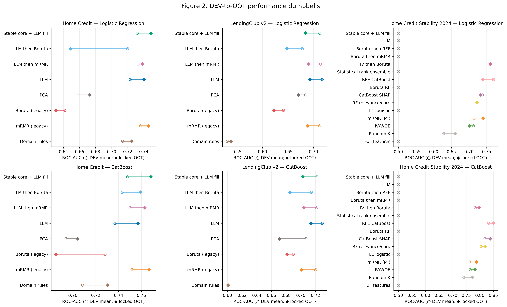

[Vector PDF](figures/fig_02_dev_vs_oot_performance.pdf)

Caption: Population—124 identities with numeric DEV means; locked OOT populations n=120,053, 293,105, and 304,916. Metric—ROC-AUC. Uncertainty—DEV fold SD is tabulated, not used as OOT uncertainty. Interpretation—Temporal change is identity-specific. Limitation—DEV folds are not independent datasets. Source—[`tables/dev_oot_generalization.csv`](tables/dev_oot_generalization.csv).

### Figure 3. Locked OOT minus DEV mean AUC

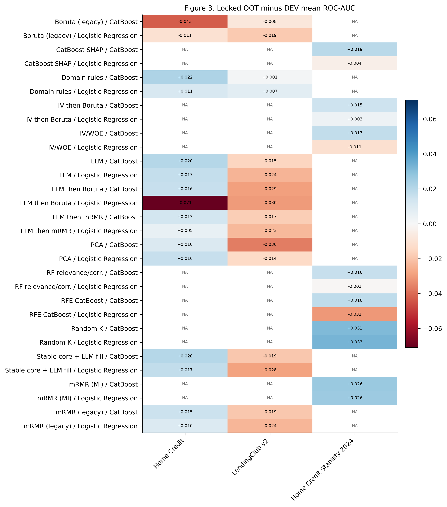

[Vector PDF](figures/fig_03_dev_to_oot_delta_heatmap.pdf)

Caption: Population—114 valid DEV/OOT identity contrasts. Metric—Absolute AUC difference. Uncertainty—None; descriptive. Interpretation—Both improvement and deterioration occur. Limitation—Missing cells are NA, not zero. Source—[`tables/dev_oot_generalization.csv`](tables/dev_oot_generalization.csv).

### Figure 4. Locked OOT maximum KS

[Vector PDF](figures/fig_04_oot_ks_by_method.pdf)

Caption: Population—66 primary registered OOT cells (54 numeric). Metric—Maximum TPR−FPR. Uncertainty—None; frozen decision thresholds are in the companion table. Interpretation—KS is method- and dataset-dependent. Limitation—Maximum KS is threshold-free in value; operational metrics use the frozen threshold. Source—[`tables/oot_metrics.csv`](tables/oot_metrics.csv).

### Figure 5. LLM-assisted effect versus matching mRMR

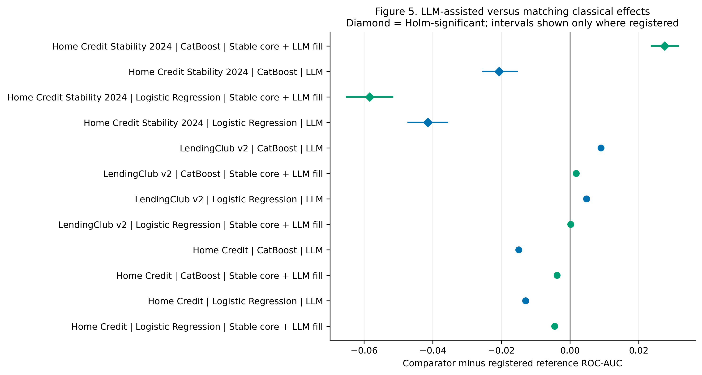

[Vector PDF](figures/fig_05_llm_vs_classical_effect_forest.pdf)

Caption: Population—12 registered matching-reference comparisons. Metric—Comparator minus reference AUC. Uncertainty—95% paired bootstrap intervals only where registered; Holm marker. Interpretation—Effects include positive, negative, and inconclusive evidence. Limitation—Original two-dataset rows are low-power fold diagnostics, not OOT inference. Source—[`tables/statistical_comparisons.csv`](tables/statistical_comparisons.csv).

### Figure 6. Holm-adjusted significance

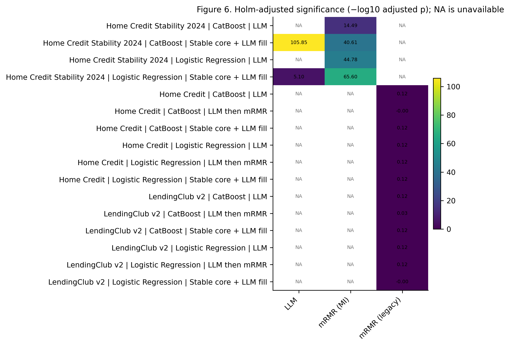

[Vector PDF](figures/fig_06_adjusted_significance_heatmap.pdf)

Caption: Population—22 registered/visible LLM-related comparisons. Metric—−log10 Holm-adjusted p. Uncertainty—Holm within frozen families. Interpretation—Non-significance is common and is not equivalence. Limitation—NA is unavailable, never p=1 or zero effect. Source—[`tables/statistical_comparisons.csv`](tables/statistical_comparisons.csv).

### Figure 7. DEV-referenced OOT score PSI

[Vector PDF](figures/fig_07_score_psi.pdf)

Caption: Population—54 cells with authenticated DEV OOF and OOT score PSI. Metric—PSI. Uncertainty—Descriptive. Interpretation—Score drift differs by method. Limitation—0.10/0.25 bands are not drawn because their role differs across cohorts. Source—[`tables/oot_metrics.csv`](tables/oot_metrics.csv).

### Figure 8. Type-aware selected-feature PSI

[Vector PDF](figures/fig_08_selected_feature_psi.pdf)

Caption: Population—40 method/model selected-feature summaries. Metric—Mean and maximum PSI. Uncertainty—Descriptive. Interpretation—Predictor drift need not align with AUC change. Limitation—Feature universes differ; compare within dataset. Source—[`tables/feature_psi.csv`](tables/feature_psi.csv).

### Figure 9. Fold selection stability

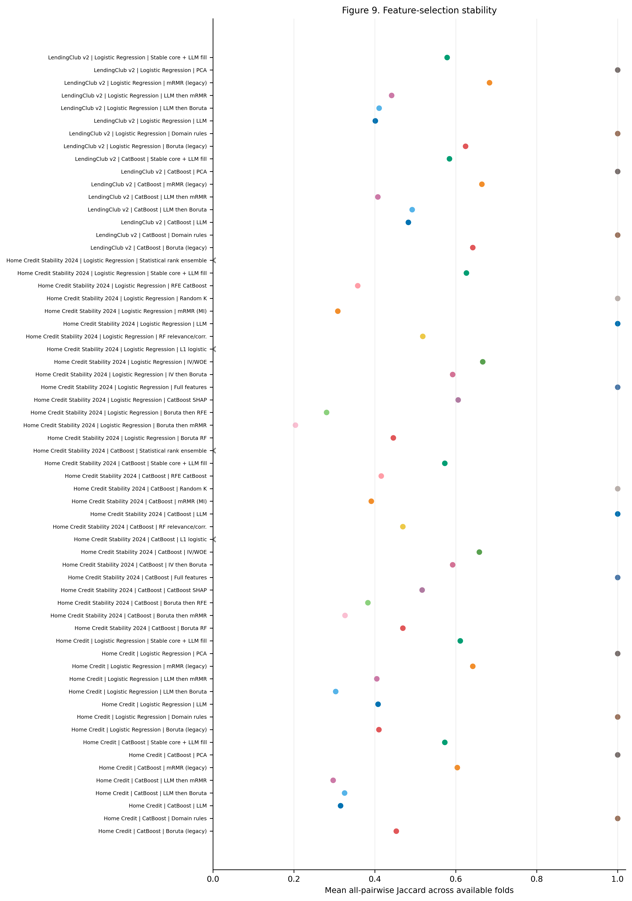

[Vector PDF](figures/fig_09_selection_stability.pdf)

Caption: Population—58 method/model summaries with authenticated fold selection sets. Metric—Mean pairwise Jaccard. Uncertainty—Descriptive. Interpretation—Stable selection is distinct from predictive performance. Limitation—Only available fold sets enter each summary. Source—[`tables/selection_stability.csv`](tables/selection_stability.csv).

### Figure 10. Within-dataset method overlap

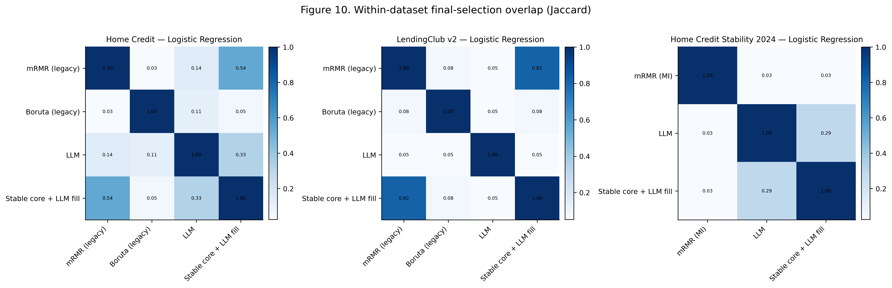

[Vector PDF](figures/fig_10_method_overlap.pdf)

Caption: Population—456 within-dataset/model pairwise final-selection records; figure shows the protocol-fixed LR subset. Metric—Jaccard overlap. Uncertainty—Descriptive. Interpretation—LLM/classical overlap is dataset-specific. Limitation—No cross-universe feature-name comparison. Source—[`tables/method_overlap.csv`](tables/method_overlap.csv).

### Figure 11. Runtime and peak RAM

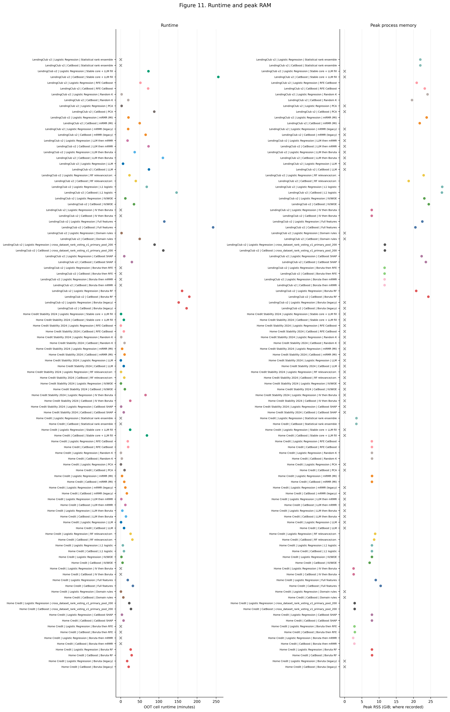

[Vector PDF](figures/fig_11_runtime_and_peak_ram.pdf)

Caption: Population—461 authenticated DEV/OOT/controller resource records. Metric—Minutes and GiB. Uncertainty—Descriptive. Interpretation—LLM/hybrid resource cost is not uniform. Limitation—Per-cell RAM is unavailable for some cohorts; crosses are NA. Source—[`tables/resource_metrics.csv`](tables/resource_metrics.csv).

### Figure 12. Performance versus runtime

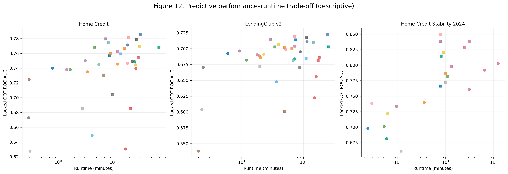

[Vector PDF](figures/fig_12_performance_resource_tradeoff.pdf)

Caption: Population—94 numeric OOT cells with runtime. Metric—ROC-AUC versus minutes. Uncertainty—Descriptive. Interpretation—Trade-offs, not a universal winner, are visible. Limitation—No inferential Pareto-superiority claim. Source—[`tables/oot_metrics.csv`](tables/oot_metrics.csv).

### Figure 13. LLM incremental AUC

[Vector PDF](figures/fig_13_llm_incremental_value.pdf)

Caption: Population—12 registered LLM/stable-core versus matching mRMR identities (12 numeric). Metric—AUC delta. Uncertainty—Third-dataset paired bootstrap where registered. Interpretation—Directions are not universally consistent. Limitation—Third benchmark shares Home Credit lineage. Source—[`tables/cross_dataset_synthesis.csv`](tables/cross_dataset_synthesis.csv).

### Figure 14. Cross-dataset common-method ranks

[Vector PDF](figures/fig_14_cross_dataset_rank_consistency.pdf)

Caption: Population—Up to 18 common method/dataset/model identities: mRMR, LLM, and stable-core. Metric—Within-dataset AUC rank. Uncertainty—None. Interpretation—Rank ordering changes by dataset/model. Limitation—Ranks omit methods without common coverage and are descriptive. Source—[`tables/oot_metrics.csv`](tables/oot_metrics.csv).

### Figure 15. Protocol-fixed OOT ROC curves

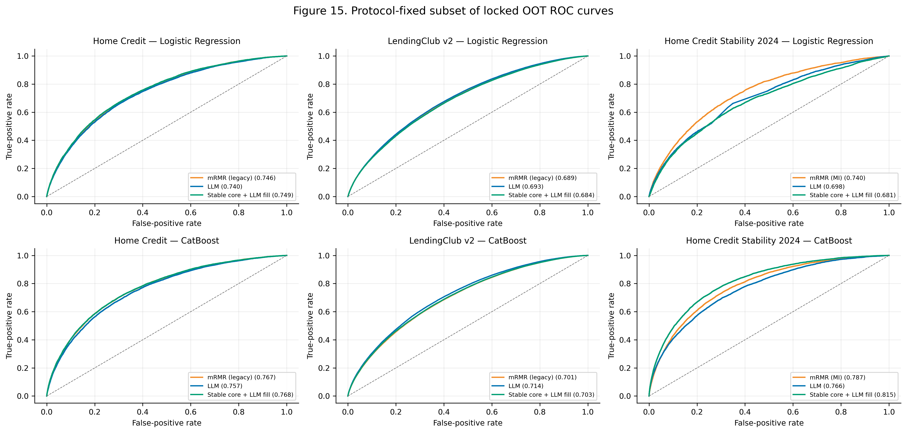

[Vector PDF](figures/fig_15_oot_roc_curves.pdf)

Caption: Population—18 saved-prediction curves over locked OOT populations n=120,053, 293,105, and 304,916. Metric—TPR versus FPR. Uncertainty—None. Interpretation—Curve shape supports the tabulated AUC evidence. Limitation—Subset fixed by method role, not observed performance. Source—[`tables/prediction_reconciliation.csv`](tables/prediction_reconciliation.csv).

### Figure 16. Protocol-fixed OOT calibration

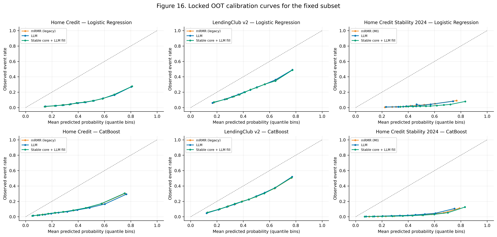

[Vector PDF](figures/fig_16_oot_calibration_curves.pdf)

Caption: Population—Same 18 saved-prediction curves; ten quantile bins per curve. Metric—Observed versus predicted event rate. Uncertainty—None. Interpretation—Calibration patterns complement log loss/Brier. Limitation—Curves are descriptive and bin-dependent. Source—[`tables/prediction_reconciliation.csv`](tables/prediction_reconciliation.csv).

### Figure 17. Protocol-fixed OOT score distributions

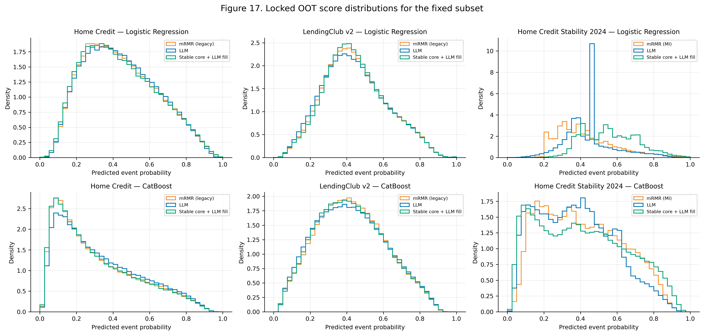

[Vector PDF](figures/fig_17_oot_score_distributions.pdf)

Caption: Population—Same 18 saved-prediction curves across three locked OOT populations. Metric—Score density. Uncertainty—None. Interpretation—Methods differ in score spread and location. Limitation—Density shape is not a performance test. Source—[`tables/prediction_reconciliation.csv`](tables/prediction_reconciliation.csv).
