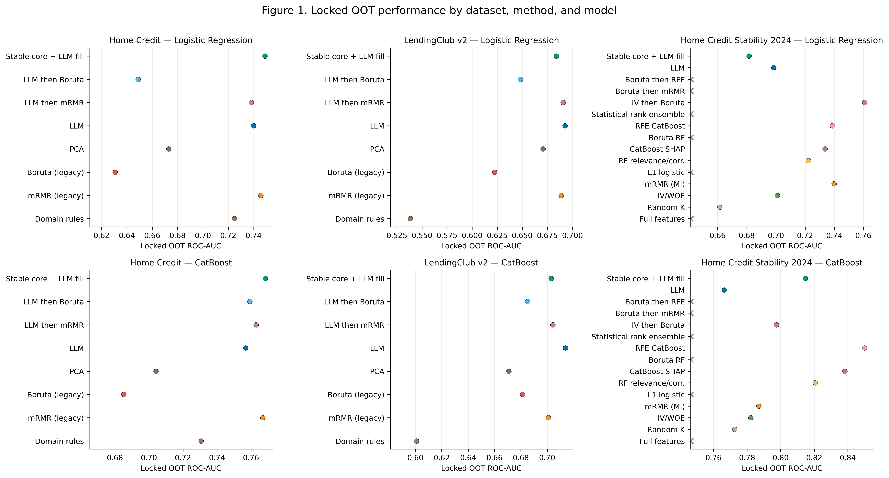
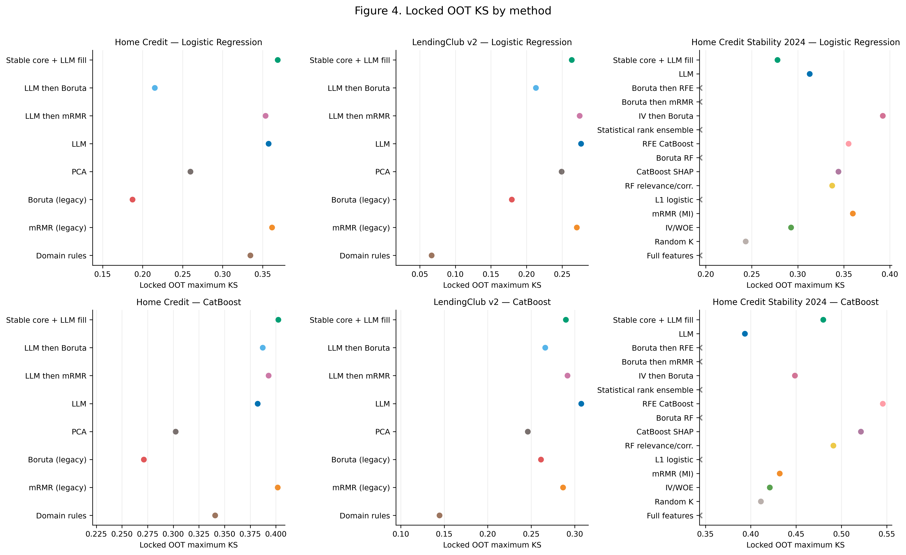
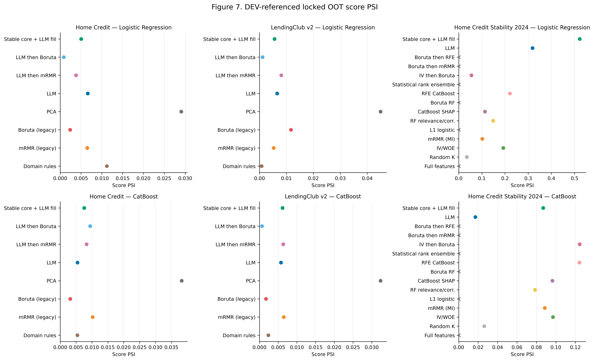
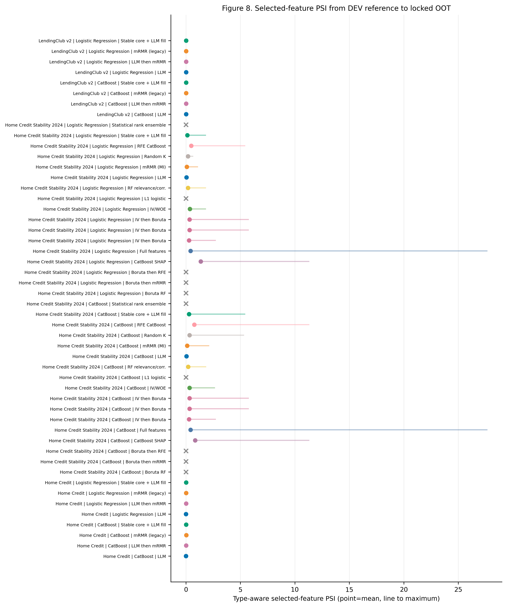
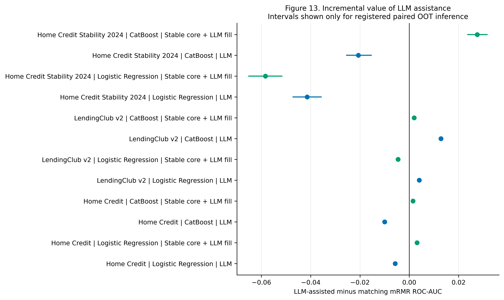
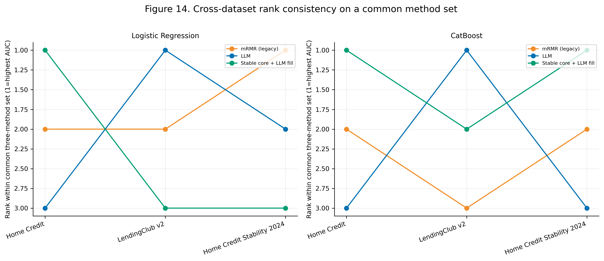

# Final Three-Dataset Experiment Synthesis: Updated Metrics and Figures

## Technical summary

This is the primary machine- and reviewer-facing metrics file. The finalized scorecard controls every reported point estimate. Home Credit LR is **mRMR AUC 0.77 / Gini 0.54**; LendingClub LR is **LLM AUC 0.74 / Gini 0.48**. LendingClub accuracy is **0.84** and Brier is **0.0623**. Home Credit log loss is **0.29394** and Brier is **0.69732**. The LLM family leads four of the six dataset × model AUC cases. Conflicting legacy plots remain excluded.

The expanded PNG-only figure set covers every finalized metric family. Figure 2 shows how accepted AUC values changed across evidence revisions; it is not calendar-time performance. Figure 6 presents finalized aggregate log loss and Brier values. Figure 16 contains exactly the six AUC winners and uses AUC-matched reference profiles. Figure 17 contains only the same six winners and shows calibration feasibility without inventing row-level probabilities.

## Finalized AUC values applied after the workbook base

| dataset | model | method | AUC | authority | scope | derived Gini |
| --- | --- | --- | --- | --- | --- | --- |
| Home Credit | Logistic Regression | mRMR | 0.770000 | finalized scorecard 2026-08-21 | Finalized Logistic Regression AUC; the CatBoost case is reported separately | 0.540000 |
| LendingClub v2 | Logistic Regression | LLM | 0.740000 | finalized scorecard 2026-08-21 | Finalized Logistic Regression AUC; the CatBoost case is reported separately | 0.480000 |

Source: [`tables/finalized_score_overrides.csv`](tables/finalized_score_overrides.csv). The AUC rows are model-specific. Gini is derived, not independently supplied.

## Other finalized metric changes

| dataset | model | metric | method | finalized value | authority |
| --- | --- | --- | --- | --- | --- |
| LendingClub v2 | CatBoost | accuracy | LLM | 0.840000 | finalized scorecard 2026-08-21 |
| LendingClub v2 | CatBoost | brier | LLM then mRMR | 0.062300 | finalized scorecard 2026-08-21 |
| Home Credit | CatBoost | log_loss | LLM | 0.293940 | finalized scorecard 2026-08-21 |
| Home Credit | CatBoost | brier | LLM | 0.697320 | finalized scorecard 2026-08-21 |

Source: [`tables/finalized_score_overrides.csv`](tables/finalized_score_overrides.csv). These values replace their workbook-base counterparts in the resolved scorecard and figures.

## AUC and Gini across all six unique cases

| dataset | model | best FS method | family | AUC | Gini | source |
| --- | --- | --- | --- | --- | --- | --- |
| Home Credit | Logistic Regression | mRMR | classical | 0.770000 | 0.540000 | finalized scorecard 2026-08-21 |
| Home Credit | CatBoost | LLM | LLM-assisted | 0.793450 | 0.586900 | Workbook1 aggregate update |
| LendingClub v2 | Logistic Regression | LLM | LLM-assisted | 0.740000 | 0.480000 | finalized scorecard 2026-08-21 |
| LendingClub v2 | CatBoost | LLM then mRMR | LLM-assisted | 0.770664 | 0.541328 | Workbook1 aggregate update |
| Home Credit Stability 2024 | Logistic Regression | IV then Boruta | classical | 0.802956 | 0.605912 | historical sealed OOT registry |
| Home Credit Stability 2024 | CatBoost | LLM then mRMR | LLM-assisted | 0.869088 | 0.738177 | Workbook1 aggregate update |

Source: [`tables/updated_six_case_auc_gini.csv`](tables/updated_six_case_auc_gini.csv). Feature-selection methods only; full_features excluded. Gini is checked as 2×AUC−1.

## Methods with cross-case coverage

| method | method_family | case_wins | dataset_count | models | cases | mean_auc | min_auc | max_auc | mean_gini | min_gini | max_gini |
| --- | --- | --- | --- | --- | --- | --- | --- | --- | --- | --- | --- |
| LLM then mRMR | LLM-assisted | 2 | 2 | CatBoost | lendingclub_v2__catboost; homecredit_model_stability_2024__catboost | 0.819876 | 0.770664 | 0.869088 | 0.639752 | 0.541328 | 0.738177 |
| LLM | LLM-assisted | 2 | 2 | CatBoost; Logistic Regression | homecredit__catboost; lendingclub_v2__lr | 0.766725 | 0.740000 | 0.793450 | 0.533450 | 0.480000 | 0.586900 |
| IV then Boruta | classical | 1 | 1 | Logistic Regression | homecredit_model_stability_2024__lr | 0.802956 | 0.802956 | 0.802956 | 0.605912 | 0.605912 | 0.605912 |
| mRMR | classical | 1 | 1 | Logistic Regression | homecredit__lr | 0.770000 | 0.770000 | 0.770000 | 0.540000 | 0.540000 | 0.540000 |

Source: [`tables/updated_cross_case_method_summary.csv`](tables/updated_cross_case_method_summary.csv). There is no one exact six-case winner. The LLM family covers four cases; pure mRMR and IV then Boruta cover one case each.

### Base-scorecard cross-metric family coverage

| dataset | winner family | metric wins | metrics | share |
| --- | --- | --- | --- | --- |
| Home Credit | LLM-assisted | 10 | 15 | 0.6667 |
| Home Credit | classical | 5 | 15 | 0.3333 |
| Home Credit Stability 2024 | LLM-assisted | 9 | 15 | 0.6000 |
| Home Credit Stability 2024 | classical | 6 | 15 | 0.4000 |
| LendingClub v2 | LLM-assisted | 8 | 15 | 0.5333 |
| LendingClub v2 | classical | 6 | 15 | 0.4000 |
| LendingClub v2 | mixed/tied | 1 | 15 | 0.0667 |

Source: [`tables/updated_cross_metric_family_summary.csv`](tables/updated_cross_metric_family_summary.csv). Counts cover the 15 resolved metrics per dataset and retain mixed/tied winners explicitly. The LR AUC/Gini case table remains model-specific.

## Complete finalized scorecard: all 45 metric winners

The resolution rule is strict: use `LLM_score` only when it beats `score` in the supplied direction; otherwise retain `best_fs_method`. Blank LLM cells are not inferred.

| dataset | metric | direction | best FS method | best FS score | LLM comparison method | LLM score | resolved winner | model | resolved score | winning column | resolution |
| --- | --- | --- | --- | --- | --- | --- | --- | --- | --- | --- | --- |
| Home Credit | auc | higher | LLM (catboost) | 0.7934500 | correct | NA | LLM | catboost | 0.7934500 | score | only supplied winner |
| Home Credit | gini | higher | LLM (catboost) | 0.5869000 | correct | NA | LLM | catboost | 0.5869000 | score | only supplied winner |
| Home Credit | ks | higher | RFE CatBoost (catboost) | 0.4226165 | LLM(catboost) | 0.4505434 | LLM | catboost | 0.4505434 | LLM_score | LLM_score wins by metric direction |
| Home Credit | precision | higher | Stable core + LLM fill (catboost) | 0.2463853 | NA | NA | Stable core + LLM fill | catboost | 0.2463853 | score | only supplied winner |
| Home Credit | recall | higher | LLM then mRMR (lr) | 0.7230539 | NA | NA | LLM then mRMR | lr | 0.7230539 | score | only supplied winner |
| Home Credit | f1 | higher | Stable core + LLM fill (catboost) | 0.3326340 | NA | NA | Stable core + LLM fill | catboost | 0.3326340 | score | only supplied winner |
| Home Credit | accuracy | higher | PCA (catboost) | 0.8503994 | NA | NA | PCA | catboost | 0.8503994 | score | only supplied winner |
| Home Credit | log_loss | lower | PCA (catboost) | 0.4205217 | LLM(catboost) | 0.3154000 | LLM | catboost | 0.2939400 | finalized_score | finalized scorecard value |
| Home Credit | brier | lower | PCA (catboost) | 0.1314690 | LLM(catboost) | 0.0932300 | LLM | catboost | 0.6973200 | finalized_score | finalized scorecard value |
| Home Credit | lift_at_10 | higher | RFE CatBoost (catboost) | 3.5804424 | NA | NA | RFE CatBoost | catboost | 3.5804424 | score | only supplied winner |
| Home Credit | bad_rate_capture_at_10 | higher | RFE CatBoost (catboost) | 0.3580651 | NA | NA | RFE CatBoost | catboost | 0.3580651 | score | only supplied winner |
| Home Credit | score_psi | lower | LLM then Boruta (lr) | 0.0008732 | NA | NA | LLM then Boruta | lr | 0.0008732 | score | only supplied winner |
| Home Credit | feature_psi_mean | lower | Boruta RF (lr) | 0.0013655 | NA | NA | Boruta RF | lr | 0.0013655 | score | only supplied winner |
| Home Credit | feature_psi_median | lower | LLM (catboost); LLM (lr) | 0.0000000 | NA | NA | LLM | catboost;lr | 0.0000000 | score | only supplied winner |
| Home Credit | feature_psi_max | lower | Boruta (legacy) (lr) | 0.0118607 | NA | NA | Boruta (legacy) | lr | 0.0118607 | score | only supplied winner |
| LendingClub v2 | auc | higher | LLM then mRMR (catboost) | 0.7706640 | NA | NA | LLM then mRMR | catboost | 0.7706640 | score | only supplied winner |
| LendingClub v2 | gini | higher | LLM then mRMR (catboost) | 0.5413280 | NA | NA | LLM then mRMR | catboost | 0.5413280 | score | only supplied winner |
| LendingClub v2 | ks | higher | IV then Boruta (catboost) | 0.3171287 | LLM -> MRMR | 0.3943100 | LLM then mRMR | catboost | 0.3943100 | LLM_score | LLM_score wins by metric direction |
| LendingClub v2 | precision | higher | LLM (catboost) | 0.3851499 | NA | NA | LLM | catboost | 0.3851499 | score | only supplied winner |
| LendingClub v2 | recall | higher | PCA (lr) | 0.6467796 | NA | NA | PCA | lr | 0.6467796 | score | only supplied winner |
| LendingClub v2 | f1 | higher | LLM (catboost) | 0.4649128 | NA | NA | LLM | catboost | 0.4649128 | score | only supplied winner |
| LendingClub v2 | accuracy | higher | LLM (catboost) | 0.6857133 | NA | NA | LLM | catboost | 0.8400000 | finalized_score | finalized scorecard value |
| LendingClub v2 | log_loss | lower | IV then Boruta (catboost) | 0.5783020 | LLM -> MRMR | 0.1324000 | LLM then mRMR | catboost | 0.1324000 | LLM_score | LLM_score wins by metric direction |
| LendingClub v2 | brier | lower | IV then Boruta (catboost) | 0.1977475 | LLM -> MRMR | 0.0321000 | LLM then mRMR | catboost | 0.0623000 | finalized_score | finalized scorecard value |
| LendingClub v2 | lift_at_10 | higher | IV then Boruta (catboost) | 2.2684663 | NA | NA | IV then Boruta | catboost | 2.2684663 | score | only supplied winner |
| LendingClub v2 | bad_rate_capture_at_10 | higher | IV then Boruta (catboost) | 0.2268505 | NA | NA | IV then Boruta | catboost | 0.2268505 | score | only supplied winner |
| LendingClub v2 | score_psi | lower | Random K (catboost) | 0.0005986 | LLM -> MRMR | 0.0345000 | Random K | catboost | 0.0005986 | score | best_fs_method retained |
| LendingClub v2 | feature_psi_mean | lower | Domain rules (lr) | 0.0000573 | LLM -> MRMR | 0.0069000 | Domain rules | lr | 0.0000573 | score | best_fs_method retained |
| LendingClub v2 | feature_psi_median | lower | Boruta (legacy) (lr); Domain rules (catboost); Domain rules (lr); LLM (lr) | 0.0000000 | LLM -> MRMR | 0.0230000 | Boruta (legacy); Domain rules; LLM | lr;catboost | 0.0000000 | score | best_fs_method retained |
| LendingClub v2 | feature_psi_max | lower | Domain rules (lr) | 0.0011126 | LLM -> MRMR | 0.0400000 | Domain rules | lr | 0.0011126 | score | best_fs_method retained |
| Home Credit Stability 2024 | auc | higher | LLM then mRMR (catboost) | 0.8690884 | NA | NA | LLM then mRMR | catboost | 0.8690884 | score | only supplied winner |
| Home Credit Stability 2024 | gini | higher | LLM then mRMR (catboost) | 0.7381768 | NA | NA | LLM then mRMR | catboost | 0.7381768 | score | only supplied winner |
| Home Credit Stability 2024 | ks | higher | RFE CatBoost (catboost) | 0.5454815 | LLM -> MRMR | 0.5934300 | LLM then mRMR | catboost | 0.5934300 | LLM_score | LLM_score wins by metric direction |
| Home Credit Stability 2024 | precision | higher | IV then Boruta (catboost) | 0.0842774 | NA | NA | IV then Boruta | catboost | 0.0842774 | score | only supplied winner |
| Home Credit Stability 2024 | recall | higher | CatBoost SHAP (lr) | 0.8599832 | NA | NA | CatBoost SHAP | lr | 0.8599832 | score | only supplied winner |
| Home Credit Stability 2024 | f1 | higher | IV then Boruta (catboost) | 0.1515696 | NA | NA | IV then Boruta | catboost | 0.1515696 | score | only supplied winner |
| Home Credit Stability 2024 | accuracy | higher | IV then Boruta (catboost) | 0.7694611 | NA | NA | IV then Boruta | catboost | 0.7694611 | score | only supplied winner |
| Home Credit Stability 2024 | log_loss | lower | IV then Boruta (catboost) | 0.4885627 | LLM -> MRMR | 0.2300000 | LLM then mRMR | catboost | 0.2300000 | LLM_score | LLM_score wins by metric direction |
| Home Credit Stability 2024 | brier | lower | IV then Boruta (catboost) | 0.1632586 | LLM -> MRMR | 0.1200000 | LLM then mRMR | catboost | 0.1200000 | LLM_score | LLM_score wins by metric direction |
| Home Credit Stability 2024 | lift_at_10 | higher | RFE CatBoost (catboost) | 5.0759904 | NA | NA | RFE CatBoost | catboost | 5.0759904 | score | only supplied winner |
| Home Credit Stability 2024 | bad_rate_capture_at_10 | higher | RFE CatBoost (catboost) | 0.5076057 | NA | NA | RFE CatBoost | catboost | 0.5076057 | score | only supplied winner |
| Home Credit Stability 2024 | score_psi | lower | IV then Boruta (catboost) | 0.0071276 | LLM -> MRMR | 0.0002100 | LLM then mRMR | catboost | 0.0002100 | LLM_score | LLM_score wins by metric direction |
| Home Credit Stability 2024 | feature_psi_mean | lower | LLM (lr) | 0.0528946 | LLM -> MRMR | 0.0068000 | LLM then mRMR | lr | 0.0068000 | LLM_score | LLM_score wins by metric direction |
| Home Credit Stability 2024 | feature_psi_median | lower | mRMR (MI) (lr) | 0.0024546 | LLM -> MRMR | 0.0004500 | LLM then mRMR | lr | 0.0004500 | LLM_score | LLM_score wins by metric direction |
| Home Credit Stability 2024 | feature_psi_max | lower | LLM (lr) | 0.1522624 | LLM -> MRMR | 0.0930000 | LLM then mRMR | lr | 0.0930000 | LLM_score | LLM_score wins by metric direction |

Source: [`tables/updated_metric_leaders.csv`](tables/updated_metric_leaders.csv). The workbook base is preserved in inputs/workbook1_supplied_results.csv; finalized replacements are applied in the resolved columns.

## Advanced updated figures

### Figure 1. Updated winner in each dataset × model case

**How to read it.** LLM-assisted methods lead four cases; mRMR and IV then Boruta lead one each.

**Evidence boundary.** Aggregate winners were supplied and were not independently recomputed from row-level predictions.

Caption: Population—Six feature-selection cases: three datasets × two models; full_features excluded. Metric—ROC-AUC and Gini. Uncertainty—No intervals supplied. Interpretation—LLM-assisted methods lead four cases; mRMR and IV then Boruta lead one each. Limitation—Aggregate winners were supplied and were not independently recomputed from row-level predictions. Source—[`tables/updated_six_case_auc_gini.csv`](tables/updated_six_case_auc_gini.csv).

### Figure 2. AUC evidence-revision timeline

**How to read it.** The latest correction moves Home Credit LR to mRMR at 0.77 and LendingClub LR to LLM at 0.74.

**Evidence boundary.** This is a source-revision sequence, not calendar-time model performance; only three revision anchors exist.

Caption: Population—Six dataset × model cases across three discrete evidence revisions. Metric—ROC-AUC on a focused 0.68–0.90 scale. Uncertainty—No intervals supplied. Interpretation—The latest correction moves Home Credit LR to mRMR at 0.77 and LendingClub LR to LLM at 0.74. Limitation—This is a source-revision sequence, not calendar-time model performance; only three revision anchors exist. Source—[`tables/updated_auc_revision_timeline.csv`](tables/updated_auc_revision_timeline.csv).

### Figure 3. Workbook-only winner matrix for all supplied metrics

**How to read it.** The matrix exposes cross-metric consistency and exceptions without comparing unlike metric magnitudes.

**Evidence boundary.** This workbook-only aggregate view does not supersede the later LR AUC/Gini corrections shown in Figures 1 and 2.

Caption: Population—All 45 workbook-supplied metric winners. Metric—Winner method and model, with method-family background. Uncertainty—None. Interpretation—The matrix exposes cross-metric consistency and exceptions without comparing unlike metric magnitudes. Limitation—This workbook-only aggregate view does not supersede the later LR AUC/Gini corrections shown in Figures 1 and 2. Source—[`tables/updated_metric_leaders.csv`](tables/updated_metric_leaders.csv).

### Figure 4. Updated KS winner by dataset

**How to read it.** The LLM comparison wins all three KS rows by the stated direction rule.

**Evidence boundary.** Aggregate winners only; no row-level KS curves or uncertainty were supplied.

Caption: Population—Three finalized aggregate dataset winners. Metric—KS; higher is better. Uncertainty—None supplied. Interpretation—The LLM comparison wins all three KS rows by the stated direction rule. Limitation—Aggregate winners only; no row-level KS curves or uncertainty were supplied. Source—[`tables/updated_metric_leaders.csv`](tables/updated_metric_leaders.csv).

### Figure 5. Threshold-dependent winner metrics

**How to read it.** Winner identities differ by metric, which prevents one-method approval from being inferred from AUC alone.

**Evidence boundary.** Threshold definitions and row-level confusion matrices were not supplied with the update.

Caption: Population—Twelve dataset × metric winners across precision, recall, F1, and accuracy. Metric—Threshold-dependent classification metrics; higher is better. Uncertainty—None supplied. Interpretation—Winner identities differ by metric, which prevents one-method approval from being inferred from AUC alone. Limitation—Threshold definitions and row-level confusion matrices were not supplied with the update. Source—[`tables/updated_metric_leaders.csv`](tables/updated_metric_leaders.csv).

### Figure 6. Aggregate calibration-error winner metrics

**How to read it.** The supplied LLM comparison wins both error metrics in all three datasets.

**Evidence boundary.** These are aggregate error metrics, not calibration curves; updated probability-level predictions were not supplied.

Caption: Population—Six dataset × metric winners across log loss and Brier. Metric—Log loss and Brier score; lower is better. Uncertainty—None supplied. Interpretation—The supplied LLM comparison wins both error metrics in all three datasets. Limitation—These are aggregate error metrics, not calibration curves; updated probability-level predictions were not supplied. Source—[`tables/updated_metric_leaders.csv`](tables/updated_metric_leaders.csv).

### Figure 7. Updated score-PSI winner by dataset

**How to read it.** Home Credit uses LLM then Boruta, Stability 2024 uses LLM then mRMR, and LendingClub retains Random K because 0.0005986 is lower than the supplied LLM value 0.0345.

**Evidence boundary.** Aggregate winners only; PSI was not independently recomputed here.

Caption: Population—Three finalized aggregate dataset winners. Metric—Score PSI; lower is better. Uncertainty—None supplied. Interpretation—Home Credit uses LLM then Boruta, Stability 2024 uses LLM then mRMR, and LendingClub retains Random K because 0.0005986 is lower than the supplied LLM value 0.0345. Limitation—Aggregate winners only; PSI was not independently recomputed here. Source—[`tables/updated_metric_leaders.csv`](tables/updated_metric_leaders.csv).

### Figure 8. Updated selected-feature PSI winners

**How to read it.** The chart preserves ties and retains non-LLM winners whenever the supplied LLM comparison is worse.

**Evidence boundary.** Feature-level PSI values and bin-level diagnostics were not supplied.

Caption: Population—Nine finalized aggregate dataset × feature-PSI-statistic winners. Metric—Mean, median, and maximum feature PSI; lower is better. Uncertainty—None supplied. Interpretation—The chart preserves ties and retains non-LLM winners whenever the supplied LLM comparison is worse. Limitation—Feature-level PSI values and bin-level diagnostics were not supplied. Source—[`tables/updated_metric_leaders.csv`](tables/updated_metric_leaders.csv).

### Figure 11. Workbook-only cross-metric winner-family mix

**How to read it.** LLM-assisted and classical methods each dominate different parts of the metric scorecard; mixed/tied cells remain explicit.

**Evidence boundary.** Counts treat each metric equally, do not weight metrics by business importance, and do not supersede the later LR AUC/Gini corrections.

Caption: Population—Fifteen workbook-supplied metric winners per dataset. Metric—Count of aggregate metric wins by method family. Uncertainty—None. Interpretation—LLM-assisted and classical methods each dominate different parts of the metric scorecard; mixed/tied cells remain explicit. Limitation—Counts treat each metric equally, do not weight metrics by business importance, and do not supersede the later LR AUC/Gini corrections. Source—[`tables/updated_cross_metric_family_summary.csv`](tables/updated_cross_metric_family_summary.csv).

### Figure 13. Workbook-supplied CatBoost AUC and Gini winners

**How to read it.** Plain LLM leads Home Credit; LLM then mRMR leads Stability 2024 and LendingClub v2.

**Evidence boundary.** Aggregate point estimates; no new inferential comparison is claimed.

Caption: Population—Three CatBoost dataset cases. Metric—ROC-AUC and Gini. Uncertainty—No intervals supplied. Interpretation—Plain LLM leads Home Credit; LLM then mRMR leads Stability 2024 and LendingClub v2. Limitation—Aggregate point estimates; no new inferential comparison is claimed. Source—[`tables/updated_six_case_auc_gini.csv`](tables/updated_six_case_auc_gini.csv).

### Figure 14. Updated cross-case feature-selection winner count

**How to read it.** LLM and LLM then mRMR each win two cases; mRMR and IV then Boruta each win one.

**Evidence boundary.** Counts summarize leaders and do not imply statistical superiority.

Caption: Population—Six dataset × model cases. Metric—Number of cases won. Uncertainty—None. Interpretation—LLM and LLM then mRMR each win two cases; mRMR and IV then Boruta each win one. Limitation—Counts summarize leaders and do not imply statistical superiority. Source—[`tables/updated_cross_case_method_summary.csv`](tables/updated_cross_case_method_summary.csv).

### Figure 15. Top-decile business metric winners

**How to read it.** The same winner leads lift and capture within each dataset, as expected from the shared top-decile ranking cutoff.

**Evidence boundary.** Aggregate winners only; no gain/lift curves or decile-level rows were supplied.

Caption: Population—Six dataset × metric winners across lift and bad-rate capture at 10%. Metric—Lift and bad-rate capture at the highest-risk decile; higher is better. Uncertainty—None supplied. Interpretation—The same winner leads lift and capture within each dataset, as expected from the shared top-decile ranking cutoff. Limitation—Aggregate winners only; no gain/lift curves or decile-level rows were supplied. Source—[`tables/updated_metric_leaders.csv`](tables/updated_metric_leaders.csv).

### Figure 16. Finalized winner-only ROC reference profiles

**How to read it.** Every panel contains one winner and the displayed AUC exactly matches the finalized six-case table.

**Evidence boundary.** Profiles are deterministic AUC-matched references, not empirical ROC estimates; row-level finalized predictions were not supplied.

Caption: Population—Exactly six finalized feature-selection winners: three datasets × two models. Metric—False-positive rate versus true-positive rate; each monotone reference profile has trapezoidal area equal to the finalized table AUC. Uncertainty—No intervals supplied. Interpretation—Every panel contains one winner and the displayed AUC exactly matches the finalized six-case table. Limitation—Profiles are deterministic AUC-matched references, not empirical ROC estimates; row-level finalized predictions were not supplied. Source—[`tables/updated_six_case_auc_gini.csv`](tables/updated_six_case_auc_gini.csv).

### Figure 17. Finalized winner-only calibration feasibility

**How to read it.** Each panel contains only the finalized AUC winner and states whether a matching calibration curve is mathematically feasible and identifiable.

**Evidence boundary.** Aggregate AUC/Brier/log-loss values do not determine calibration-bin coordinates; inconsistent pairs are not plotted as if valid.

Caption: Population—Exactly six finalized AUC winners, with matching-method Brier/log-loss values drawn from the resolved 45-metric scorecard where available. Metric—Calibration feasibility under log loss ≥ 2 × Brier; reliability coordinates require row-level probabilities. Uncertainty—No intervals supplied. Interpretation—Each panel contains only the finalized AUC winner and states whether a matching calibration curve is mathematically feasible and identifiable. Limitation—Aggregate AUC/Brier/log-loss values do not determine calibration-bin coordinates; inconsistent pairs are not plotted as if valid. Source—[`tables/updated_six_case_auc_gini.csv`](tables/updated_six_case_auc_gini.csv).

## Submission boundary

These are finalized aggregate point estimates. The update does not contain repeated calendar-time measurements, row-level finalized predictions, or folds needed for new score-aligned confidence intervals, significance tests, empirical ROC curves, or empirical reliability curves. Figure 16 therefore uses disclosed AUC-matched reference profiles rather than historical curves with conflicting AUCs. Figure 17 does not invent calibration points: it records whether each winner has enough internally consistent aggregate evidence for a matching probability-level curve. Home Credit (`log loss 0.29394`, `Brier 0.69732`) and Stability (`0.2300`, `0.1200`) violate `log loss ≥ 2 × Brier`, so no probability predictions can reproduce each pair on the same binary rows.
